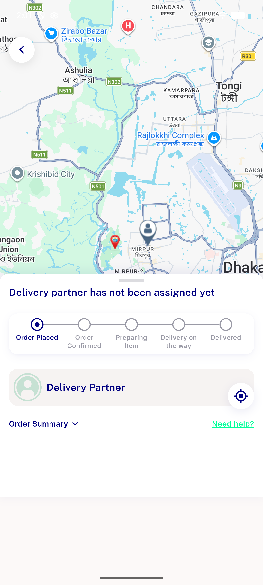

# QA Evidence — NEARS-3224

**PASS with 3 pre-existing regression_bugs found (guard applied uniformly, order-placement paths confirmed clean)**

**1 screenshot(s).** Click any thumbnail for full resolution.

<table>
<tr>
<td align="center" width="33%"> ac7 customer order placed</td>
</tr>
</table>

### Other artifacts
- [`bug-pos-tax-recalc-500-on-tampered-quantity.log`](bug-pos-tax-recalc-500-on-tampered-quantity.log)
- [`regression-order-edit-null-cart-isempty.log`](regression-order-edit-null-cart-isempty.log)
- [`regression-order-edit-update-500-on-tampered-quantity.log`](regression-order-edit-update-500-on-tampered-quantity.log)

---
*From `nears/docs/qa-evidence/NEARS-3224/` · public-repo scrub policy (no live secrets; verified clean).*
