# QA Evidence — NEARS-323

**PASS — checkout MVVM refactor byte-identical; COD order 152 placed; getOrderTax cadence + H1 re-entry verified; 412 tests green**

**14 screenshot(s).** Click any thumbnail for full resolution.

<table>
<tr>
<td align="center" width="33%"><a href="01-current.png">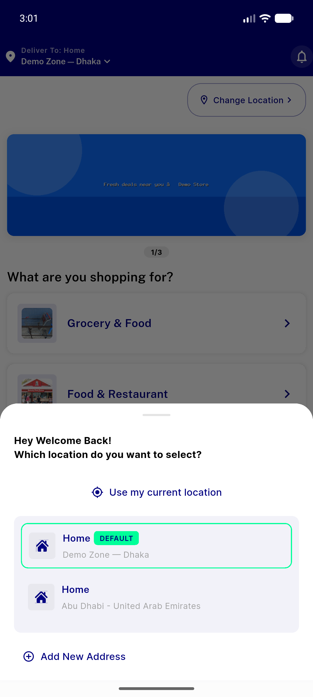</a> current</td>
<td align="center" width="33%"><a href="02-cart-totals.png">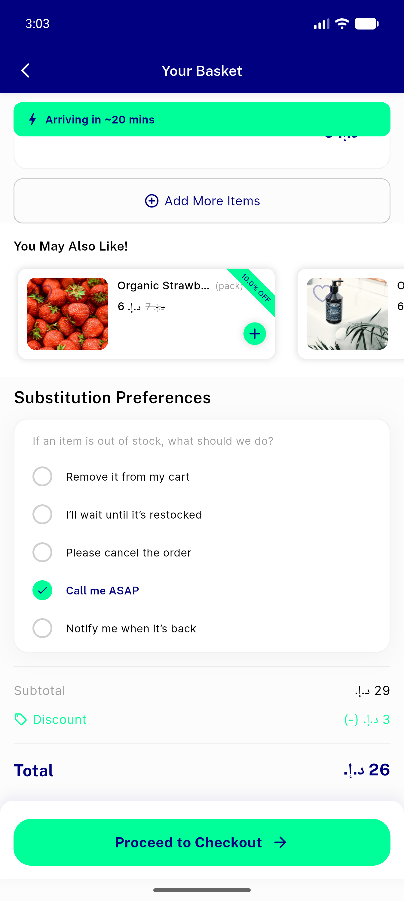</a> cart totals</td>
<td align="center" width="33%"><a href="03-checkout-totals.png">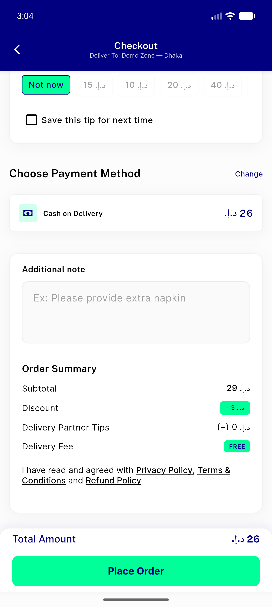</a> checkout totals</td>
</tr>
<tr>
<td align="center" width="33%"><a href="04-after-place.png">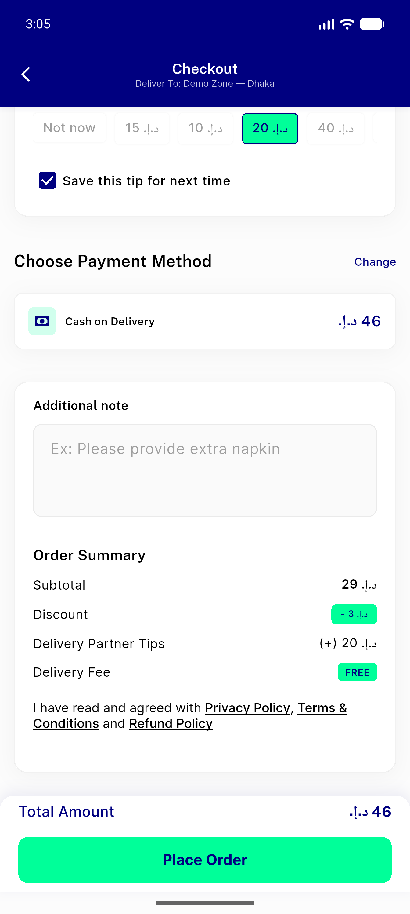</a> after place</td>
<td align="center" width="33%"><a href="05-checkout-top.png">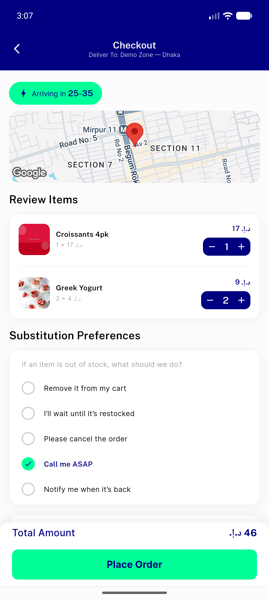</a> checkout top</td>
<td align="center" width="33%"><a href="06-snackbar.png">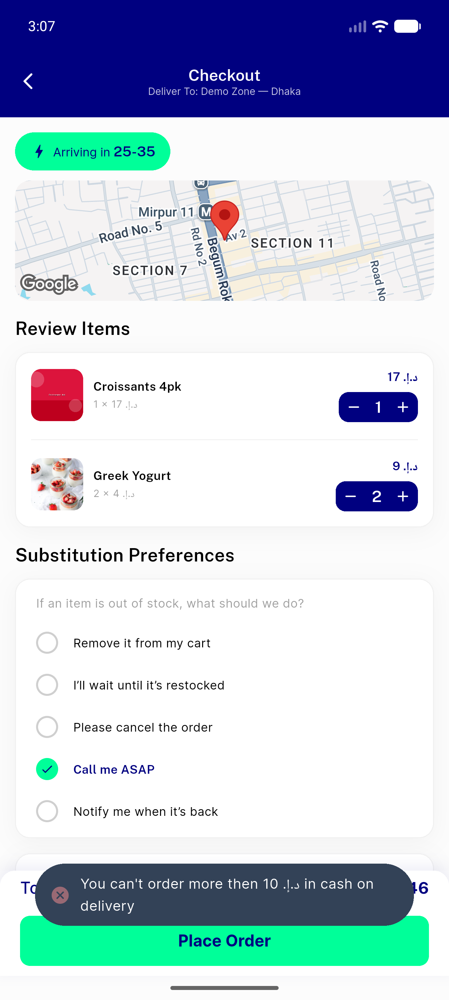</a> snackbar</td>
</tr>
<tr>
<td align="center" width="33%"><a href="07-cart-small.png">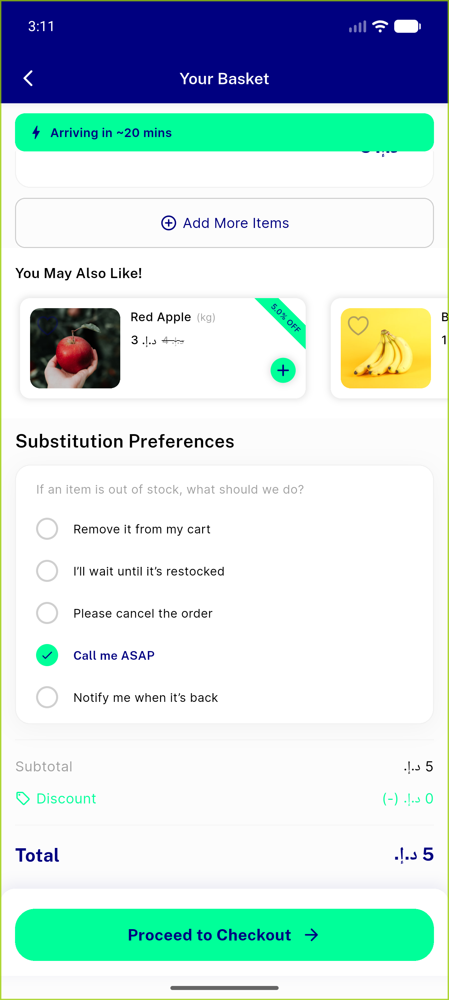</a> cart small</td>
<td align="center" width="33%"><a href="08-checkout-small.png">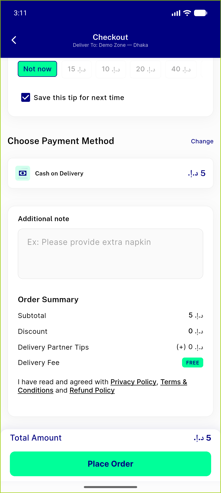</a> checkout small</td>
<td align="center" width="33%"><a href="09-place-result.png">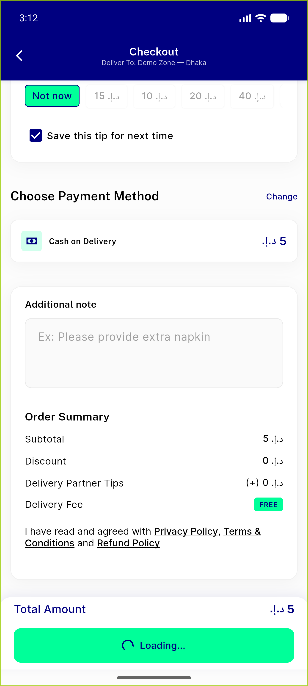</a> place result</td>
</tr>
<tr>
<td align="center" width="33%"><a href="10-order-success.png">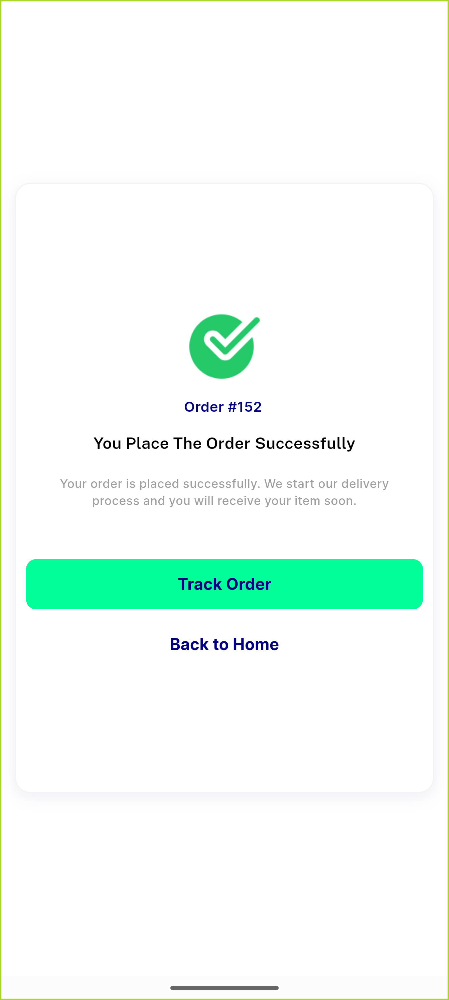</a> order success</td>
<td align="center" width="33%"><a href="11-reentry-item.png">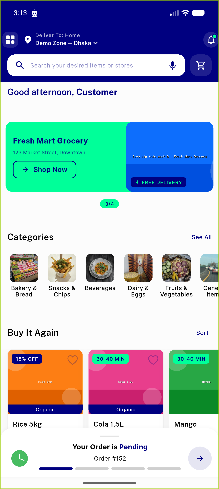</a> reentry item</td>
<td align="center" width="33%"><a href="12-payment-methods.png">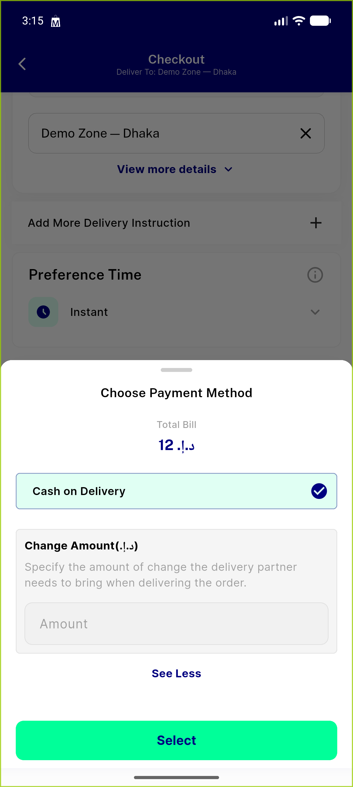</a> payment methods</td>
</tr>
<tr>
<td align="center" width="33%"><a href="13-checkout-widgets.png">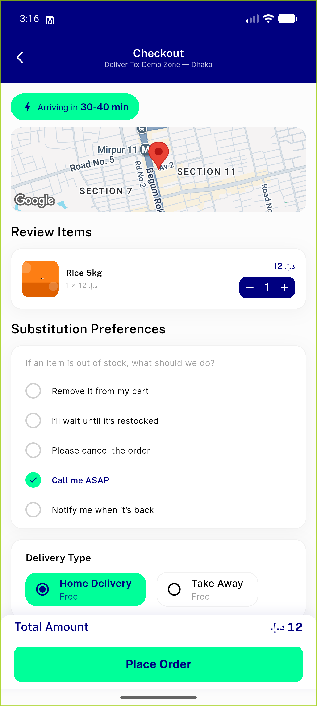</a> checkout widgets</td>
<td align="center" width="33%"><a href="14-checkout-lower.png">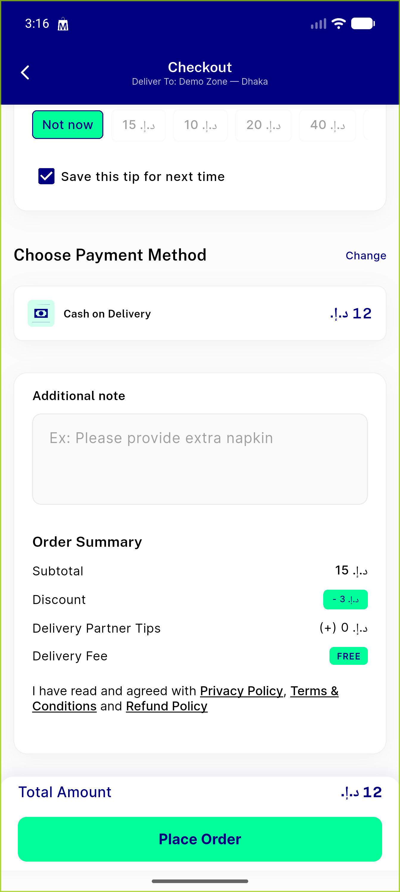</a> checkout lower</td>
</tr>
</table>

---
*From `nears/docs/qa-evidence/NEARS-323/` · public-repo scrub policy (no live secrets; verified clean).*
