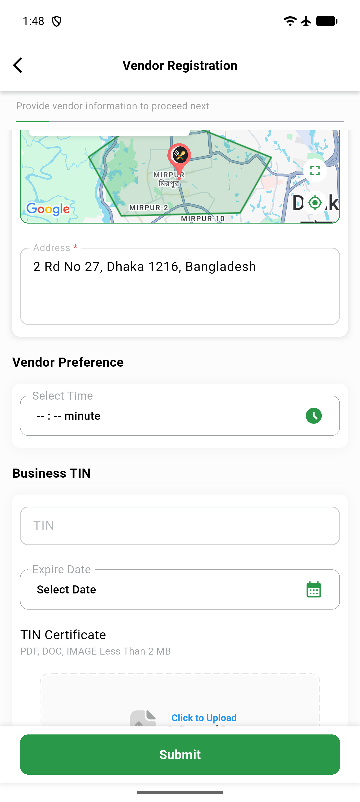
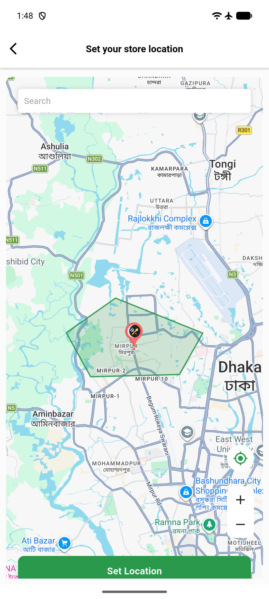

# QA Evidence — NEARS-3230

**PASS - VendorApp AddressController.clearPickupZone() reset verified live on emulator-5556 (Pixel_10_Pro_2 AVD)**

**2 screenshot(s).** Click any thumbnail for full resolution.

<table>
<tr>
<td align="center" width="33%"> ac2 address field reset to default</td>
<td align="center" width="33%"> ac2 fullscreen reset set location</td>
</tr>
</table>

### Other artifacts
- [`ac2-reentry-dump.xml`](ac2-reentry-dump.xml)
- [`regression-inzone-reset-dump.xml`](regression-inzone-reset-dump.xml)
- [`regression-not-in-zone-dump.xml`](regression-not-in-zone-dump.xml)

---
*From `nears/docs/qa-evidence/NEARS-3230/` · public-repo scrub policy (no live secrets; verified clean).*
