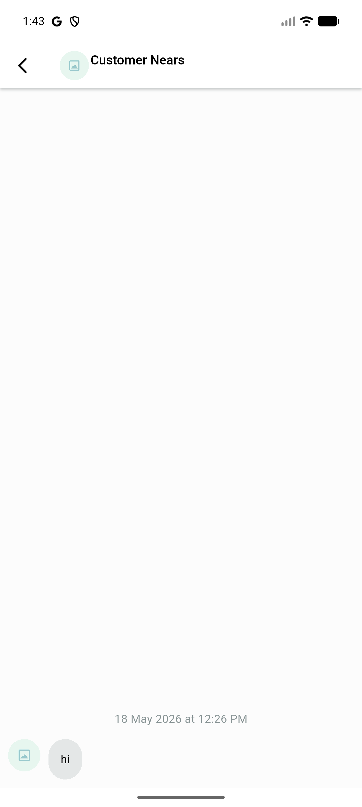
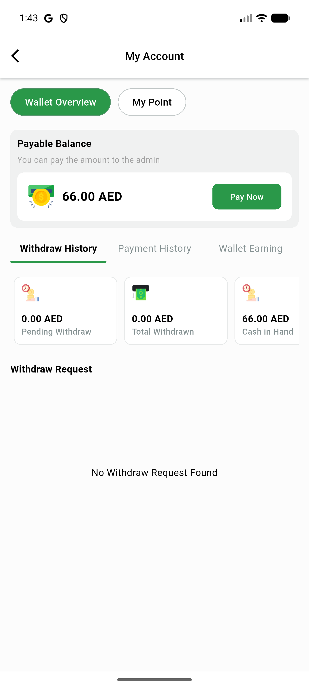
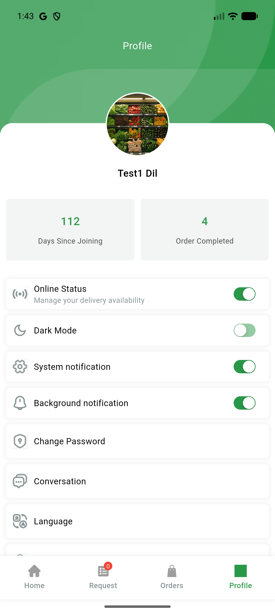
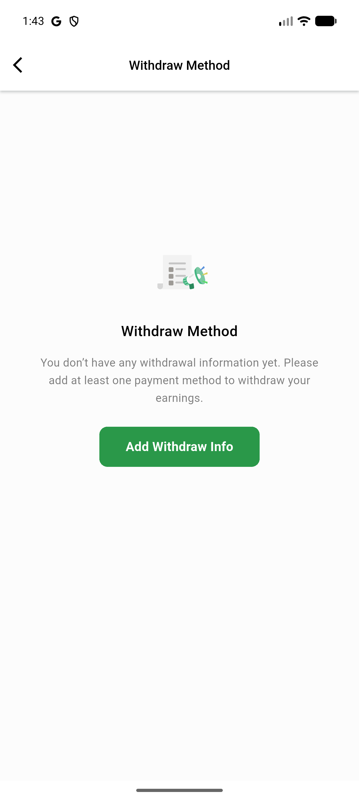

# QA Evidence — NEARS-3232

**PASS - DeliveryApp clearSharedData fan-out verified live on emulator-5554**

**4 screenshot(s).** Click any thumbnail for full resolution.

<table>
<tr>
<td align="center" width="33%"> agentB chat hi only</td>
<td align="center" width="33%"> agentB myaccount</td>
<td align="center" width="33%"> agentB profile</td>
</tr>
<tr>
<td align="center" width="33%"> agentB withdraw method empty</td>
</tr>
</table>

---
*From `nears/docs/qa-evidence/NEARS-3232/` · public-repo scrub policy (no live secrets; verified clean).*
