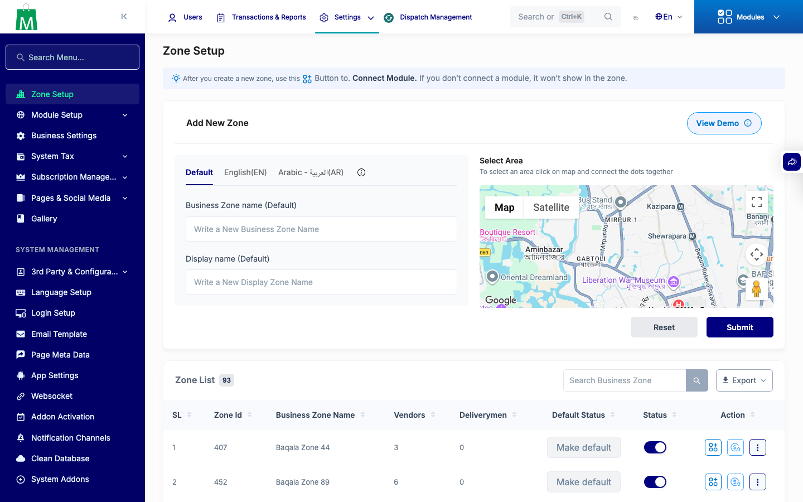

# QA Evidence — NEARS-3236

**PASS - zone-coordinates admin auth gate live-verified, 7/7 AC demonstrated, 1 unrelated pre-existing regression noted**

**1 screenshot(s).** Click any thumbnail for full resolution.

<table>
<tr>
<td align="center" width="33%"> ac4 zone index map</td>
</tr>
</table>

### Other artifacts
- [`ac1-ac3-curl.log`](ac1-ac3-curl.log)
- [`ac4-map-console-network.log`](ac4-map-console-network.log)
- [`ac6-route-middleware.log`](ac6-route-middleware.log)
- [`ac7-phpunit.log`](ac7-phpunit.log)

---
*From `nears/docs/qa-evidence/NEARS-3236/` · public-repo scrub policy (no live secrets; verified clean).*
