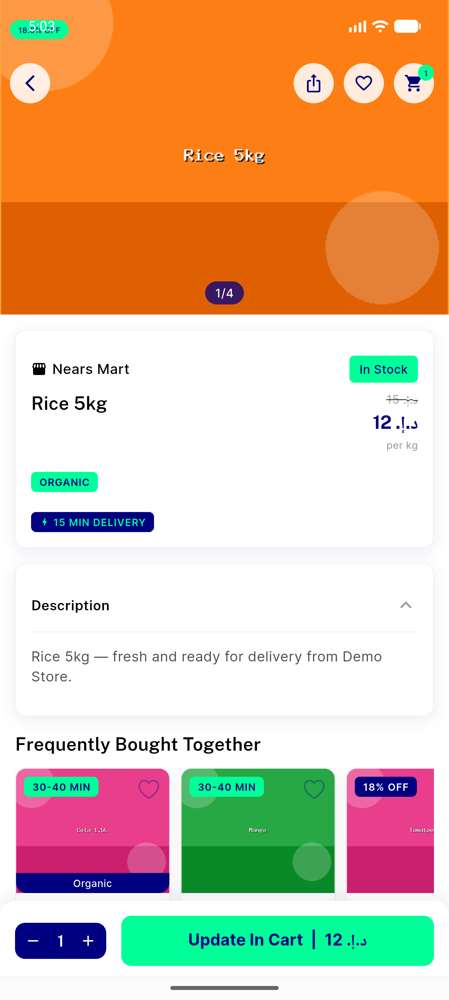
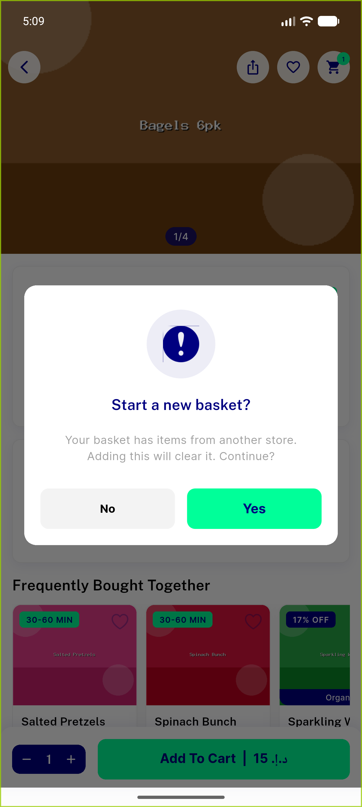
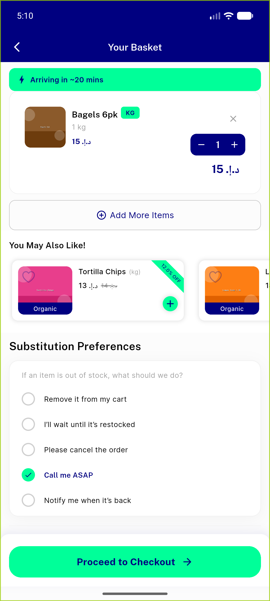
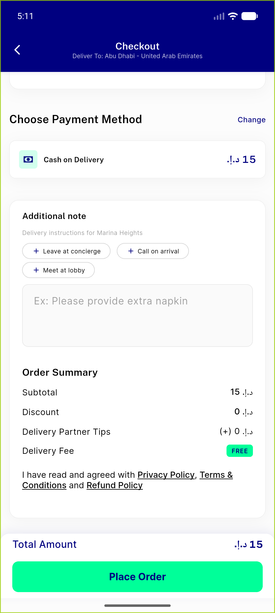
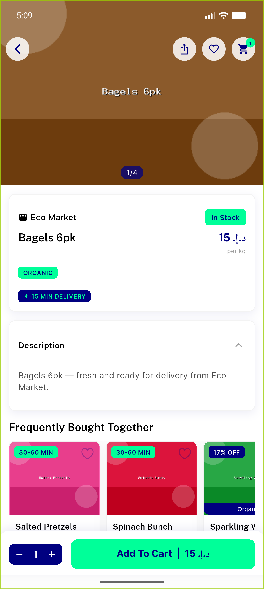
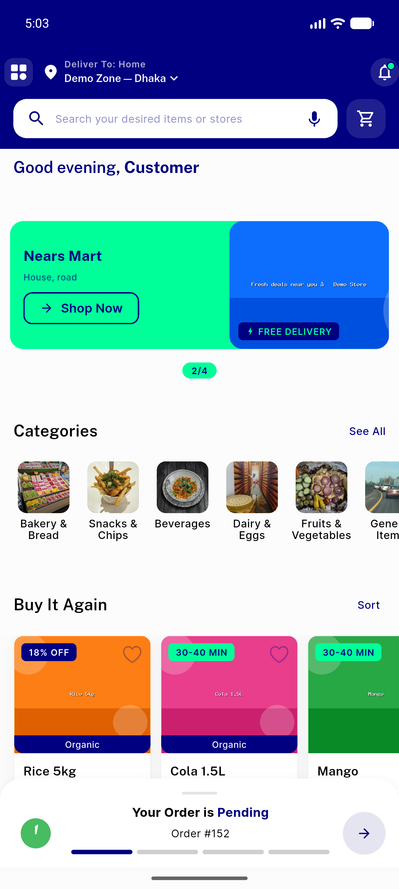

# QA Evidence — NEARS-324

**PASS — item MVVM refactor (Tier-1): price parity, cross-store reset, update-in-cart, cart+checkout pricing all byte-identical; 434 tests green**

**7 screenshot(s).** Click any thumbnail for full resolution.

<table>
<tr>
<td align="center" width="33%"> item detail discounted price 12 15</td>
<td align="center" width="33%"> cross store reset dialog</td>
<td align="center" width="33%"> cart after reset single store</td>
</tr>
<tr>
<td align="center" width="33%"> checkout pricing breakdown</td>
<td align="center" width="33%"> update in cart discounted 22 27</td>
<td align="center" width="33%"> item detail add to cart 15</td>
</tr>
<tr>
<td align="center" width="33%"> item cards discount badges</td>
</tr>
</table>

---
*From `nears/docs/qa-evidence/NEARS-324/` · public-repo scrub policy (no live secrets; verified clean).*
