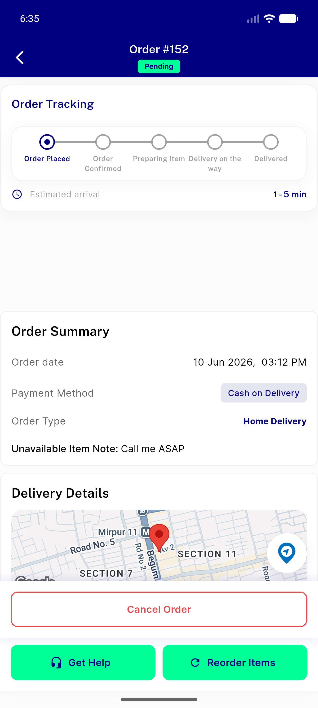
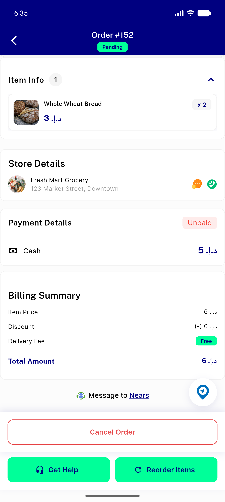
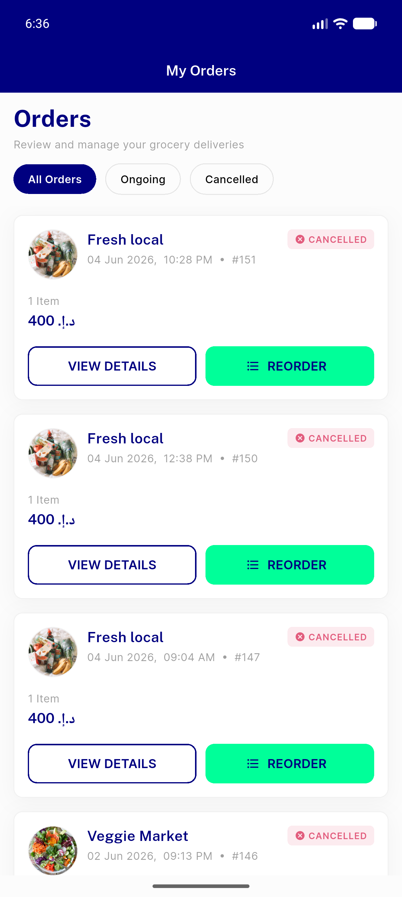
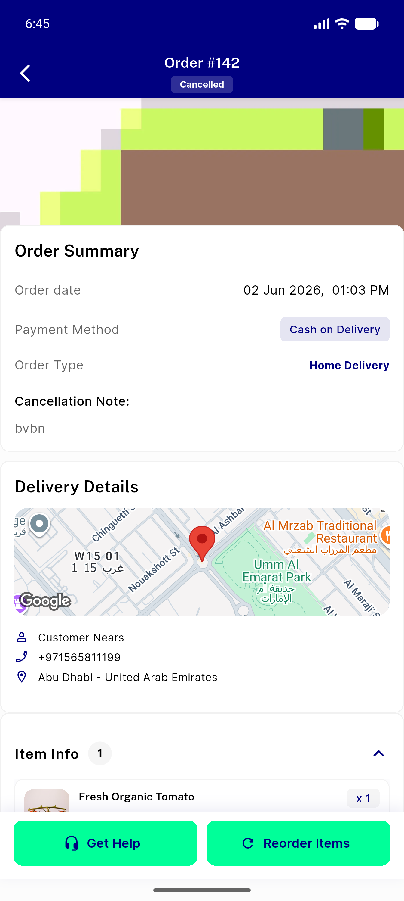
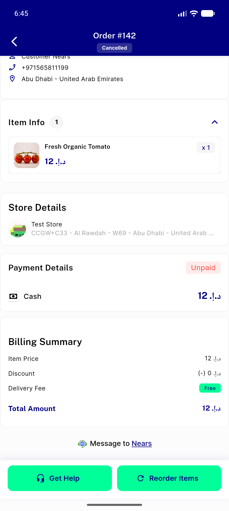
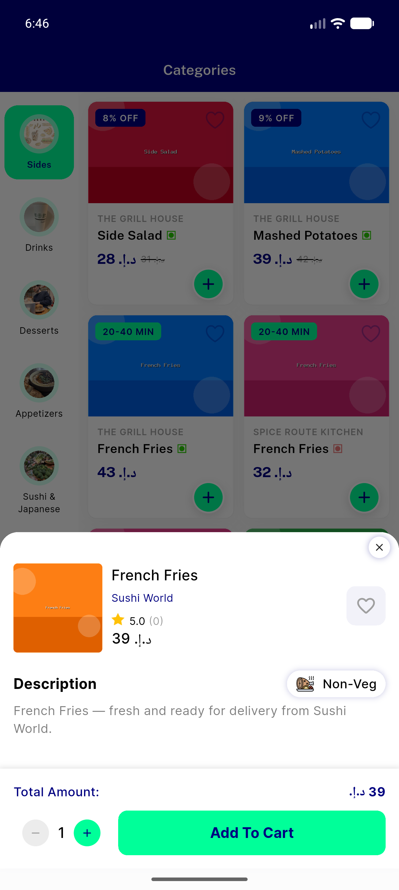
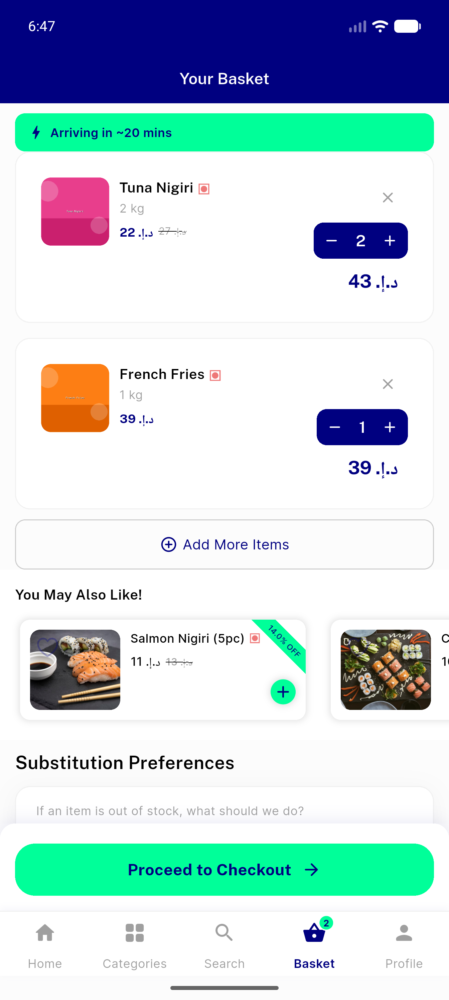
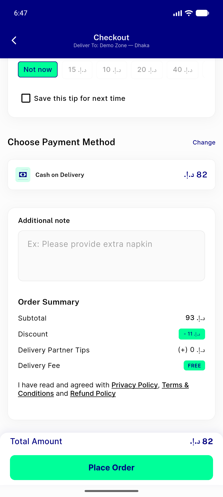

# QA Evidence — NEARS-325

**PASS — order MVVM verbatim move; breakdown+button-matrix+shared-pricing verified live; rich/COD/parcel paths pin-covered**

**8 screenshot(s).** Click any thumbnail for full resolution.

<table>
<tr>
<td align="center" width="33%"> pending order 152 tracking</td>
<td align="center" width="33%"> pending order 152 billing</td>
<td align="center" width="33%"> order list</td>
</tr>
<tr>
<td align="center" width="33%"> canceled order 142 details</td>
<td align="center" width="33%"> canceled order 142 billing</td>
<td align="center" width="33%"> item details</td>
</tr>
<tr>
<td align="center" width="33%"> cart</td>
<td align="center" width="33%"> checkout billing</td>
</tr>
</table>

---
*From `nears/docs/qa-evidence/NEARS-325/` · public-repo scrub policy (no live secrets; verified clean).*
