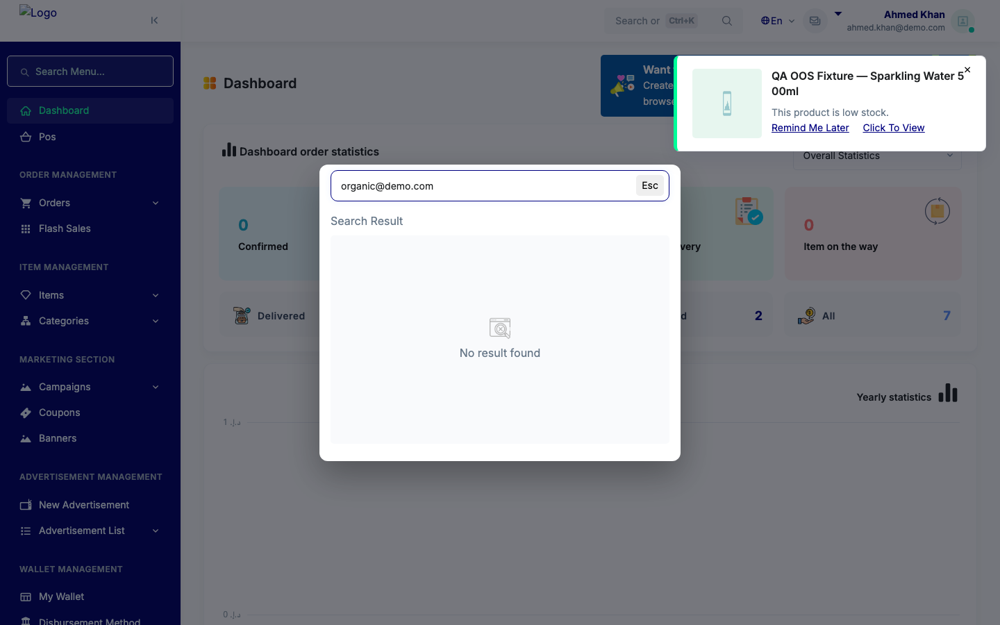
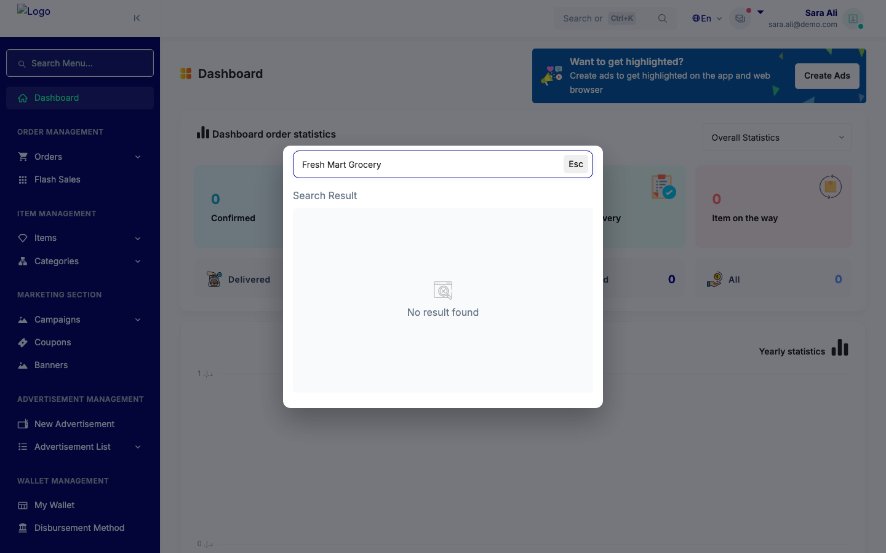
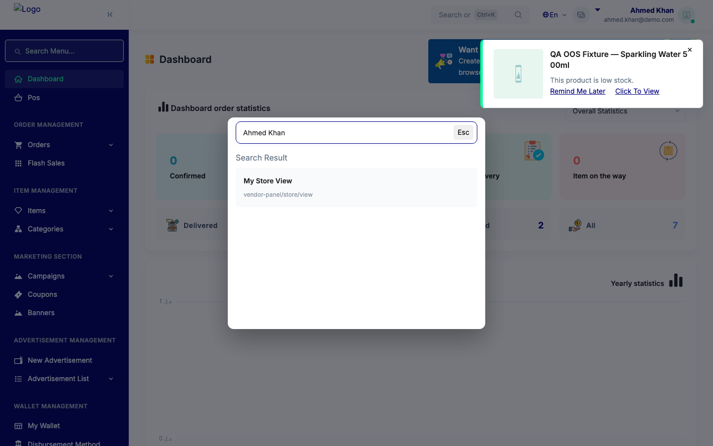
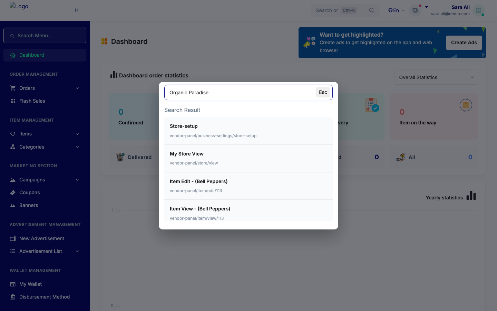
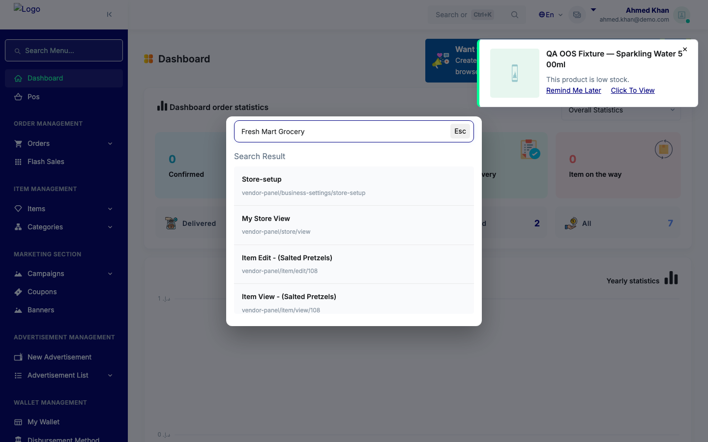
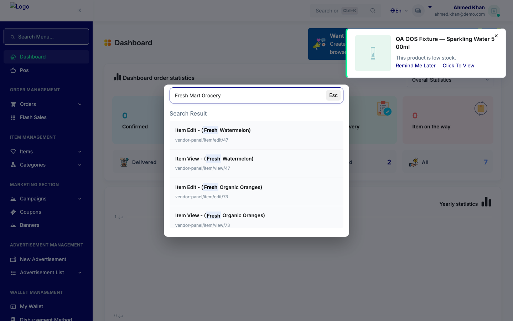
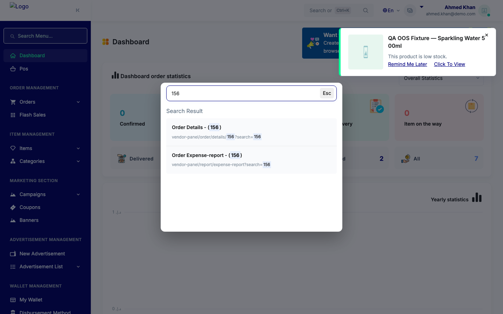

# QA Evidence — NEARS-3257

**PASS - VendorSearchDefinitions store-scope fix verified live (cross-tenant blocked both directions, own-store match preserved)**

**11 screenshot(s).** Click any thumbnail for full resolution.

<table>
<tr>
<td align="center" width="33%"> ac1 crosstenant address blocked</td>
<td align="center" width="33%"> ac1 crosstenant email blocked</td>
<td align="center" width="33%"> ac1 crosstenant name blocked</td>
</tr>
<tr>
<td align="center" width="33%"> ac1 crosstenant vendorname blocked</td>
<td align="center" width="33%"> ac1 reverse crosstenant blocked</td>
<td align="center" width="33%"> ac2 own email match</td>
</tr>
<tr>
<td align="center" width="33%"> ac2 own vendorname match</td>
<td align="center" width="33%"> ac2 reverse own match</td>
<td align="center" width="33%"> ac2 settings info own store</td>
</tr>
<tr>
<td align="center" width="33%"> ac2 settings own store</td>
<td align="center" width="33%"> regression order numeric search</td>
</tr>
</table>

---
*From `nears/docs/qa-evidence/NEARS-3257/` · public-repo scrub policy (no live secrets; verified clean).*
