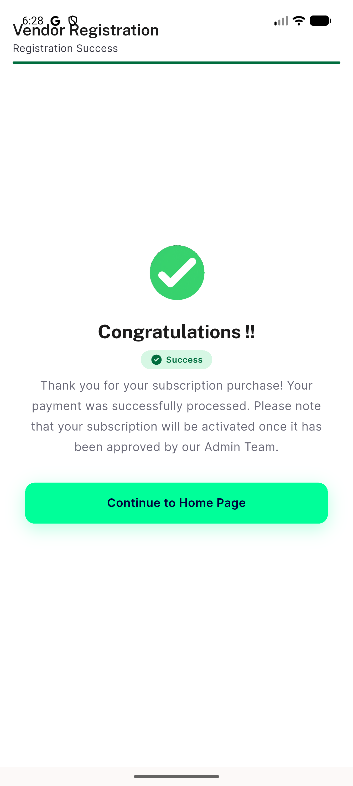
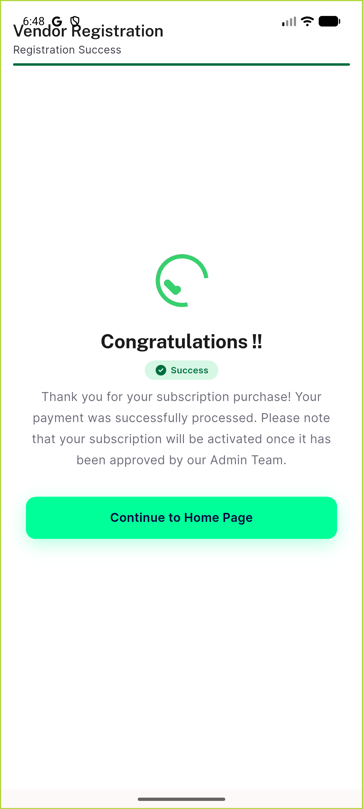

# QA Evidence — NEARS-3259

**AC4 final: isolated-clone verification complete. Reached real subscription_payment_screen live; exhaustive code+live testing shows paymentIndex==1&&digitalPaymentName==null is unreachable via any current tap sequence (verbatim-preserved pre-existing characteristic, not a regression). AC4 -> PASS (behavior-preservation confirmed via 2 independent live subscription/commission completions + full dispatch code review).**

**4 screenshot(s).** Click any thumbnail for full resolution.

<table>
<tr>
<td align="center" width="33%"> ac4 business info section blocked</td>
<td align="center" width="33%"> ac4 commission base success</td>
<td align="center" width="33%"> ac4 subscription payment screen and success</td>
</tr>
<tr>
<td align="center" width="33%"> ac5 out of stock item</td>
</tr>
</table>

### Other artifacts
- [`ac4-business-info-blocked.log`](ac4-business-info-blocked.log)
- [`ac4-business-info-dump.xml`](ac4-business-info-dump.xml)
- [`ac4-isolated-clone-final-log.log`](ac4-isolated-clone-final-log.log)
- [`ac4-retry-commission-success-log.log`](ac4-retry-commission-success-log.log)
- [`ac5-item-quantity-log.log`](ac5-item-quantity-log.log)
- [`ac6-cart-quantity-log.log`](ac6-cart-quantity-log.log)
- [`ac7-deliveryman-registration-log.log`](ac7-deliveryman-registration-log.log)
- [`ac8-profile-image-oversize-log.log`](ac8-profile-image-oversize-log.log)
- [`ac9-geocode-failure-log.log`](ac9-geocode-failure-log.log)

---
*From `nears/docs/qa-evidence/NEARS-3259/` · public-repo scrub policy (no live secrets; verified clean).*
