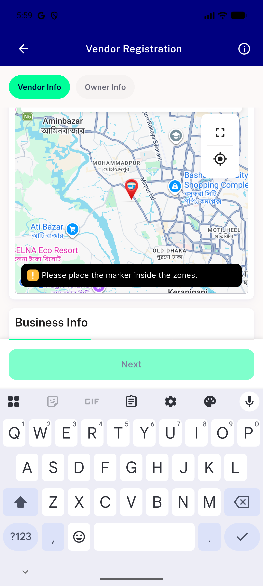
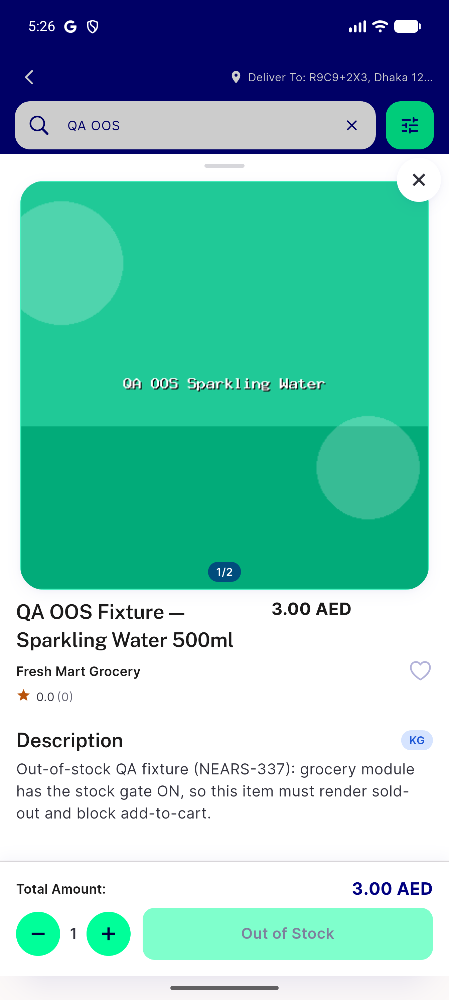

# QA Evidence — NEARS-3259

**8/9 ACs PASS live+code-confirmed, AC4 UNVERIFIABLE (blocked by unrelated pre-existing rendering issue), 1 pre-existing unrelated test failure**

**2 screenshot(s).** Click any thumbnail for full resolution.

<table>
<tr>
<td align="center" width="33%"> ac4 business info section blocked</td>
<td align="center" width="33%"> ac5 out of stock item</td>
</tr>
</table>

### Other artifacts
- [`ac4-business-info-blocked.log`](ac4-business-info-blocked.log)
- [`ac4-business-info-dump.xml`](ac4-business-info-dump.xml)
- [`ac5-item-quantity-log.log`](ac5-item-quantity-log.log)
- [`ac6-cart-quantity-log.log`](ac6-cart-quantity-log.log)
- [`ac7-deliveryman-registration-log.log`](ac7-deliveryman-registration-log.log)
- [`ac8-profile-image-oversize-log.log`](ac8-profile-image-oversize-log.log)
- [`ac9-geocode-failure-log.log`](ac9-geocode-failure-log.log)

---
*From `nears/docs/qa-evidence/NEARS-3259/` · public-repo scrub policy (no live secrets; verified clean).*
