# QA Evidence — NEARS-326

**PASS — parcel MVVM verbatim-move: live parcel flow seed-blocked (NEARS-337, pin-covered 49 tests); shared PricingService consumers verified live; 203 tests green; 0 new DB rows**

**14 screenshot(s).** Click any thumbnail for full resolution.

<table>
<tr>
<td align="center" width="33%"><a href="01-home-boot.png">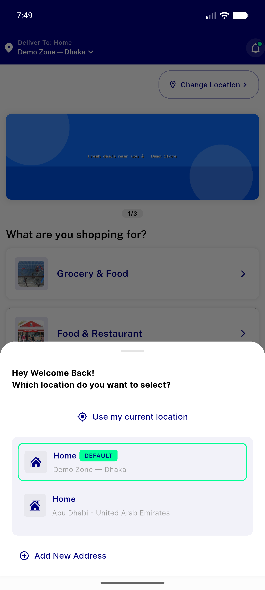</a> home boot</td>
<td align="center" width="33%"><a href="02-home-no-parcel-module.png">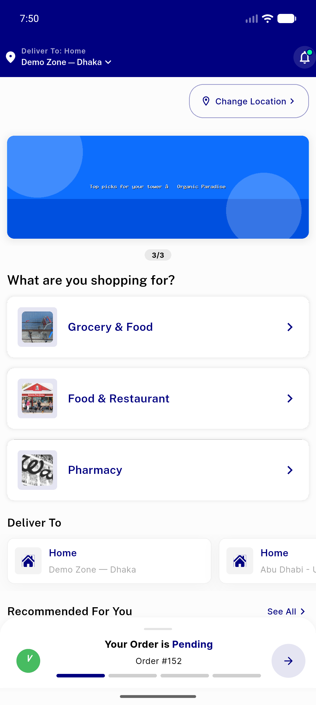</a> home no parcel module</td>
<td align="center" width="33%"> order 152 summary</td>
</tr>
<tr>
<td align="center" width="33%"><a href="04-order-152-billing-full.png">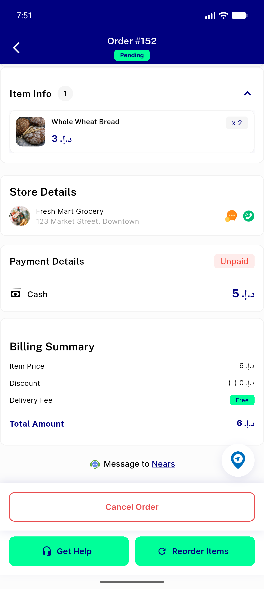</a> order 152 billing full</td>
<td align="center" width="33%"><a href="05-cart-pricing.png">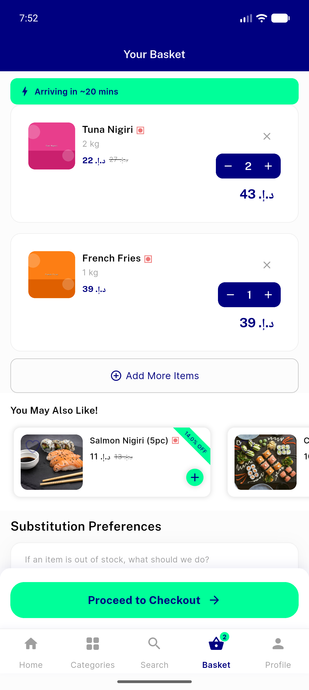</a> cart pricing</td>
<td align="center" width="33%"><a href="06-cart-totals.png">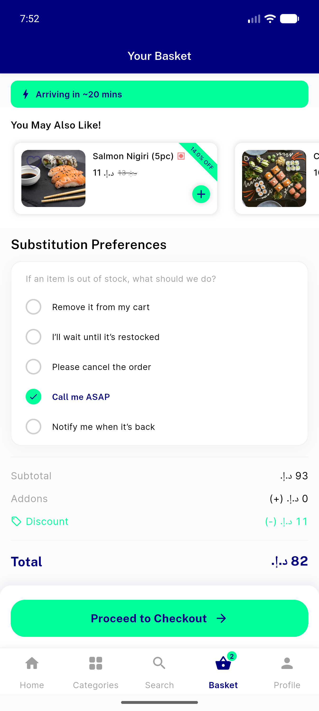</a> cart totals</td>
</tr>
<tr>
<td align="center" width="33%"><a href="07-checkout-totals.png">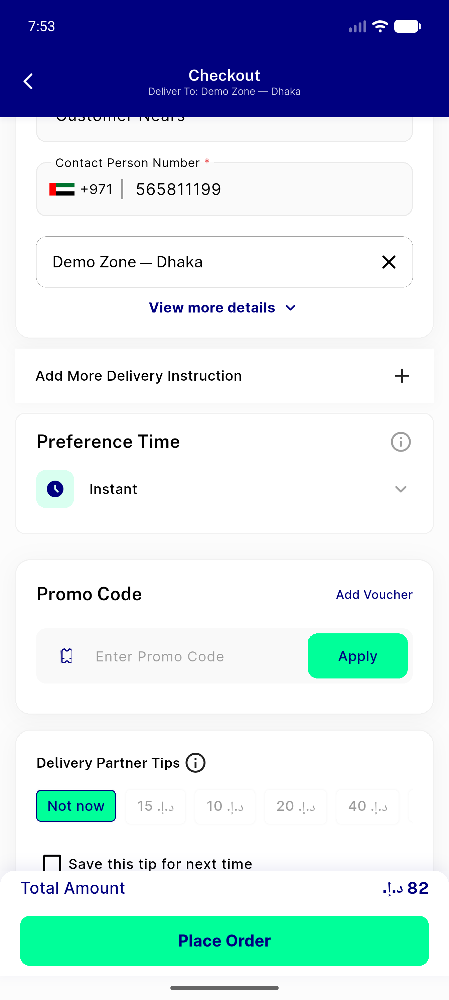</a> checkout totals</td>
<td align="center" width="33%"><a href="08-checkout-billing.png">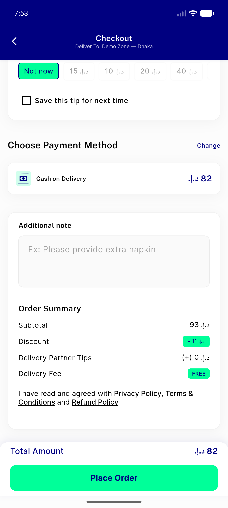</a> checkout billing</td>
<td align="center" width="33%"><a href="09-food-module-fresh-finds.png">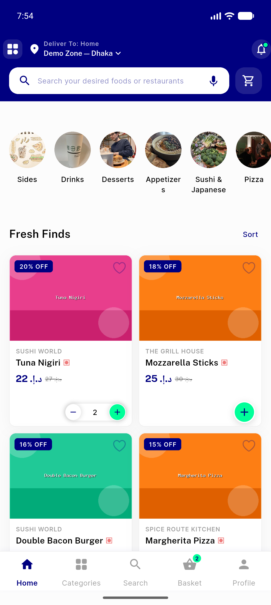</a> food module fresh finds</td>
</tr>
<tr>
<td align="center" width="33%"><a href="10-food-module-semantics-dead.png">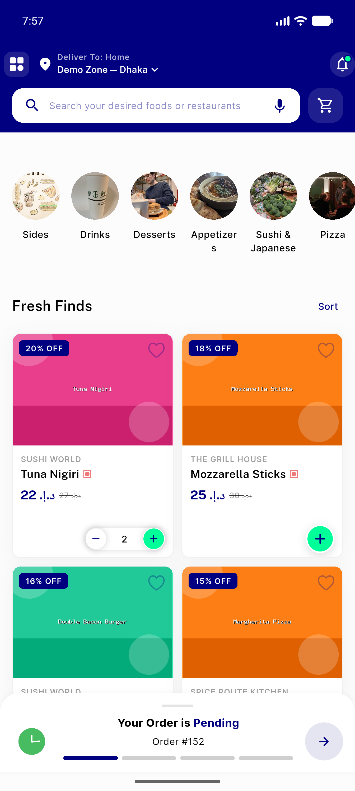</a> food module semantics dead</td>
<td align="center" width="33%"><a href="11-item-details.png">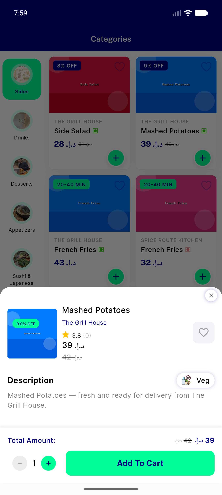</a> item details</td>
<td align="center" width="33%"><a href="12-profile.png">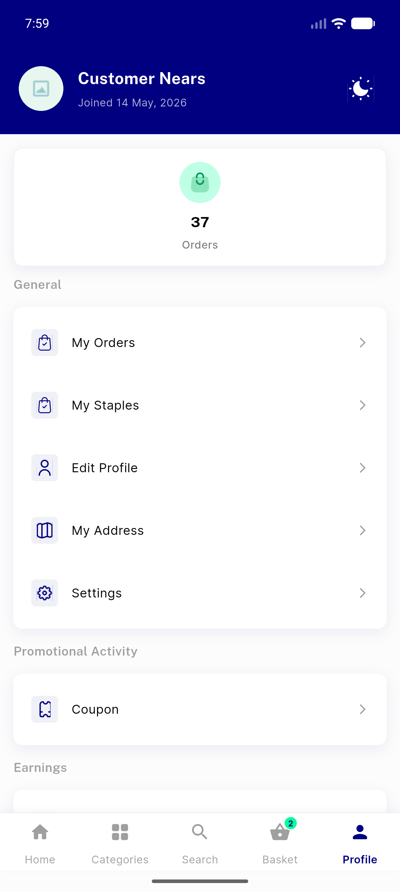</a> profile</td>
</tr>
<tr>
<td align="center" width="33%"><a href="13-address-list.png">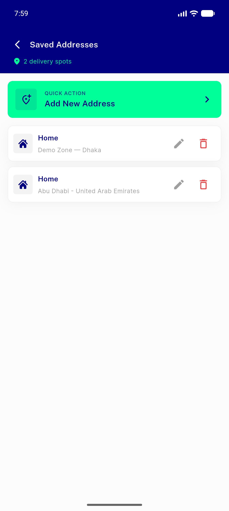</a> address list</td>
<td align="center" width="33%"><a href="14-profile-wallet.png">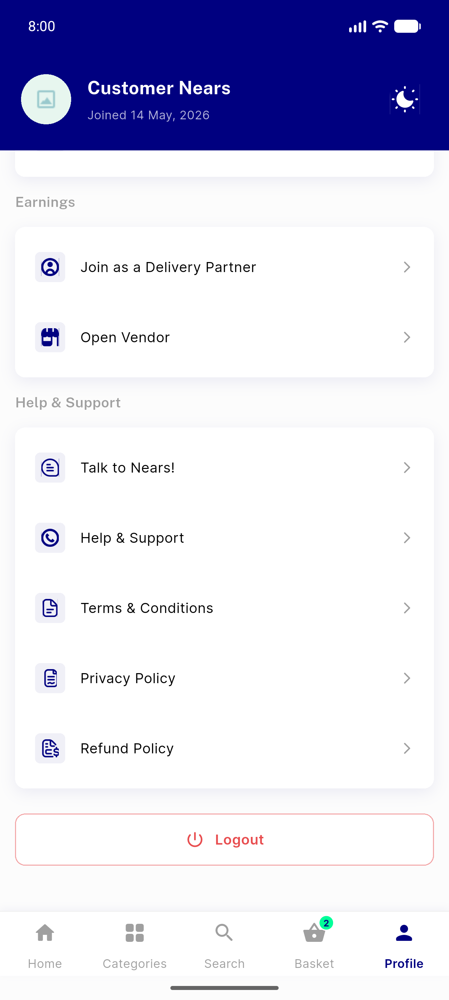</a> profile wallet</td>
</tr>
</table>

---
*From `nears/docs/qa-evidence/NEARS-326/` · public-repo scrub policy (no live secrets; verified clean).*
