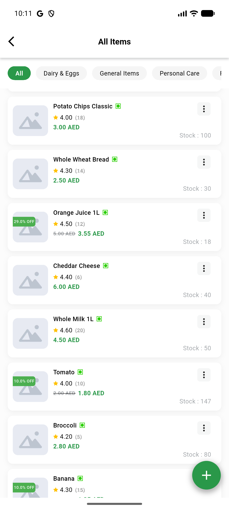

# QA Evidence — NEARS-3262

**PASS — VendorApp ItemModel.fromJson offset cast fix verified live, no regression**

**1 screenshot(s).** Click any thumbnail for full resolution.

<table>
<tr>
<td align="center" width="33%"> all items loaded</td>
</tr>
</table>

---
*From `nears/docs/qa-evidence/NEARS-3262/` · public-repo scrub policy (no live secrets; verified clean).*
