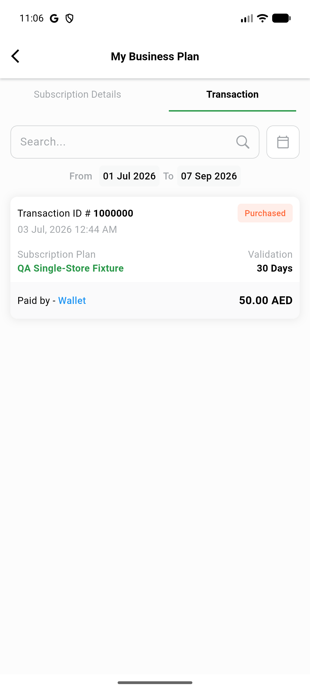

# QA Evidence — NEARS-3263

**PASS — VendorApp subscription-transaction offset cast fix verified live (fix-cycle 1)**

**1 screenshot(s).** Click any thumbnail for full resolution.

<table>
<tr>
<td align="center" width="33%"> ac1 transaction list rendered</td>
</tr>
</table>

### Other artifacts
- [`ac2-positive-control-prefix-crash.log`](ac2-positive-control-prefix-crash.log)
- [`ac2-postfix-clean.log`](ac2-postfix-clean.log)

---
*From `nears/docs/qa-evidence/NEARS-3263/` · public-repo scrub policy (no live secrets; verified clean).*
