# QA Evidence — NEARS-327

**PASS — auth MVVM (Tier-2): manual login + post-auth routing + remember-me ON/OFF + validation walls (sign-up/store/dm) all behave identically; regression clean; 0 net-new rows**

**23 screenshot(s).** Click any thumbnail for full resolution.

<table>
<tr>
<td align="center" width="33%"><a href="00_initial_home_loggedin.png">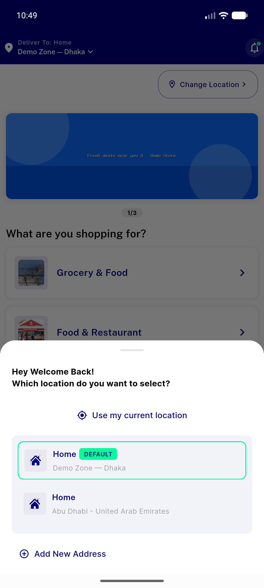</a> initial home loggedin</td>
<td align="center" width="33%"><a href="02_navbar_visible.png">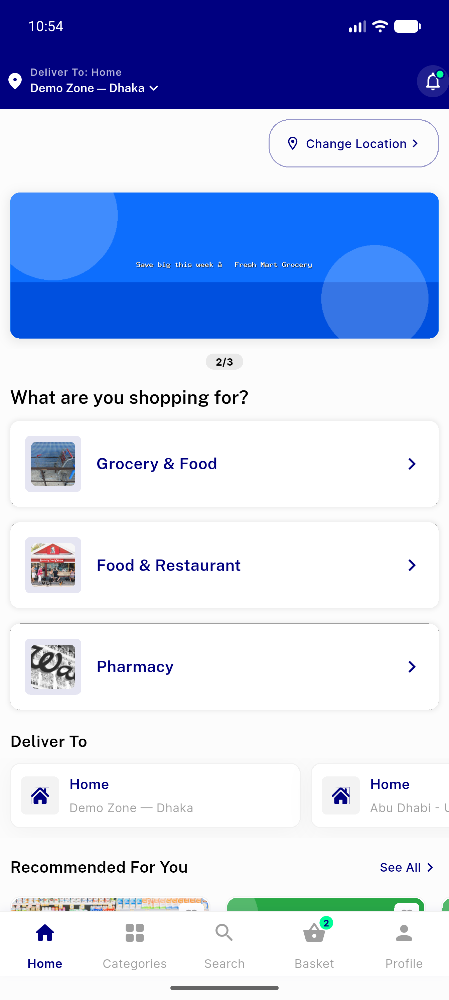</a> navbar visible</td>
<td align="center" width="33%"><a href="05_location_or_signin.png">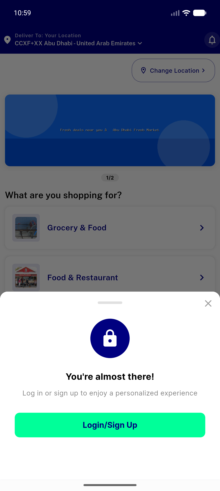</a> location or signin</td>
</tr>
<tr>
<td align="center" width="33%"><a href="06_signin_screen.png">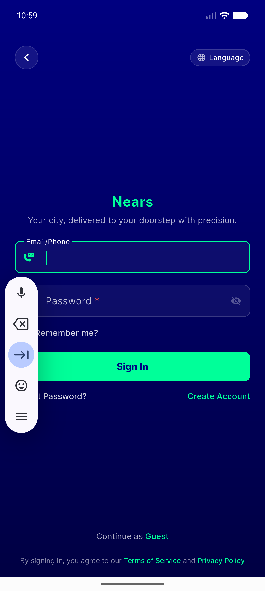</a> signin screen</td>
<td align="center" width="33%"><a href="07_invalid_phone.png">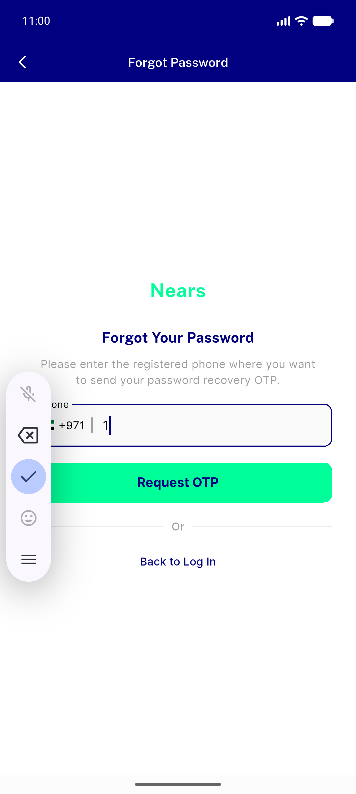</a> invalid phone</td>
<td align="center" width="33%"><a href="09_back_to_signin.png">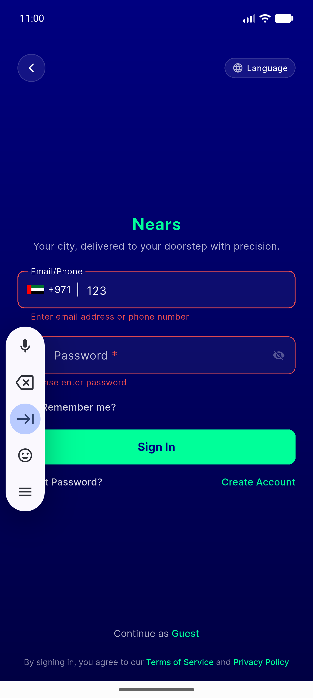</a> back to signin</td>
</tr>
<tr>
<td align="center" width="33%"><a href="12_wrongcreds_snackbar.png">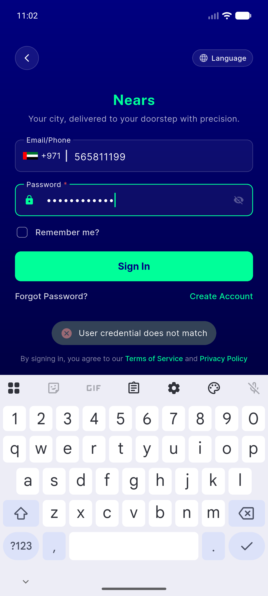</a> wrongcreds snackbar</td>
<td align="center" width="33%"><a href="15_logout_confirm.png">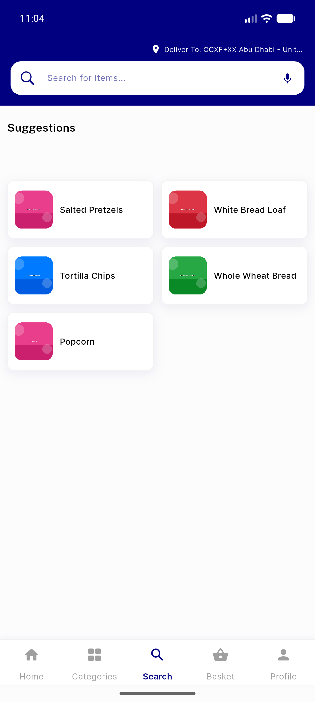</a> logout confirm</td>
<td align="center" width="33%"><a href="17_after_logout.png">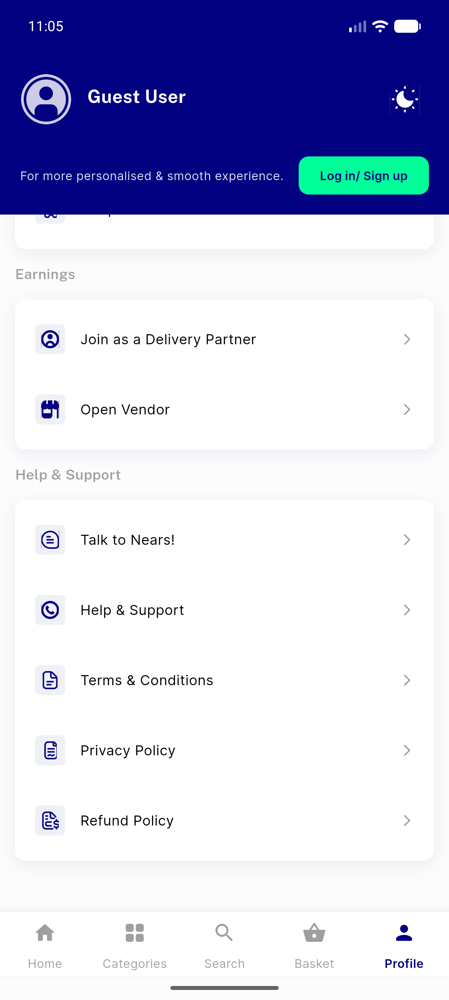</a> after logout</td>
</tr>
<tr>
<td align="center" width="33%"><a href="18_signin_prefilled.png">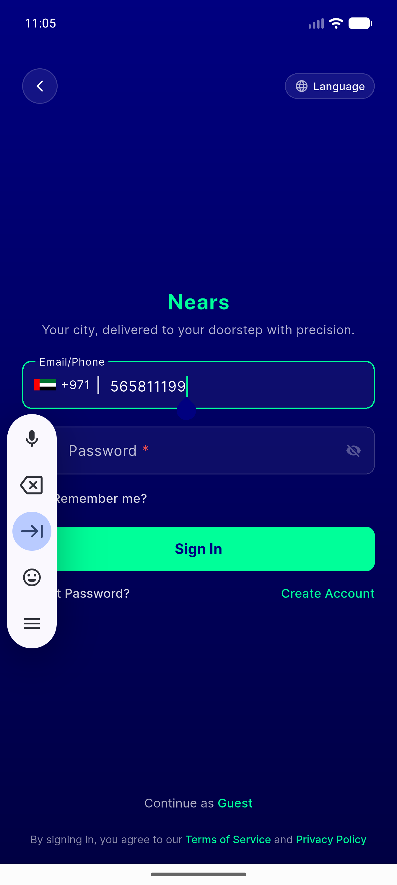</a> signin prefilled</td>
<td align="center" width="33%"><a href="20_signin_cleared.png">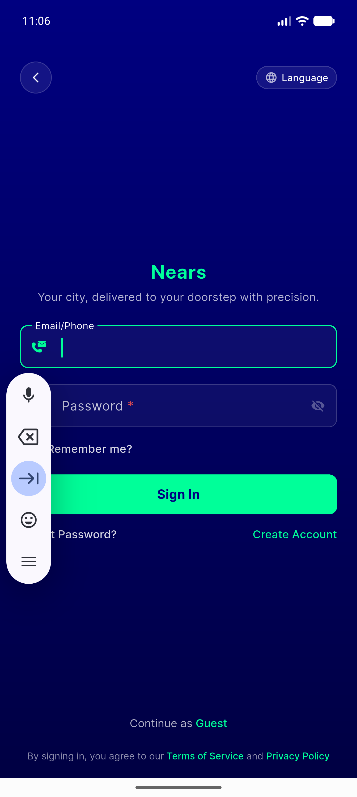</a> signin cleared</td>
<td align="center" width="33%"><a href="26_signup_shortpass.png">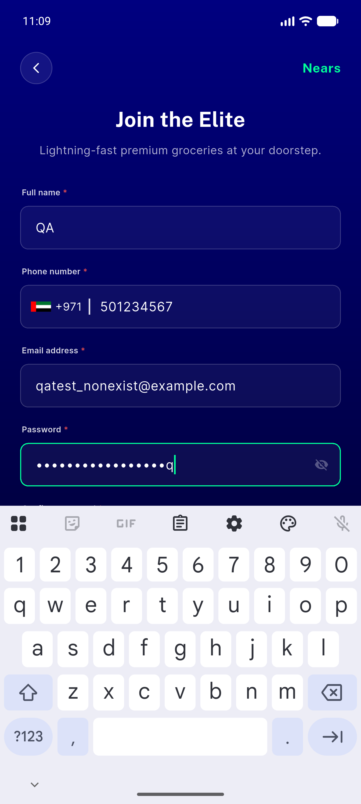</a> signup shortpass</td>
</tr>
<tr>
<td align="center" width="33%"><a href="27_signup_pwd_short_snackbar.png">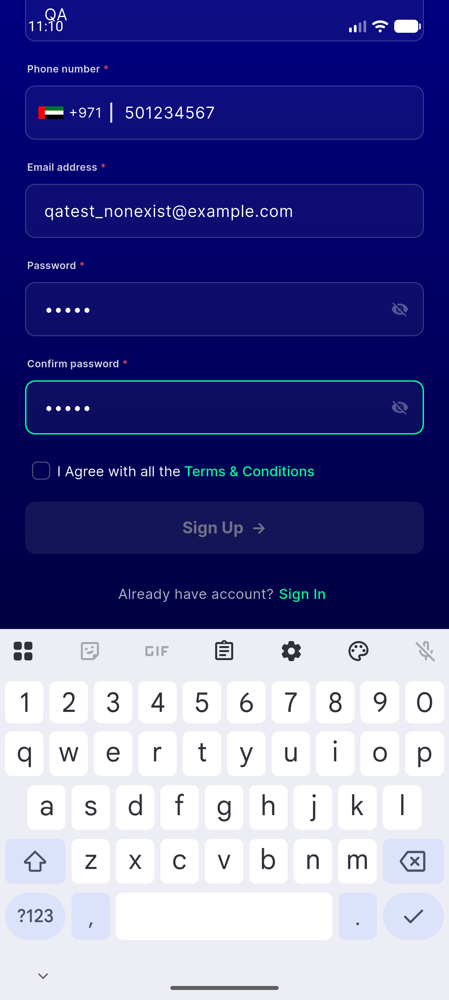</a> signup pwd short snackbar</td>
<td align="center" width="33%"><a href="28_terms_checked.png">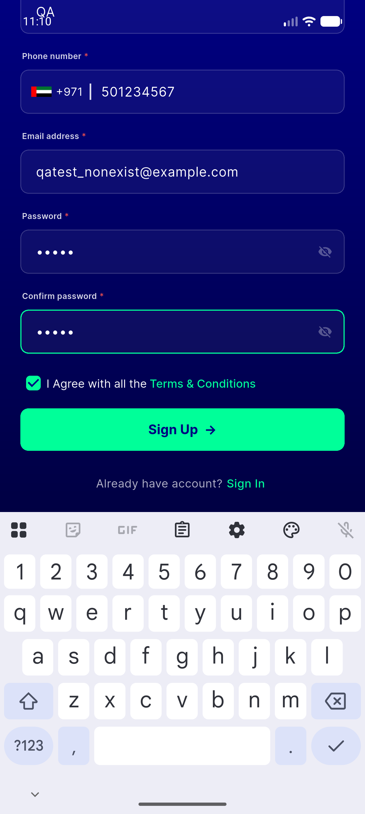</a> terms checked</td>
<td align="center" width="33%"> pwd8 snackbar</td>
</tr>
<tr>
<td align="center" width="33%"><a href="34_store_validation_snackbar.png">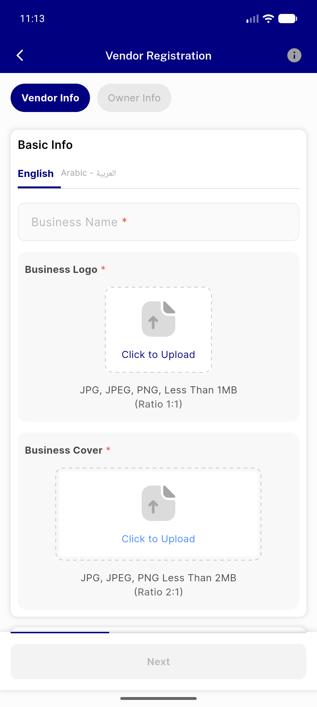</a> store validation snackbar</td>
<td align="center" width="33%"><a href="35_store_owner_info.png">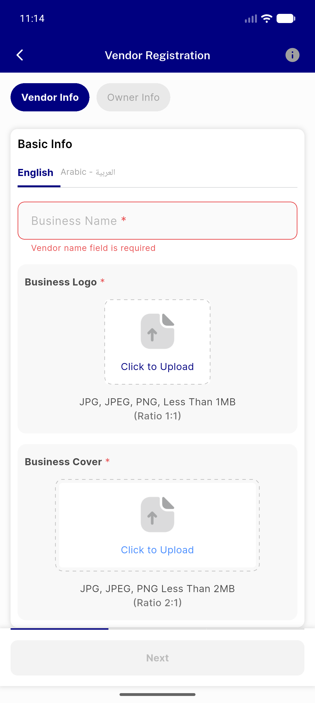</a> store owner info</td>
<td align="center" width="33%"><a href="39_dm_validation.png">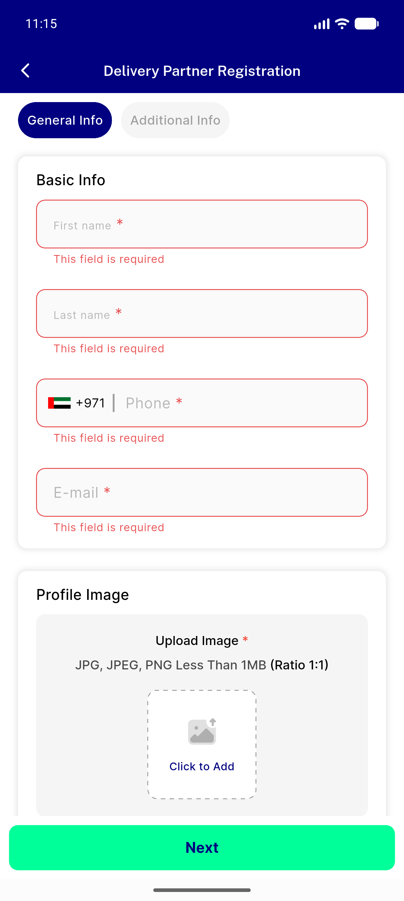</a> dm validation</td>
</tr>
<tr>
<td align="center" width="33%"><a href="43_dm_snack_b.png">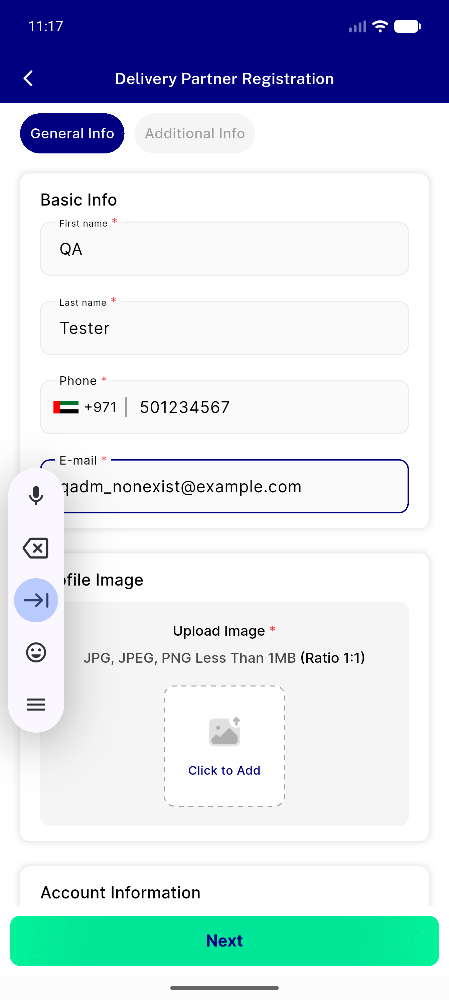</a> dm snack b</td>
<td align="center" width="33%"><a href="44_home_loggedin.png">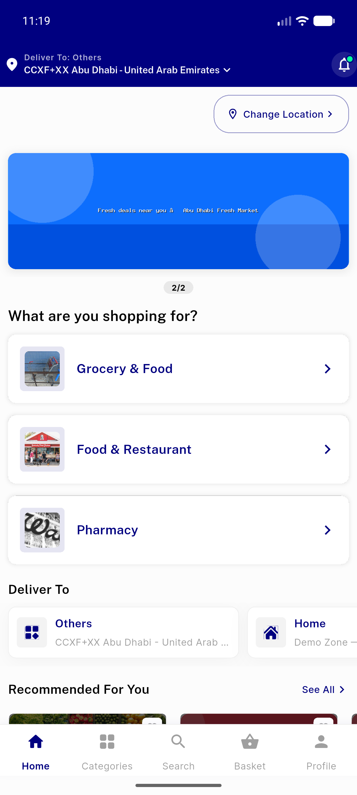</a> home loggedin</td>
<td align="center" width="33%"><a href="45_basket.png">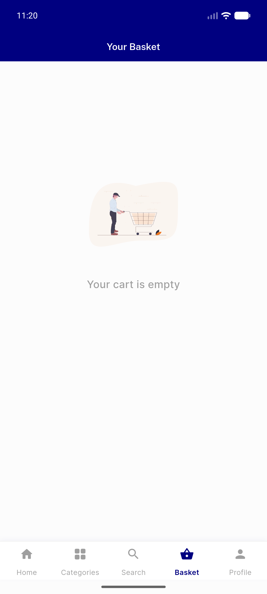</a> basket</td>
</tr>
<tr>
<td align="center" width="33%"><a href="46_grocery_module.png">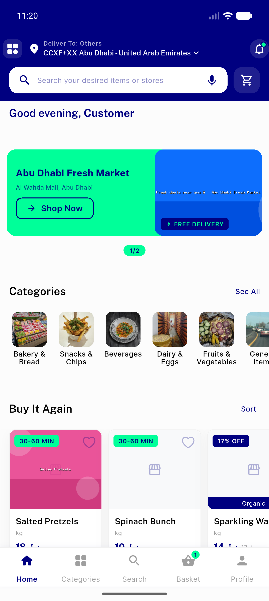</a> grocery module</td>
<td align="center" width="33%"><a href="47_item_detail.png">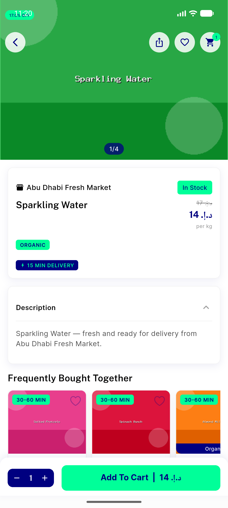</a> item detail</td>
</tr>
</table>

---
*From `nears/docs/qa-evidence/NEARS-327/` · public-repo scrub policy (no live secrets; verified clean).*
