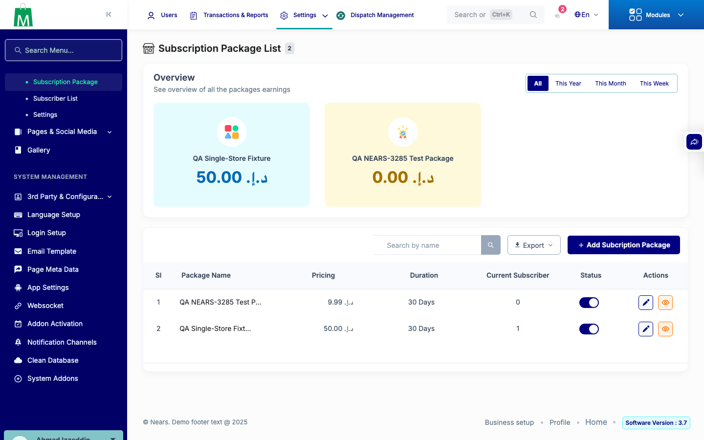
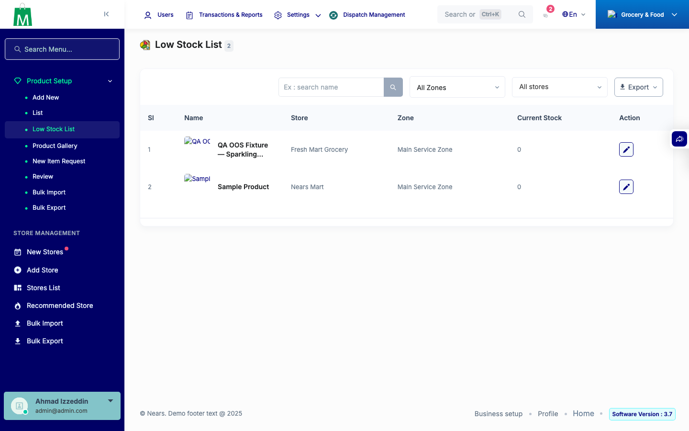
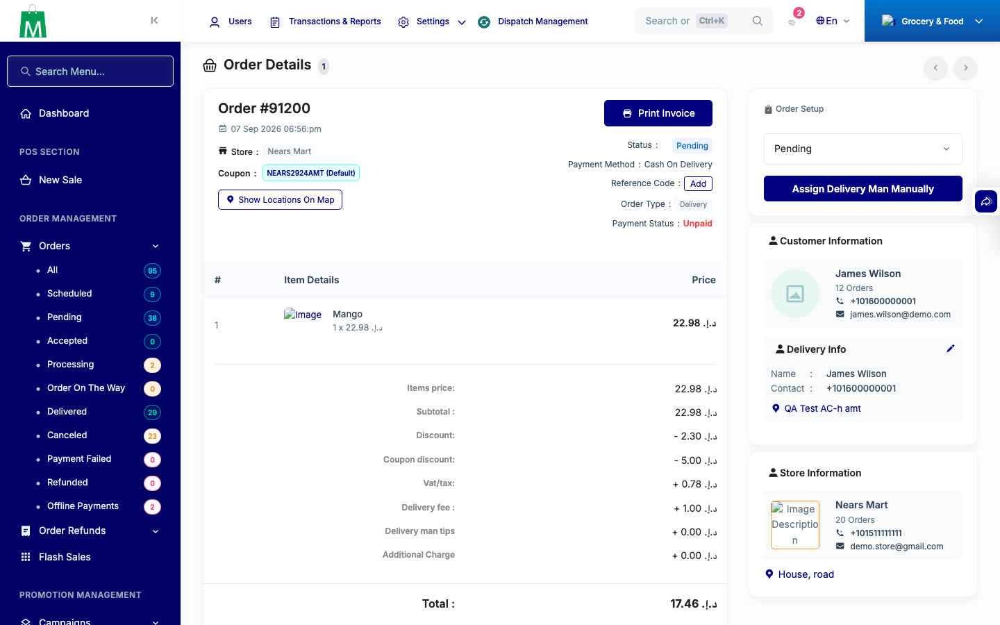

# QA Evidence — NEARS-3285

**PASS — 22 route/action pairs repaired: 20 removed routes 404/405 (no 500), 2 fixed routes verified via stock-report export; subscriptionackage 6 CRUD verbs green; gate test green**

**4 screenshot(s).** Click any thumbnail for full resolution.

<table>
<tr>
<td align="center" width="33%"> ac subscriptionackage index</td>
<td align="center" width="33%"> ac1 stock report page</td>
<td align="center" width="33%"> bug preexisting file manager 500</td>
</tr>
<tr>
<td align="center" width="33%"> regression order view</td>
</tr>
</table>

---
*From `nears/docs/qa-evidence/NEARS-3285/` · public-repo scrub policy (no live secrets; verified clean).*
