# QA Evidence — NEARS-329

**PASS — address MVVM verbatim-move: validation wall #1-#4 live, map write-back, Others/level field, 612 tests green, no DB mutation**

**11 screenshot(s).** Click any thumbnail for full resolution.

<table>
<tr>
<td align="center" width="33%"><a href="01_saved_address_list.png">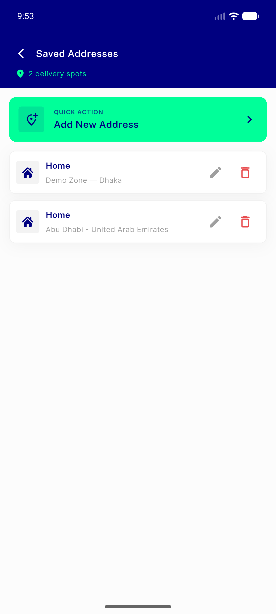</a> saved address list</td>
<td align="center" width="33%"><a href="02_add_address_form.png">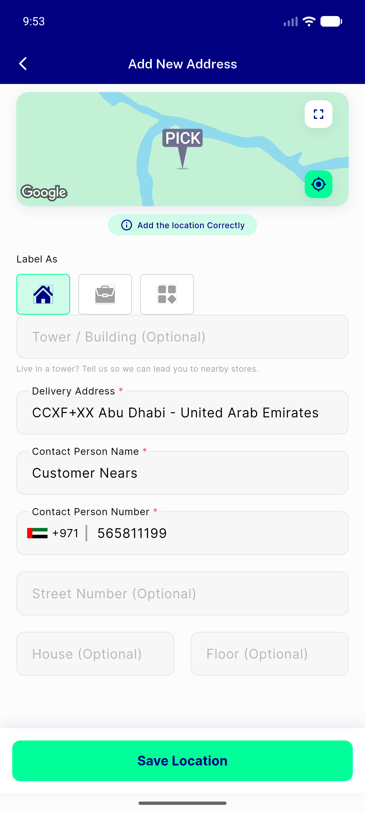</a> add address form</td>
<td align="center" width="33%"><a href="03_validation_empty_address.png">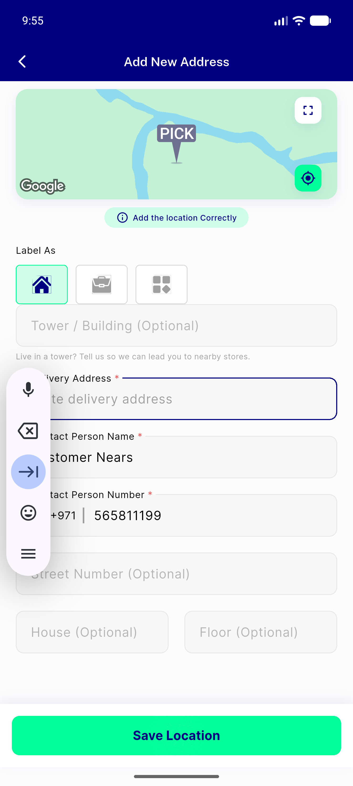</a> validation empty address</td>
</tr>
<tr>
<td align="center" width="33%"><a href="03b_snackbar_addr.png">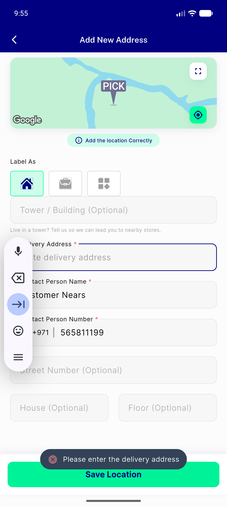</a> 03b snackbar addr</td>
<td align="center" width="33%"><a href="04_validation_empty_name.png">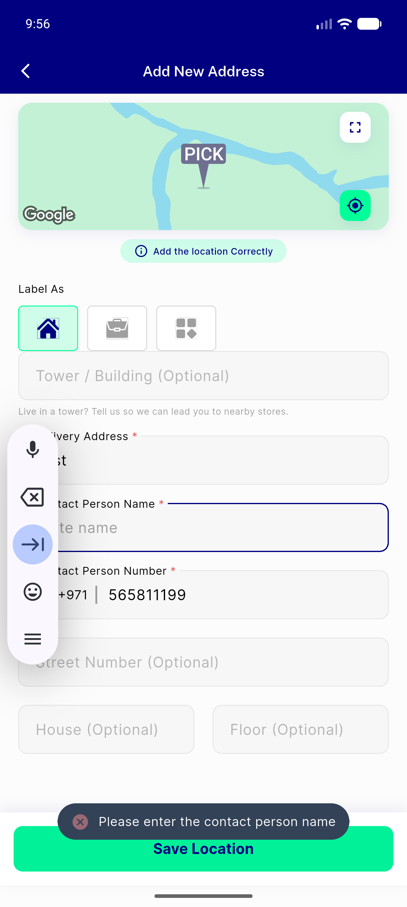</a> validation empty name</td>
<td align="center" width="33%"><a href="05_validation_empty_number.png">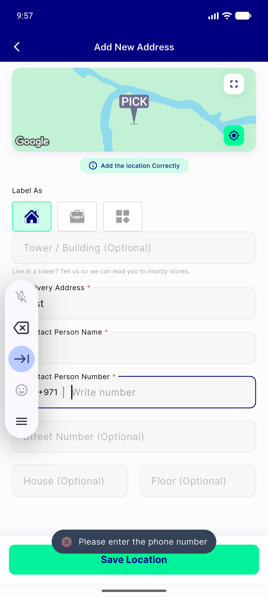</a> validation empty number</td>
</tr>
<tr>
<td align="center" width="33%"><a href="06_validation_invalid_phone.png">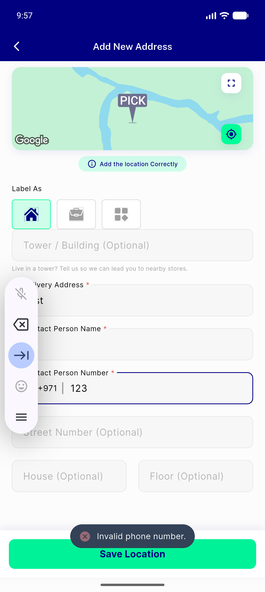</a> validation invalid phone</td>
<td align="center" width="33%"><a href="07_pick_map_screen.png">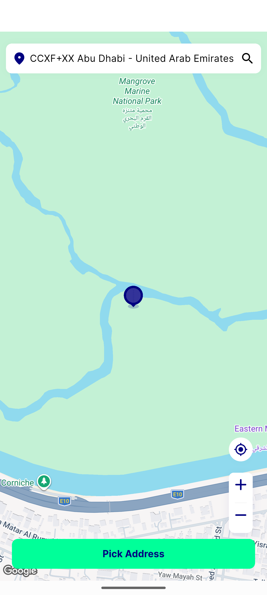</a> pick map screen</td>
<td align="center" width="33%"><a href="08_others_level_field.png">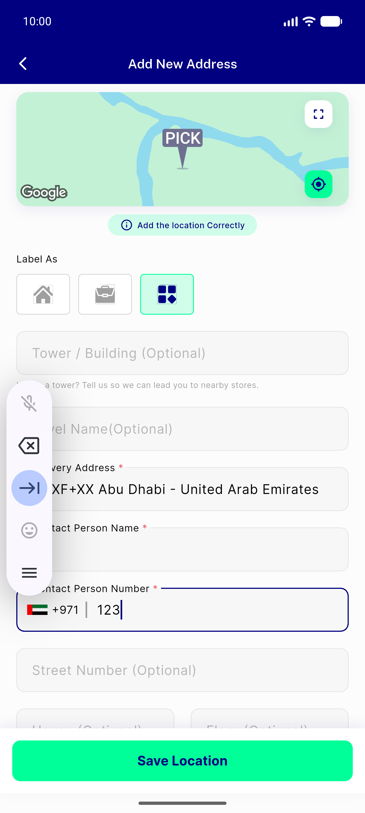</a> others level field</td>
</tr>
<tr>
<td align="center" width="33%"><a href="09_address_detail_edit.png">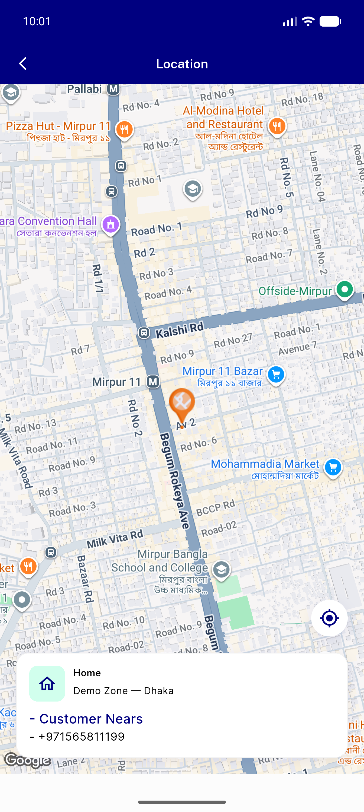</a> address detail edit</td>
<td align="center" width="33%"><a href="10_home_location_regression.png">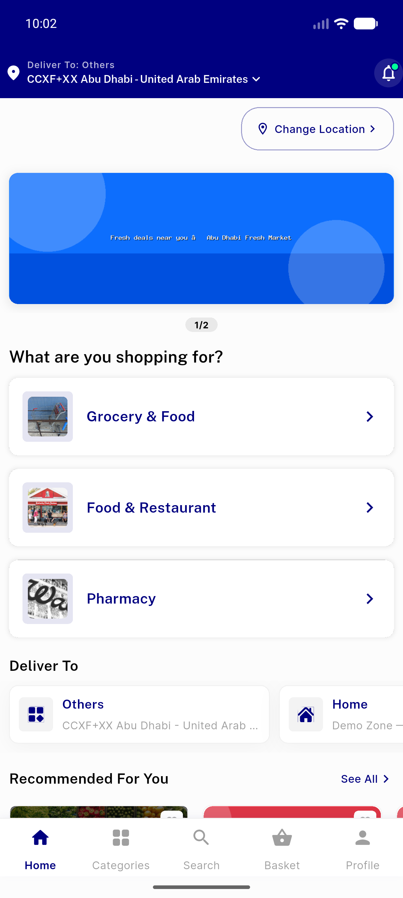</a> home location regression</td>
</tr>
</table>

---
*From `nears/docs/qa-evidence/NEARS-329/` · public-repo scrub policy (no live secrets; verified clean).*
