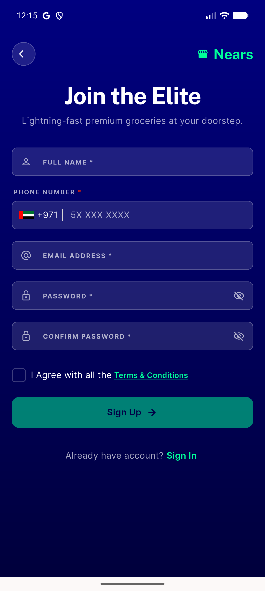

# QA Evidence — NEARS-3291

**PASS — 51/51 unit tests green, code-read + live-env corroboration for AC4, no live repro possible/needed (config-gated screen)**

**1 screenshot(s).** Click any thumbnail for full resolution.

<table>
<tr>
<td align="center" width="33%"> sign up screen fromSignUp flow</td>
</tr>
</table>

### Other artifacts
- [`flutter-test-run.log`](flutter-test-run.log)

---
*From `nears/docs/qa-evidence/NEARS-3291/` · public-repo scrub policy (no live secrets; verified clean).*
