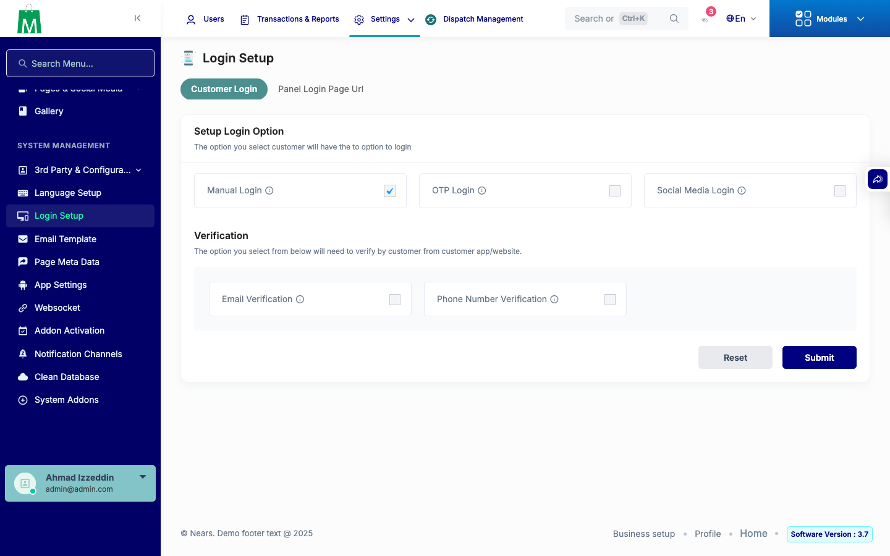
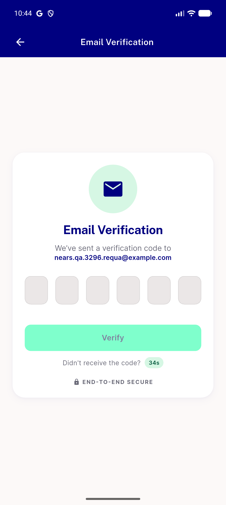
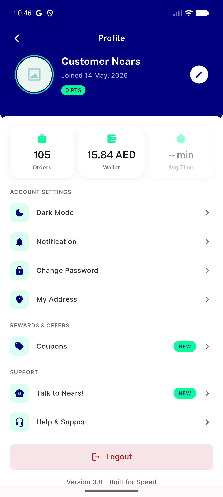
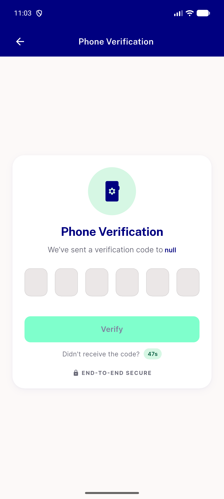
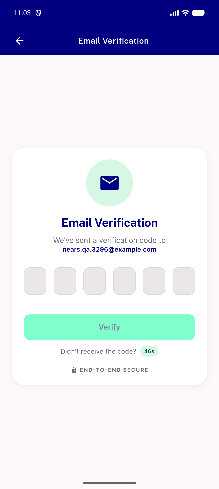
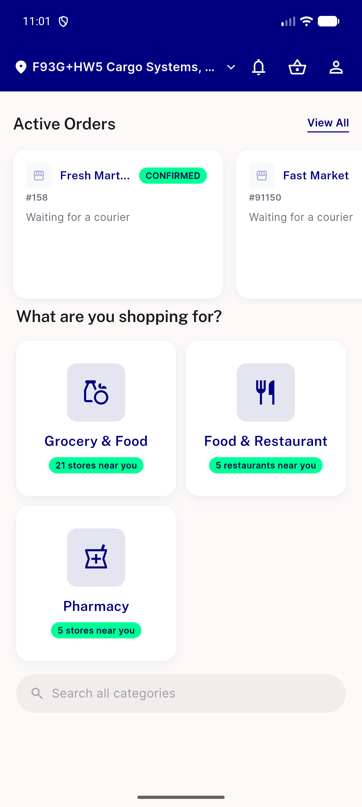

# QA Evidence — NEARS-3296

**PASS — AC1 re-verified live post-NEARS-3430 merge: unverified-email login lands on working Email Verification screen showing the real email; verified-account regression clean**

**7 screenshot(s).** Click any thumbnail for full resolution.

<table>
<tr>
<td align="center" width="33%"> login settings before</td>
<td align="center" width="33%"> email verification on</td>
<td align="center" width="33%"> email verification screen unverified account</td>
</tr>
<tr>
<td align="center" width="33%"> verified account regression home</td>
<td align="center" width="33%"> ac1 contrast prefix empty email phonechannel</td>
<td align="center" width="33%"> ac1 email verify screen</td>
</tr>
<tr>
<td align="center" width="33%"> regression email login proceeds</td>
</tr>
</table>

---
*From `nears/docs/qa-evidence/NEARS-3296/` · public-repo scrub policy (no live secrets; verified clean).*
