# QA Evidence — NEARS-330

**PASS — location MVVM verbatim-move: pick-from-map (in/out zone, fromAddAddress), use-current-location (in/out zone), DB-safe**

**13 screenshot(s).** Click any thumbnail for full resolution.

<table>
<tr>
<td align="center" width="33%"><a href="01-home-abudhabi.png">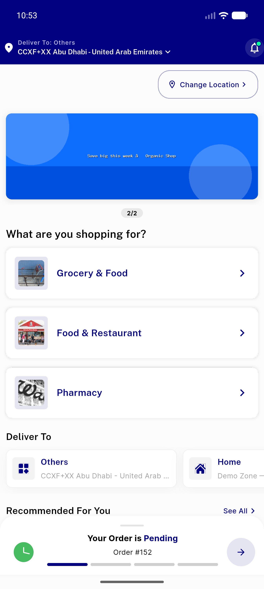</a> home abudhabi</td>
<td align="center" width="33%"><a href="02-set-location-sheet-saved-addresses.png">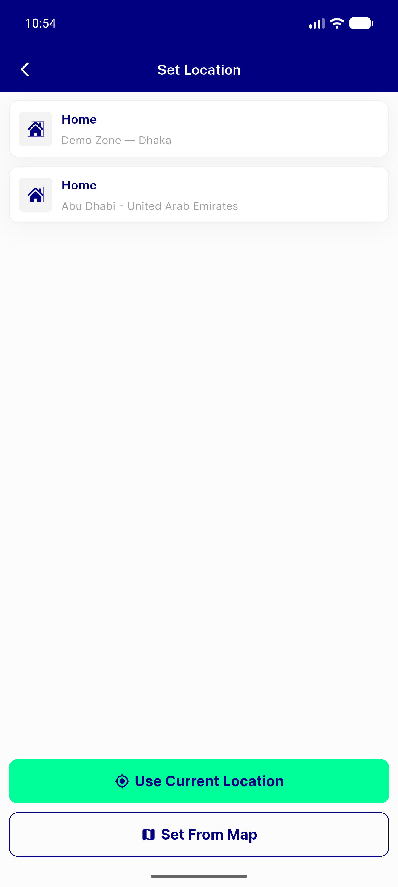</a> set location sheet saved addresses</td>
<td align="center" width="33%"> pickmap inzone abudhabi</td>
</tr>
<tr>
<td align="center" width="33%"><a href="04-pickmap-after-drag.png">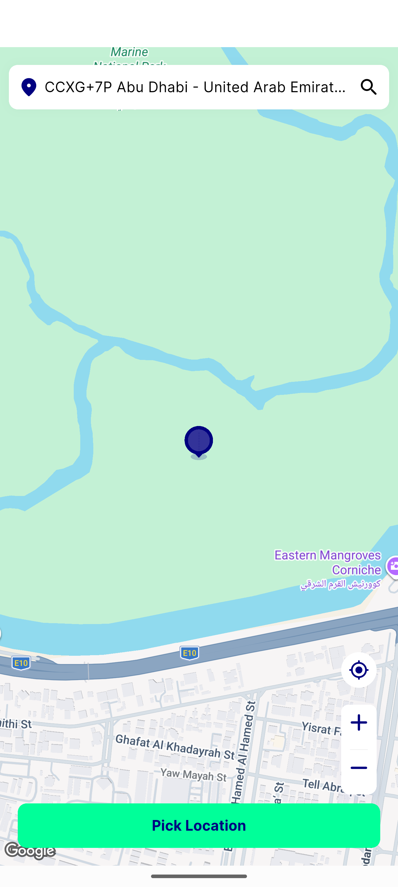</a> pickmap after drag</td>
<td align="center" width="33%"><a href="05-pickmap-dragged-far.png">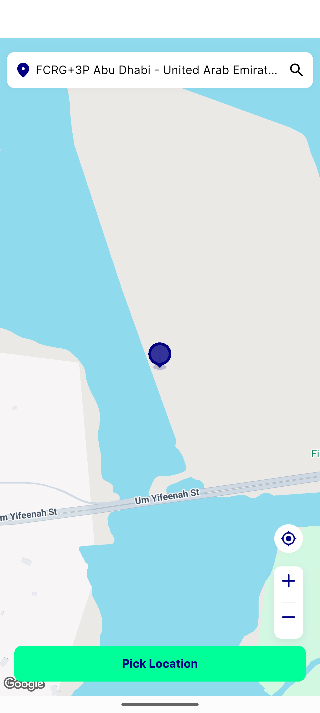</a> pickmap dragged far</td>
<td align="center" width="33%"><a href="06-pickmap-attempt-outzone.png">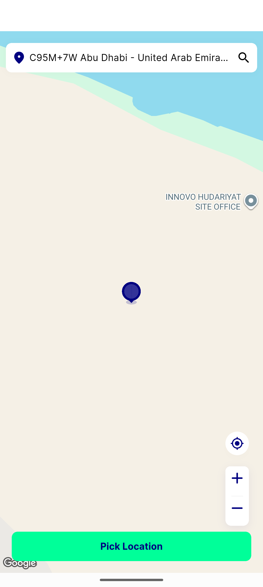</a> pickmap attempt outzone</td>
</tr>
<tr>
<td align="center" width="33%"><a href="07-outzone-service-not-available.png">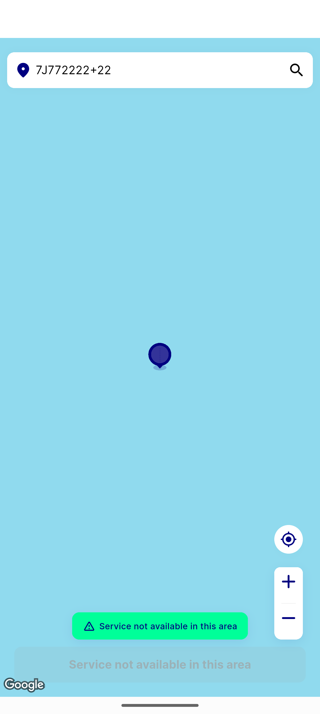</a> outzone service not available</td>
<td align="center" width="33%"><a href="08-inzone-resolved-dashboard.png">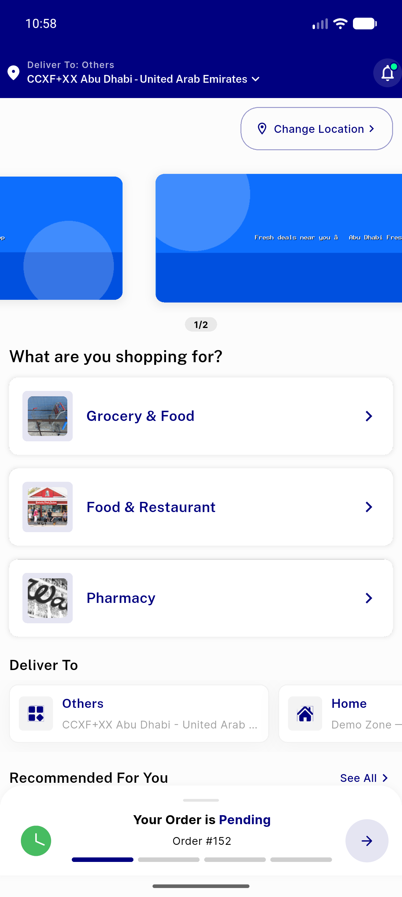</a> inzone resolved dashboard</td>
<td align="center" width="33%"> my address list</td>
</tr>
<tr>
<td align="center" width="33%"><a href="10-add-address-form.png">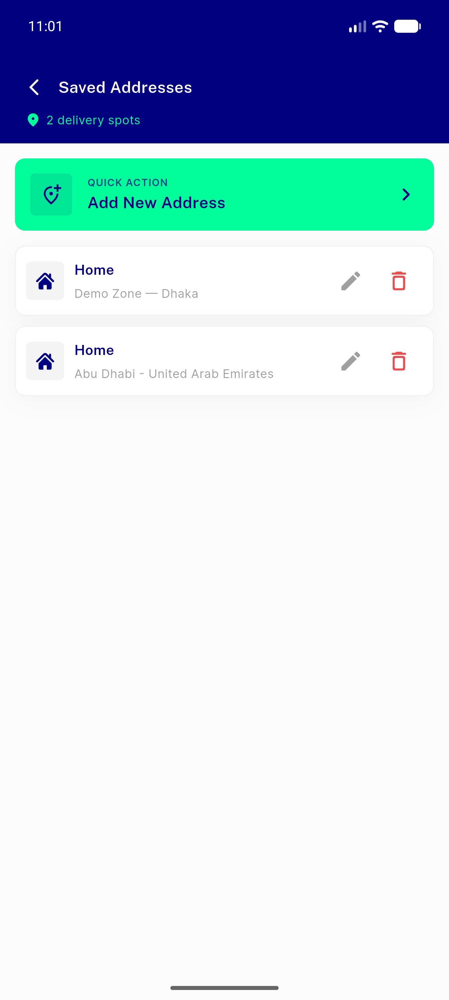</a> add address form</td>
<td align="center" width="33%"><a href="11-add-address-form-with-map.png">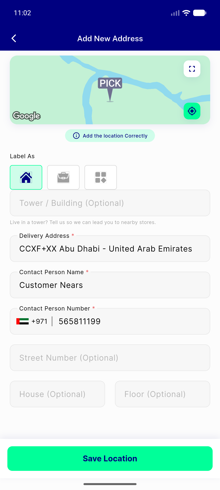</a> add address form with map</td>
<td align="center" width="33%"><a href="12-pickmap-from-addaddress.png">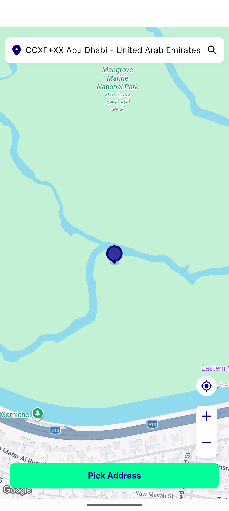</a> pickmap from addaddress</td>
</tr>
<tr>
<td align="center" width="33%"><a href="13-back-to-form-after-pick.png">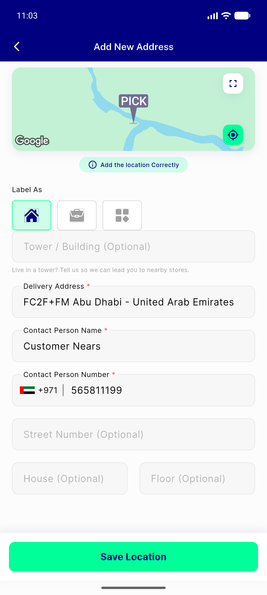</a> back to form after pick</td>
</tr>
</table>

---
*From `nears/docs/qa-evidence/NEARS-330/` · public-repo scrub policy (no live secrets; verified clean).*
