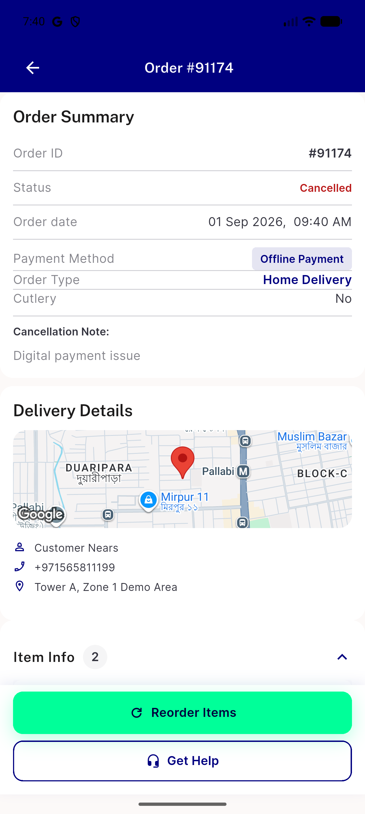

# QA Evidence — NEARS-3306

**PASS — Item Info paints immediately on cold navigation, no rebuild loop, no CPU spin on poll tick**

**1 screenshot(s).** Click any thumbnail for full resolution.

<table>
<tr>
<td align="center" width="33%"> ac1 cold nav item info painted</td>
</tr>
</table>

---
*From `nears/docs/qa-evidence/NEARS-3306/` · public-repo scrub policy (no live secrets; verified clean).*
