# QA Evidence — NEARS-331

**PASS — category MVVM verbatim-move: rail+grid, FIX-013 auto-select, switch, pagination, deep-link, sub-cat, search+item/store all live-verified; 644 tests green**

**17 screenshot(s).** Click any thumbnail for full resolution.

<table>
<tr>
<td align="center" width="33%"><a href="00-launch.png">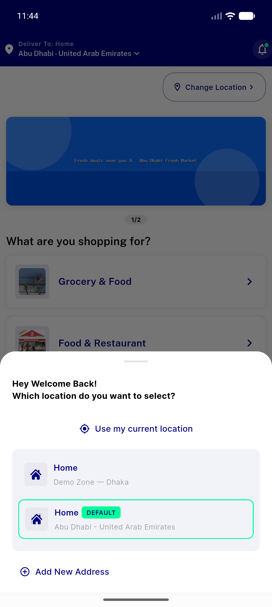</a> launch</td>
<td align="center" width="33%"> categories tab</td>
<td align="center" width="33%"><a href="02-seeall-categories.png">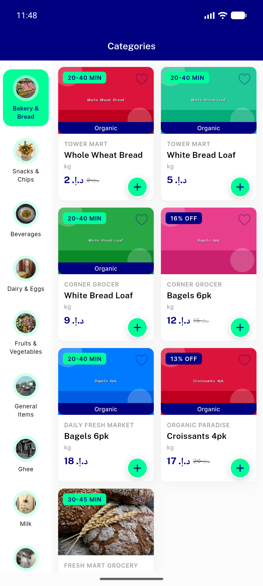</a> seeall categories</td>
</tr>
<tr>
<td align="center" width="33%"><a href="03-switch-beverages.png">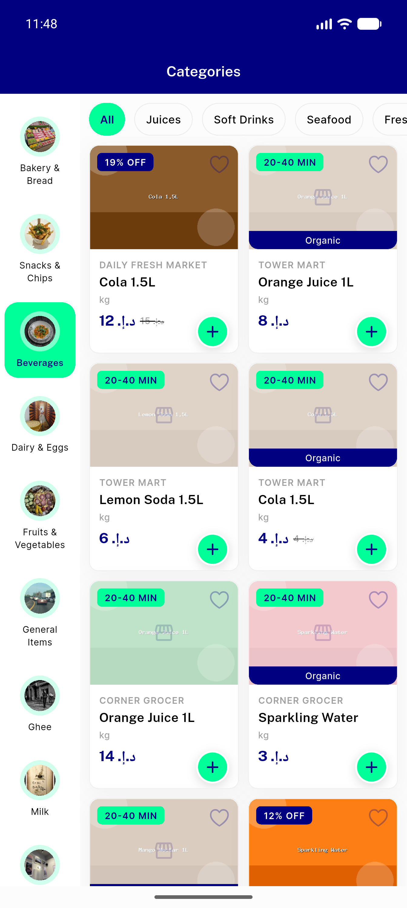</a> switch beverages</td>
<td align="center" width="33%"><a href="04-subcat-juices.png">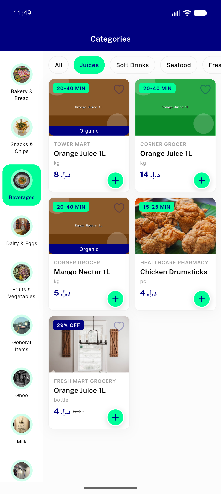</a> subcat juices</td>
<td align="center" width="33%"> pagination scroll</td>
</tr>
<tr>
<td align="center" width="33%"><a href="06-pagination-more.png">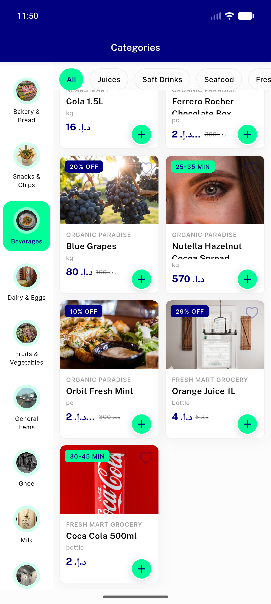</a> pagination more</td>
<td align="center" width="33%"><a href="07-deeplink-dairy.png">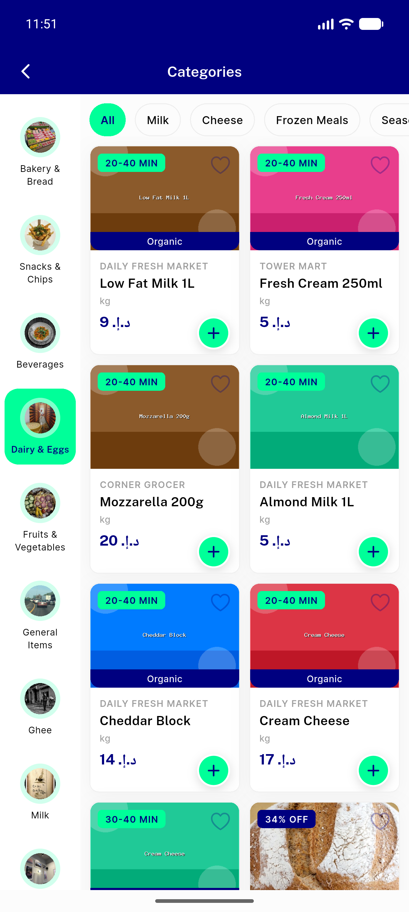</a> deeplink dairy</td>
<td align="center" width="33%"><a href="08-tablet-home.png">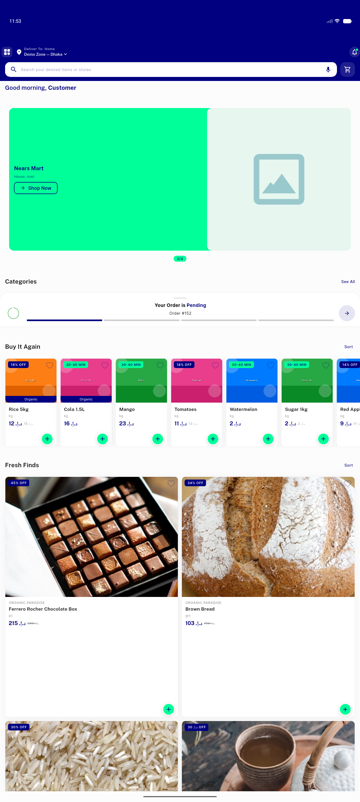</a> tablet home</td>
</tr>
<tr>
<td align="center" width="33%"><a href="09-tablet-catscreen.png">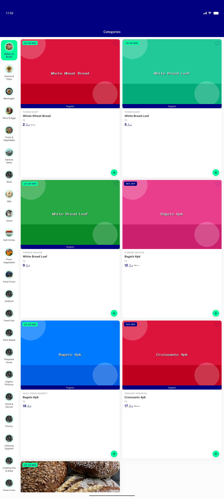</a> tablet catscreen</td>
<td align="center" width="33%"><a href="10-desktop-catgrid.png">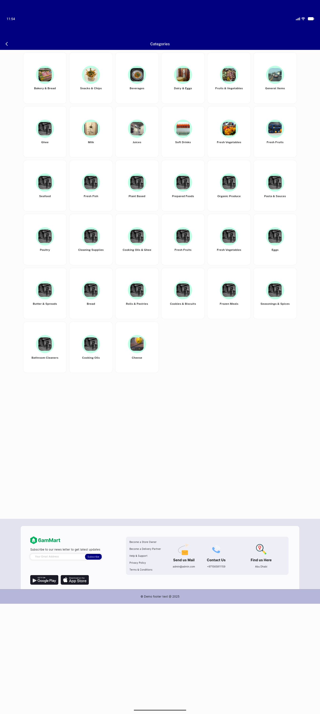</a> desktop catgrid</td>
<td align="center" width="33%"><a href="11-categoryitem-screen.png">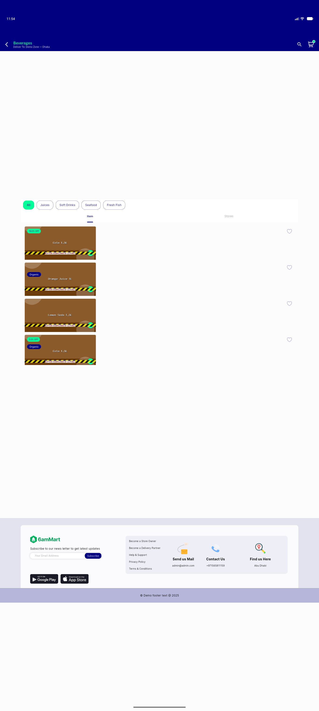</a> categoryitem screen</td>
</tr>
<tr>
<td align="center" width="33%"> categoryitem stores</td>
<td align="center" width="33%"><a href="12-stores-tab.png">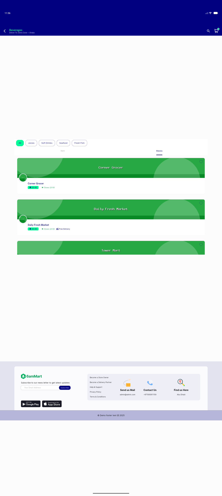</a> stores tab</td>
<td align="center" width="33%"><a href="13-search-active.png">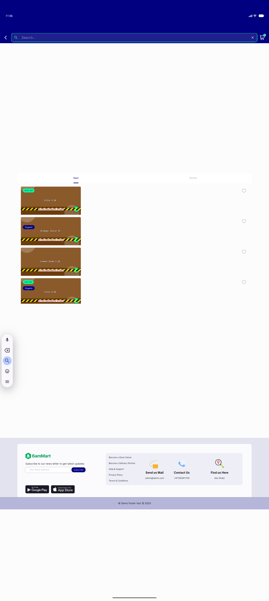</a> search active</td>
</tr>
<tr>
<td align="center" width="33%"><a href="14-search-results.png">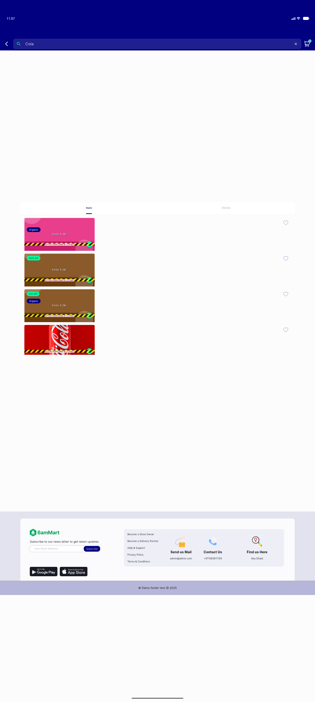</a> search results</td>
<td align="center" width="33%"><a href="15-bottomnav-attempt.png">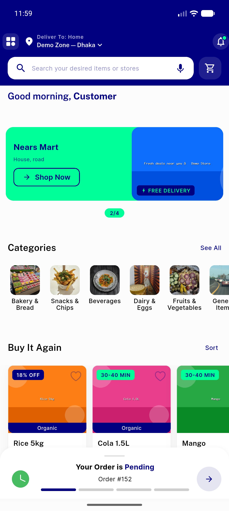</a> bottomnav attempt</td>
</tr>
</table>

---
*From `nears/docs/qa-evidence/NEARS-331/` · public-repo scrub policy (no live secrets; verified clean).*
