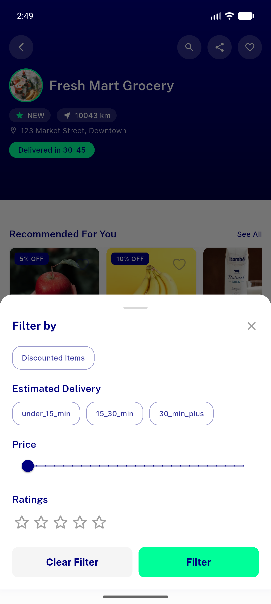
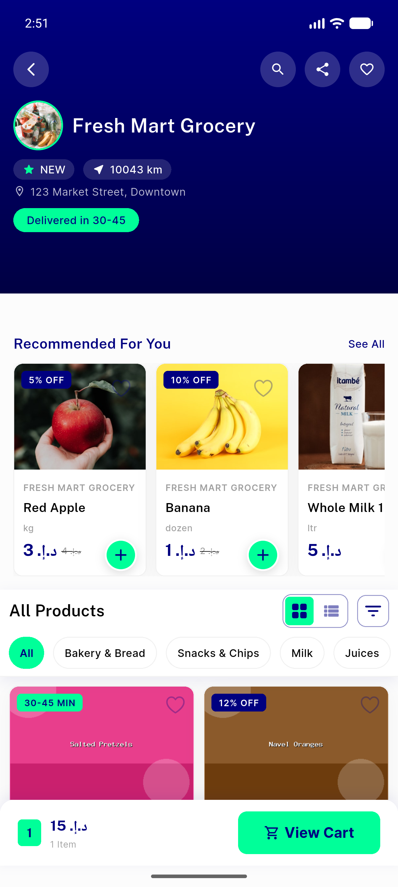
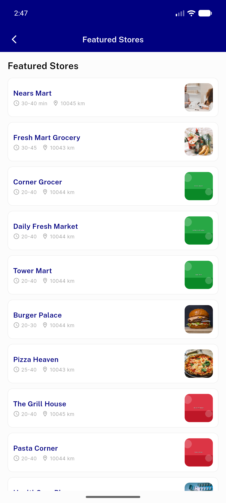

# QA Evidence — NEARS-332

**PASS — store MVVM Tier-3 verbatim logic move; store detail/price-filter/pagination/featured all-store verified live, 23/23 unit tests green, no visual change**

**4 screenshot(s).** Click any thumbnail for full resolution.

<table>
<tr>
<td align="center" width="33%"> ac1 store detail</td>
<td align="center" width="33%"> ac2 price filter sheet</td>
<td align="center" width="33%"> ac3 store paginated</td>
</tr>
<tr>
<td align="center" width="33%"> ac4 featured allstore</td>
</tr>
</table>

### Other artifacts
- [`progress.md`](progress.md)

---
*From `nears/docs/qa-evidence/NEARS-332/` · public-repo scrub policy (no live secrets; verified clean).*
