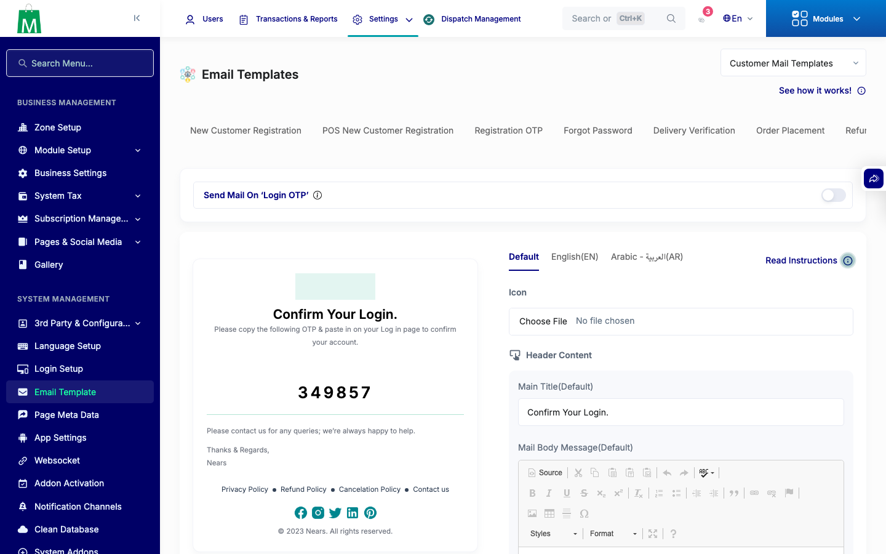
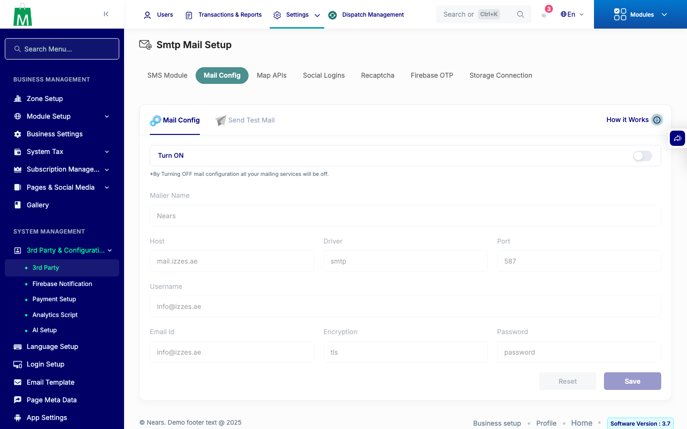
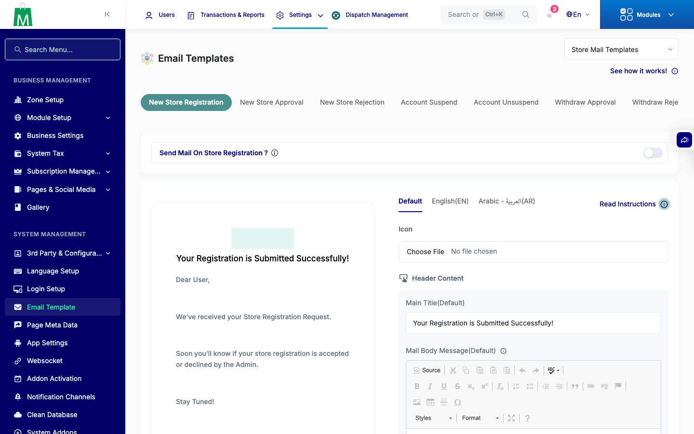

# QA Evidence — NEARS-3326

**QA PASS — NEARS-3326 DB brand strings scrubbed, scratch-DB run, 3 screenshots**

**3 screenshot(s).** Click any thumbnail for full resolution.

<table>
<tr>
<td align="center" width="33%"> ac1 email template login otp</td>
<td align="center" width="33%"> ac2 mail config screen</td>
<td align="center" width="33%"> ac5 mail route dropdown store</td>
</tr>
</table>

---
*From `nears/docs/qa-evidence/NEARS-3326/` · public-repo scrub policy (no live secrets; verified clean).*
