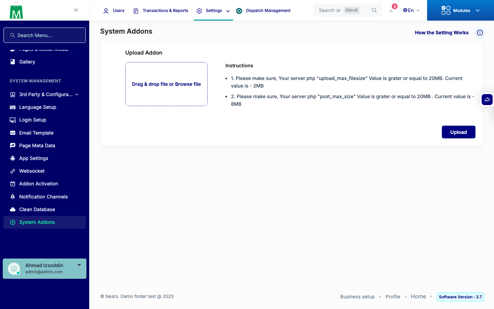

# QA Evidence — NEARS-3327

**PASS - System Addons redirect + scandir absolute-path fix verified live**

**1 screenshot(s).** Click any thumbnail for full resolution.

<table>
<tr>
<td align="center" width="33%"> ac1 redirect loads index</td>
</tr>
</table>

### Other artifacts
- [`ac2-non-project-root-cwd-scandir-fix.log`](ac2-non-project-root-cwd-scandir-fix.log)
- [`ac3-be-log-scoped-grep.log`](ac3-be-log-scoped-grep.log)

---
*From `nears/docs/qa-evidence/NEARS-3327/` · public-repo scrub policy (no live secrets; verified clean).*
