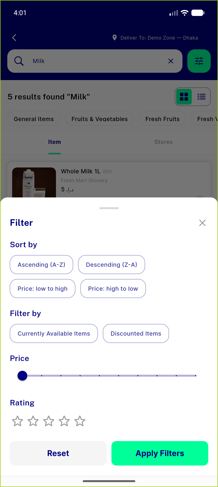
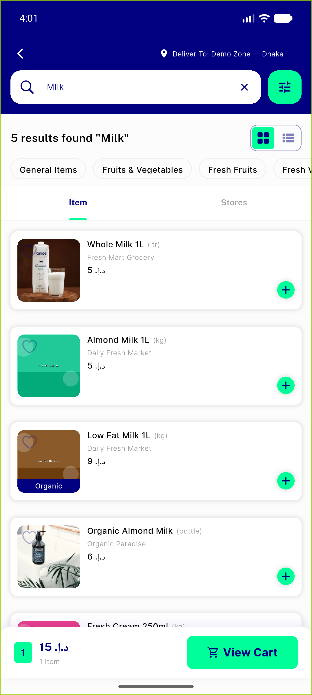
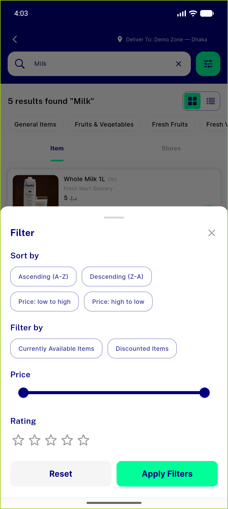
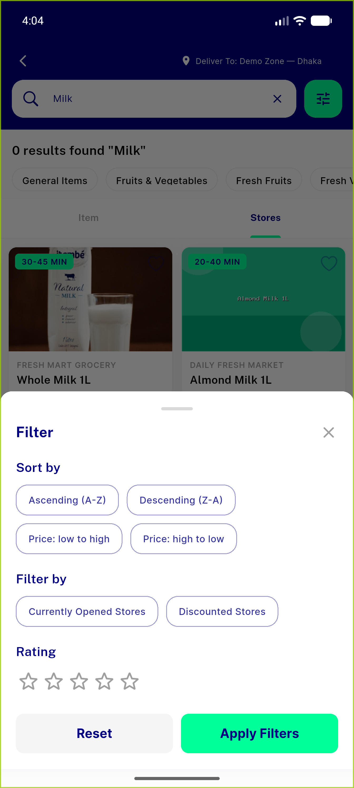
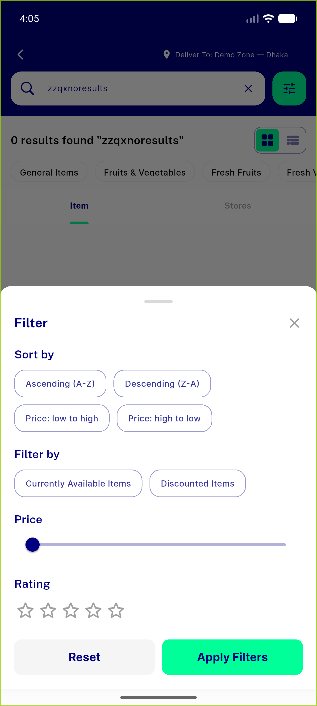
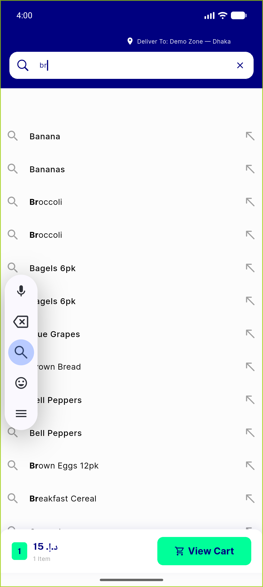

# QA Evidence — NEARS-333

**PASS — search MVVM Tier-3 parity: price-max (item-derived 9.46 / store 1000 / empty 1000) + suggestion highlight (start TitleCase, mid raw, case-insensitive) all parity-preserved; 679 tests green**

**7 screenshot(s).** Click any thumbnail for full resolution.

<table>
<tr>
<td align="center" width="33%"> ac1 filtersheet itemderived max</td>
<td align="center" width="33%"> ac1 search results milk</td>
<td align="center" width="33%"> ac1 slider spans itemmax</td>
</tr>
<tr>
<td align="center" width="33%"> ac2 store mode no price slider</td>
<td align="center" width="33%"> ac3 empty results 1000 slider</td>
<td align="center" width="33%"> ac4 highlight midstring raw</td>
</tr>
<tr>
<td align="center" width="33%"> ac4 highlight start titlecase caseinsensitive</td>
</tr>
</table>

### Other artifacts
- [`progress.md`](progress.md)

---
*From `nears/docs/qa-evidence/NEARS-333/` · public-repo scrub policy (no live secrets; verified clean).*
