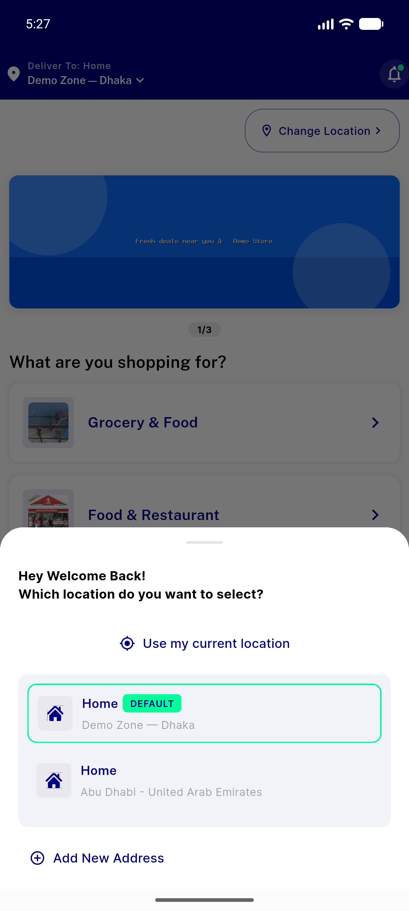
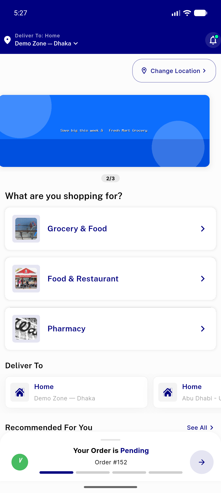
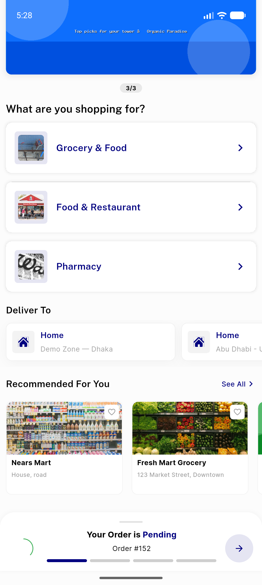
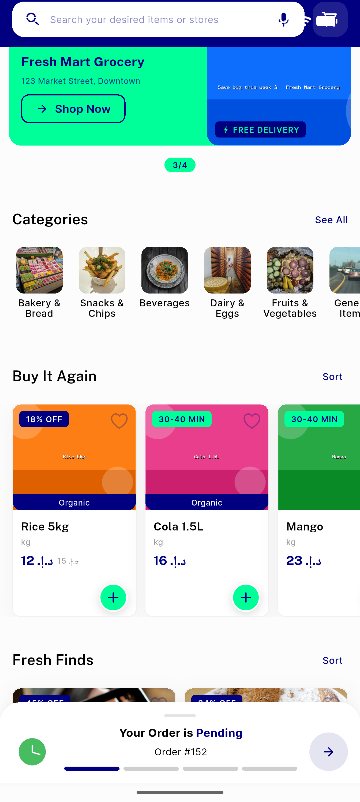
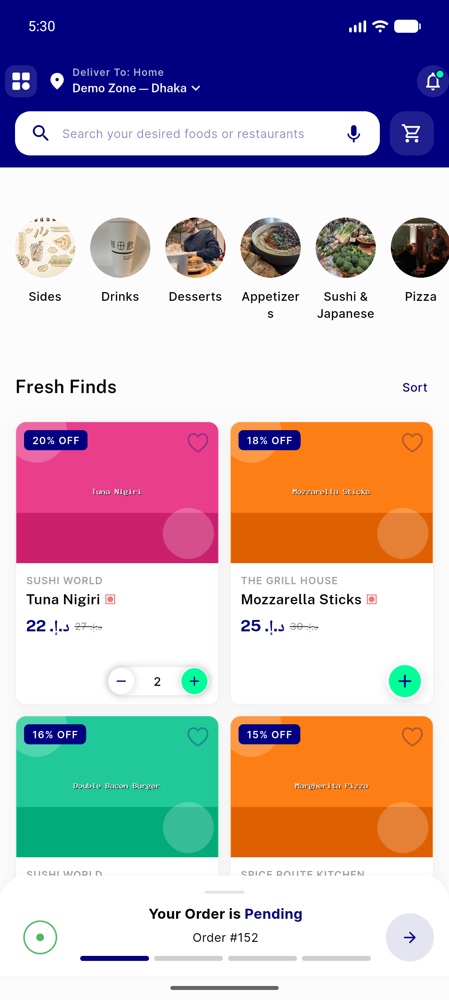
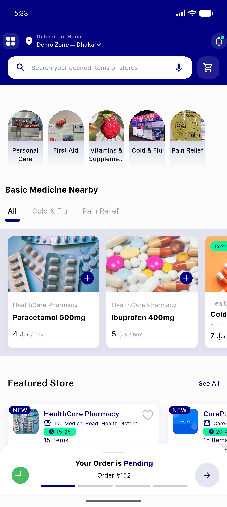
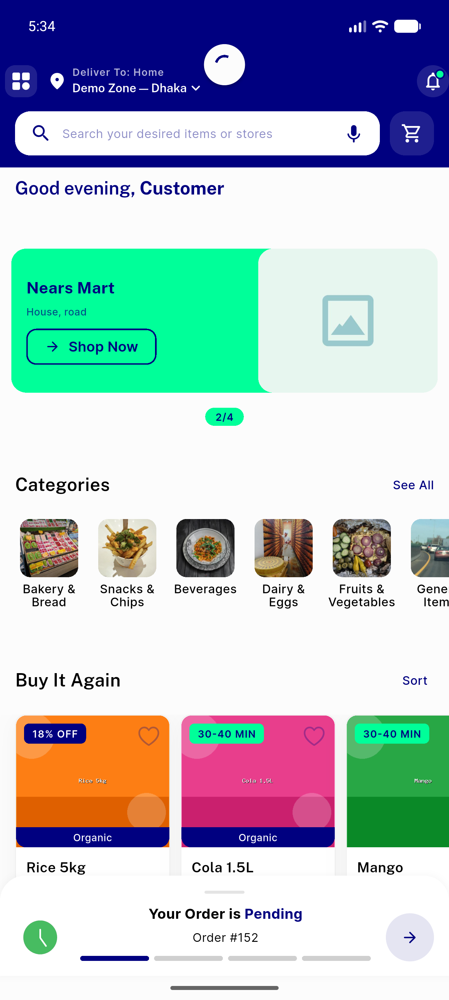
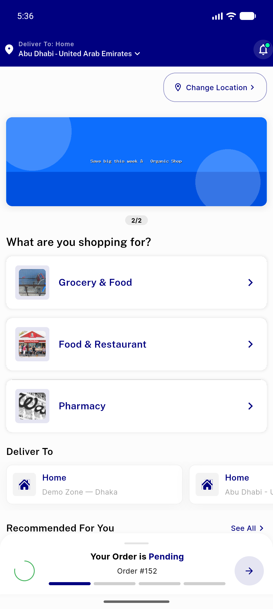
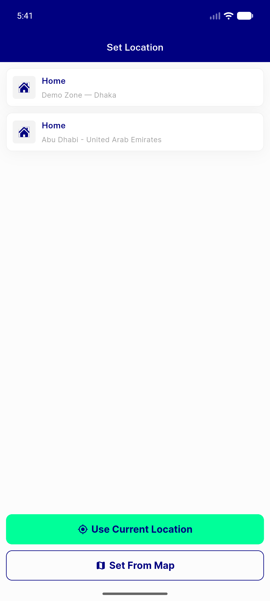
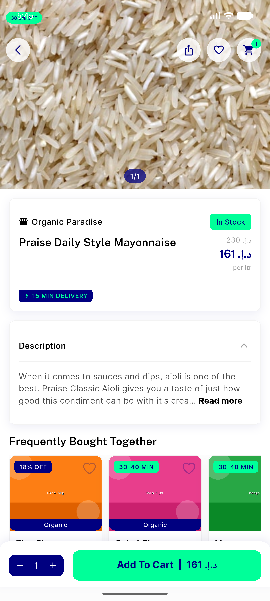

# QA Evidence — NEARS-334

**PASS — home MVVM Tier-3 verbatim-move: cold-load/refresh/module-switch/zone-change all render correct; 702 tests green**

**10 screenshot(s).** Click any thumbnail for full resolution.

<table>
<tr>
<td align="center" width="33%"> address select</td>
<td align="center" width="33%"> home zone1 top</td>
<td align="center" width="33%"> home zone1 scrolled</td>
</tr>
<tr>
<td align="center" width="33%"> home grocery rails</td>
<td align="center" width="33%"> home food after switch</td>
<td align="center" width="33%"> home pharmacy after switch</td>
</tr>
<tr>
<td align="center" width="33%"> pull to refresh</td>
<td align="center" width="33%"> zone change abudhabi</td>
<td align="center" width="33%"> single sector zone3</td>
</tr>
<tr>
<td align="center" width="33%"> store page</td>
</tr>
</table>

### Other artifacts
- [`progress.md`](progress.md)

---
*From `nears/docs/qa-evidence/NEARS-334/` · public-repo scrub policy (no live secrets; verified clean).*
