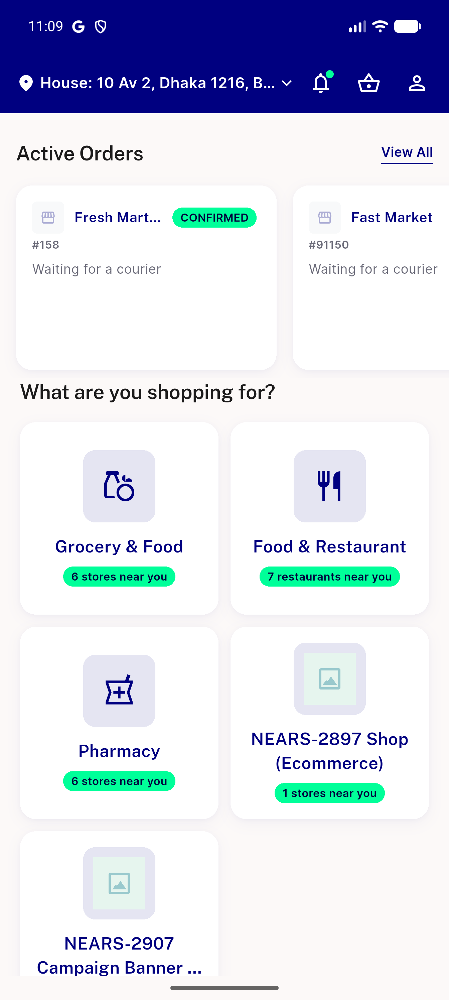
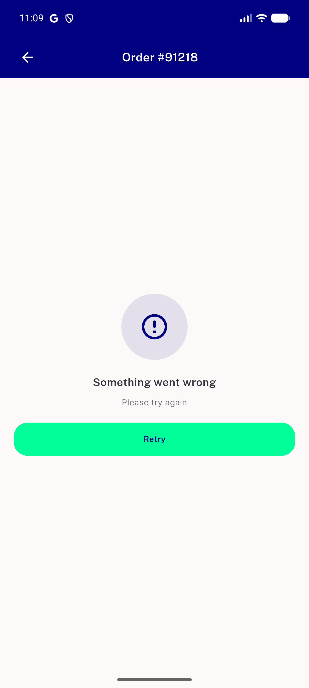
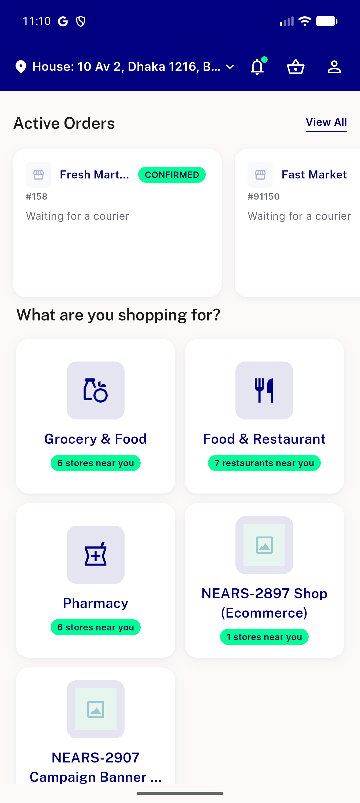
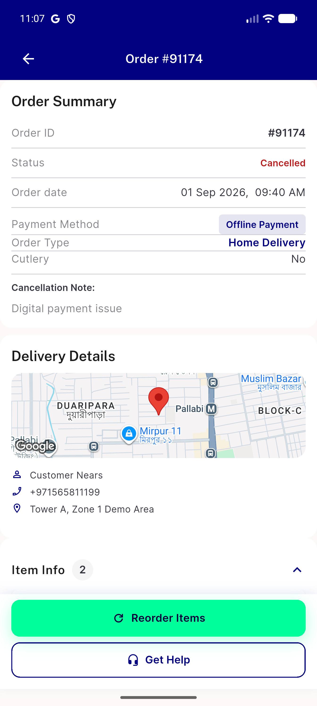

# QA Evidence — NEARS-3340

**PASS — AC1/AC2/AC3 live-demonstrated, forced canPop=false repro used per ticket instructions, no regressions on fromNotification/fromOfflinePayment branches**

**4 screenshot(s).** Click any thumbnail for full resolution.

<table>
<tr>
<td align="center" width="33%"> ac1 after appbar back home</td>
<td align="center" width="33%"> ac1 error retry state</td>
<td align="center" width="33%"> ac2 after hardware back home</td>
</tr>
<tr>
<td align="center" width="33%"> ac3 healthy order details</td>
</tr>
</table>

---
*From `nears/docs/qa-evidence/NEARS-3340/` · public-repo scrub policy (no live secrets; verified clean).*
