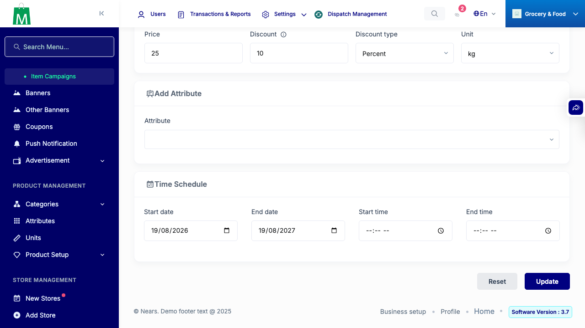

# QA Evidence — NEARS-3355

**PASS - null-safe time guard verified live, HTTP 200 + blank fields for ids 13-17, no new FAIL logs, positive control confirmed**

**1 screenshot(s).** Click any thumbnail for full resolution.

<table>
<tr>
<td align="center" width="33%"> ac2 time fields blank id13</td>
</tr>
</table>

### Other artifacts
- [`ac4-positive-control-prefix-fail-lines.log`](ac4-positive-control-prefix-fail-lines.log)

---
*From `nears/docs/qa-evidence/NEARS-3355/` · public-repo scrub policy (no live secrets; verified clean).*
