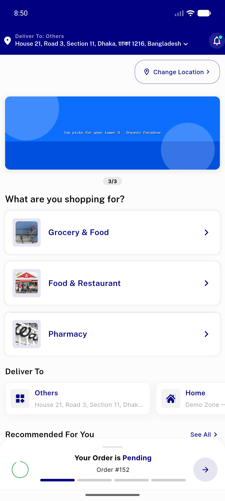

# QA Evidence — NEARS-336

**PASS — Tier-4 cleanup (final MVVM module): 779 green (60 new pins), 336-branch renders clean; live drive pin-covered (NEARS-339/340 a11y block)**

**2 screenshot(s).** Click any thumbnail for full resolution.

<table>
<tr>
<td align="center" width="33%"> home</td>
<td align="center" width="33%"> food home render clean</td>
</tr>
</table>

### Other artifacts
- [`progress.md`](progress.md)

---
*From `nears/docs/qa-evidence/NEARS-336/` · public-repo scrub policy (no live secrets; verified clean).*
