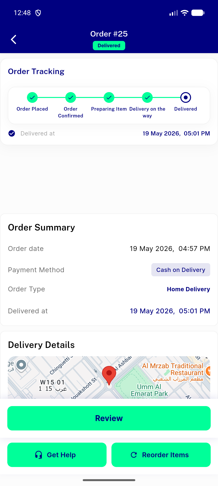
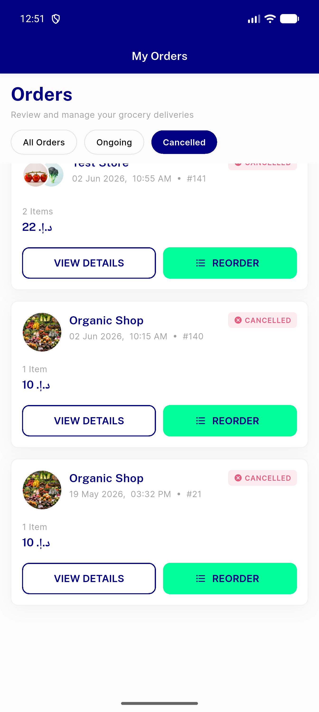
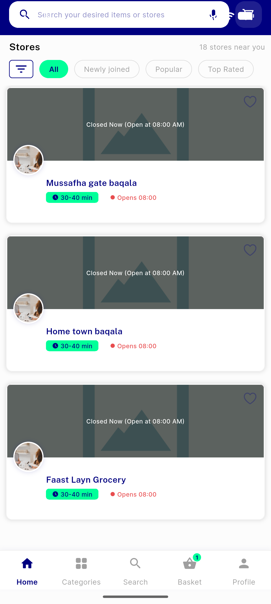
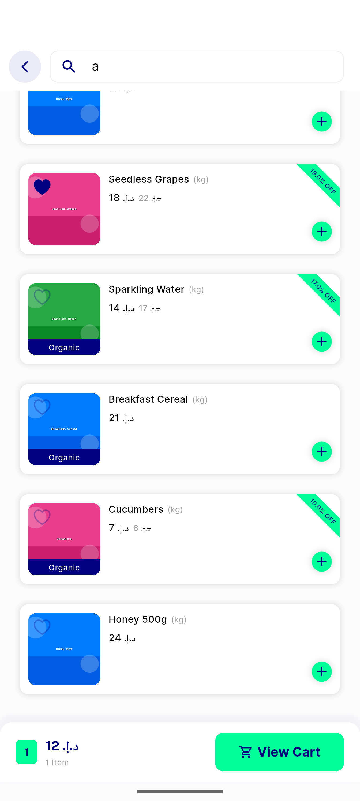
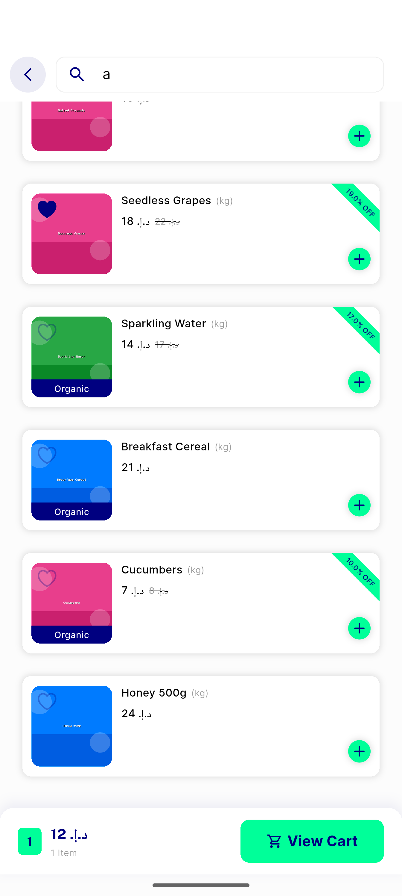
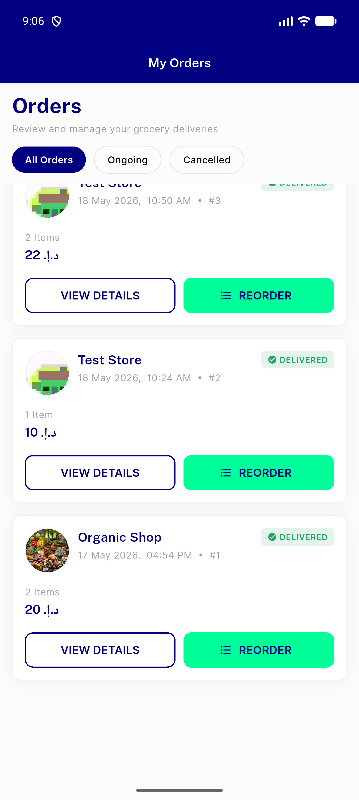
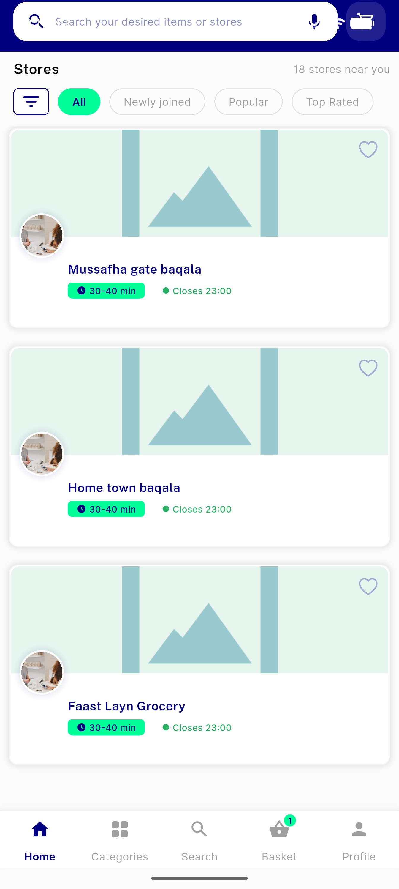

# QA Evidence — NEARS-338

**Delta re-QA (fix cycle 2) PASS — duplicate-fetch race fixed (0/2 repro, was 2/2); orders smoke + sweeps clean; 711 tests green**

**16 screenshot(s).** Click any thumbnail for full resolution.

<table>
<tr>
<td align="center" width="33%"> orders running</td>
<td align="center" width="33%"> history bottom oldest</td>
<td align="center" width="33%"> order 25 detail</td>
</tr>
<tr>
<td align="center" width="33%"> running tab</td>
<td align="center" width="33%"> cancelled filter</td>
<td align="center" width="33%"> cancelled bottom 21</td>
</tr>
<tr>
<td align="center" width="33%"> home stores paginated</td>
<td align="center" width="33%"> store search paginated</td>
<td align="center" width="33%"> search bottom</td>
</tr>
<tr>
<td align="center" width="33%"> search duplicate items</td>
<td align="center" width="33%"> orders dark mode</td>
<td align="center" width="33%"> delta search attempt1 no dupe</td>
</tr>
<tr>
<td align="center" width="33%"> delta search attempt2 no dupe</td>
<td align="center" width="33%"> delta history bottom oldest</td>
<td align="center" width="33%"> delta cancelled paginated</td>
</tr>
<tr>
<td align="center" width="33%"> delta home stores paginated</td>
</tr>
</table>

### Other artifacts
- [`progress.md`](progress.md)

---
*From `nears/docs/qa-evidence/NEARS-338/` · public-repo scrub policy (no live secrets; verified clean).*
