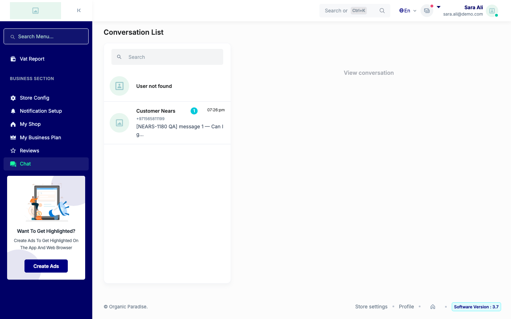
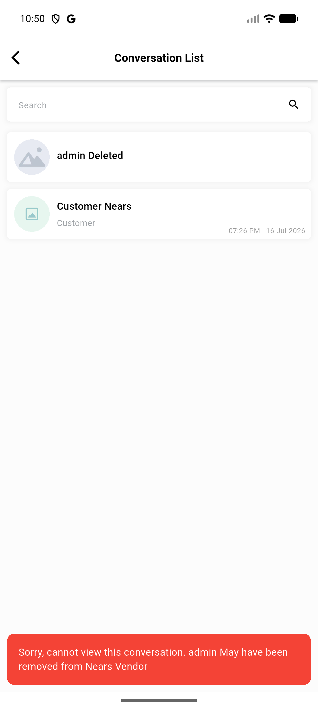
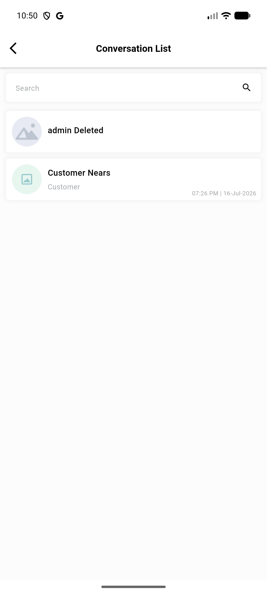

# QA Evidence — NEARS-3383

**Delta re-QA AC3-reworded: BLOCKED - fix proven sound (prior curl+automated), but a pre-existing client-side gap (both VendorApp list-tap and Store Panel list render) blocks opening an admin-initiated thread via normal navigation in either real client**

**3 screenshot(s).** Click any thumbnail for full resolution.

<table>
<tr>
<td align="center" width="33%"> delta storepanel list usernotfound</td>
<td align="center" width="33%"> delta vendorapp admin thread blocked snackbar</td>
<td align="center" width="33%"> delta vendorapp conversation list</td>
</tr>
</table>

### Other artifacts
- [`delta-vendorapp-admin-thread-blocked-dump.xml`](delta-vendorapp-admin-thread-blocked-dump.xml)

---
*From `nears/docs/qa-evidence/NEARS-3383/` · public-repo scrub policy (no live secrets; verified clean).*
