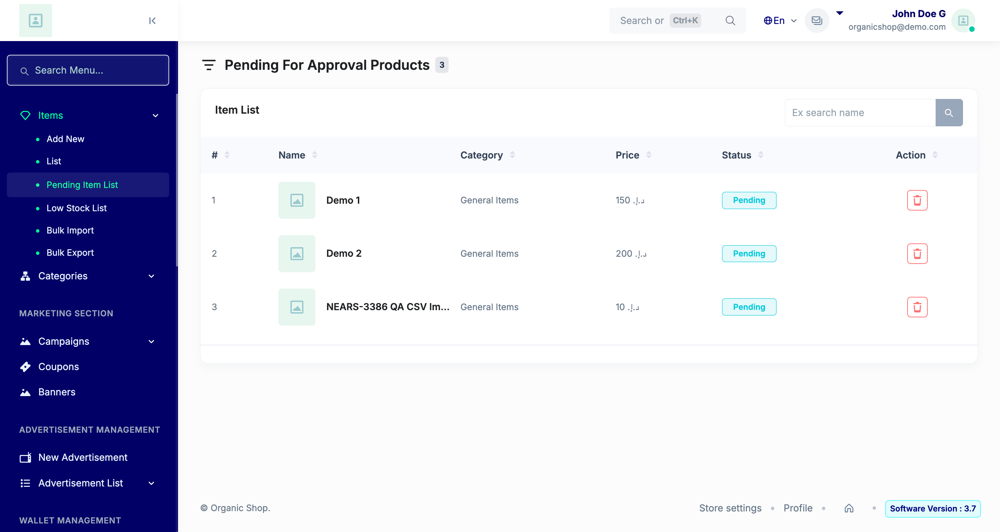

# QA Evidence — NEARS-3386

**PASS: CSV imports successfully via real HTTP bulk-import form; XLSX regression-free; hardened error path logs cleanly with trace/correlation id**

**1 screenshot(s).** Click any thumbnail for full resolution.

<table>
<tr>
<td align="center" width="33%"> ac1 ac2 pending item list</td>
</tr>
</table>

### Other artifacts
- [`ac3-log-clean-for-csv.log`](ac3-log-clean-for-csv.log)

---
*From `nears/docs/qa-evidence/NEARS-3386/` · public-repo scrub policy (no live secrets; verified clean).*
