# QA Evidence — NEARS-339

**PASS — food-home semantics crash fix: AC1/2/4 logged-in+guest, AC3 sticky, AC5 grocery+pharmacy, rapid module-switch parentDataDirty=0, dark+RTL rail spot; flutter test 703/703**

**13 screenshot(s).** Click any thumbnail for full resolution.

<table>
<tr>
<td align="center" width="33%"><a href="01-before-rail-absent-restaurants-jump.png">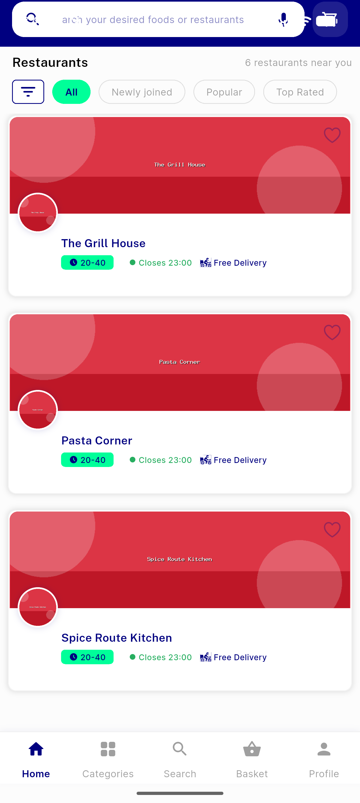</a> before rail absent restaurants jump</td>
<td align="center" width="33%"><a href="02-after-popular-rail-renders.png">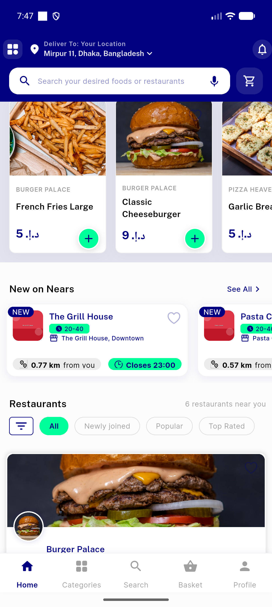</a> after popular rail renders</td>
<td align="center" width="33%"><a href="10-qa-loggedin-popular-rail-light.png">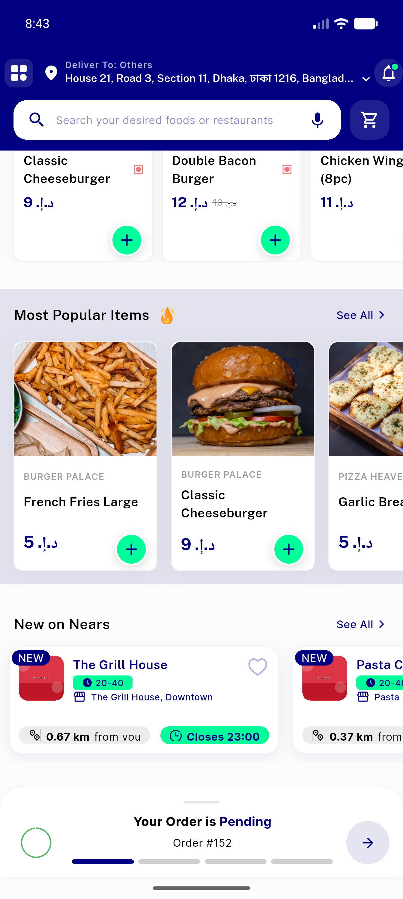</a> qa loggedin popular rail light</td>
</tr>
<tr>
<td align="center" width="33%"><a href="11-qa-rail-card-tap-item-detail.png">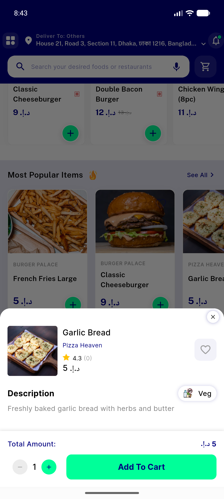</a> qa rail card tap item detail</td>
<td align="center" width="33%"><a href="12-qa-rail-plus-stepper.png">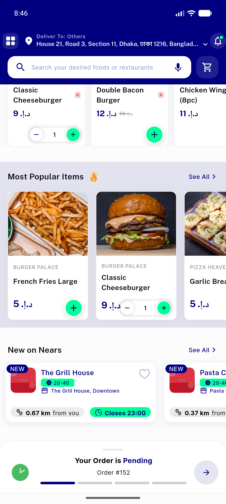</a> qa rail plus stepper</td>
<td align="center" width="33%"><a href="13-qa-search-alive-after-food-visits.png">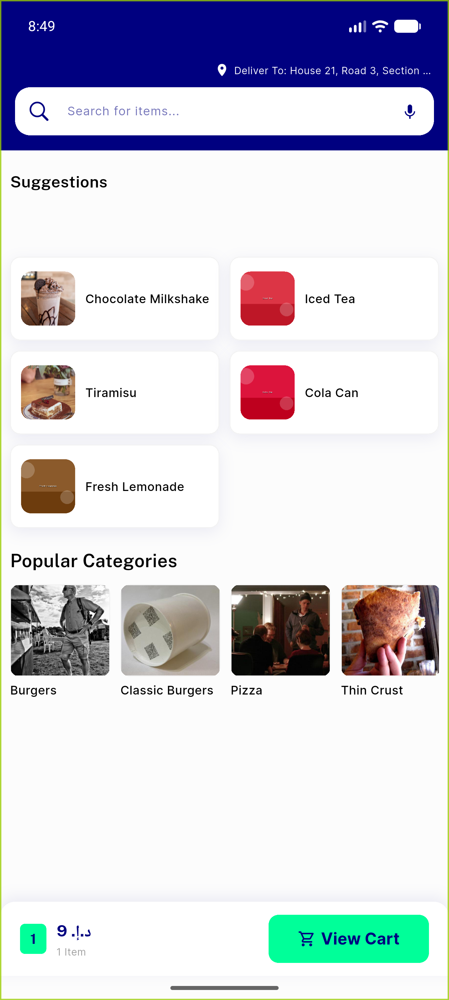</a> qa search alive after food visits</td>
</tr>
<tr>
<td align="center" width="33%"><a href="14-qa-grocery-home-labels44.png">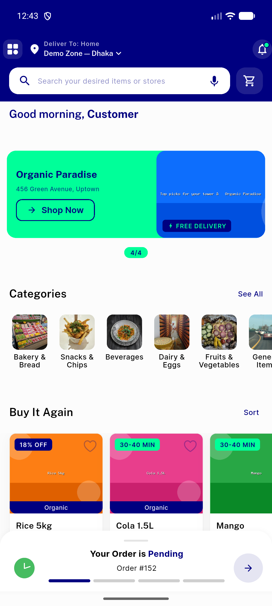</a> qa grocery home labels44</td>
<td align="center" width="33%"><a href="15-qa-pharmacy-home-labels.png">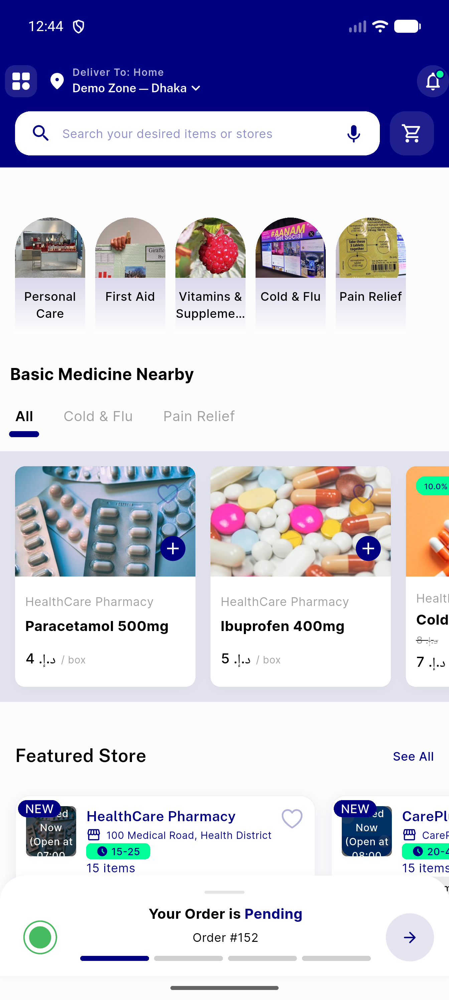</a> qa pharmacy home labels</td>
<td align="center" width="33%"><a href="16-qa-profile-alive-after-food-visits.png">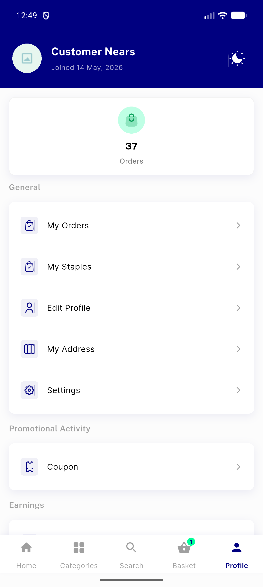</a> qa profile alive after food visits</td>
</tr>
<tr>
<td align="center" width="33%"><a href="17-qa-rail-dark-mode.png">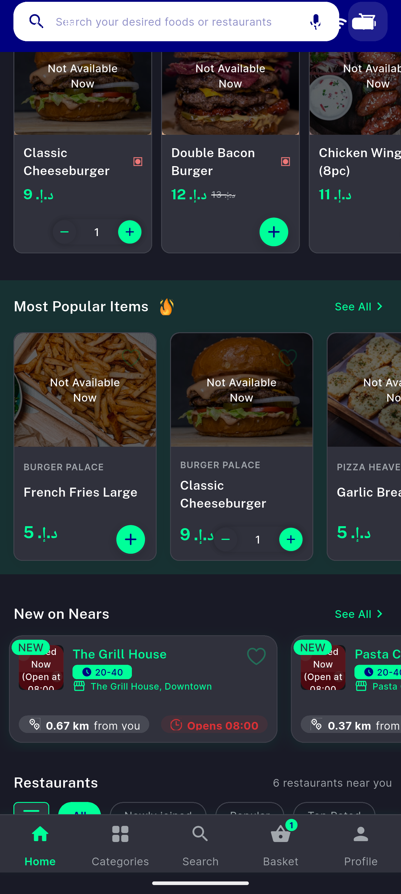</a> qa rail dark mode</td>
<td align="center" width="33%"><a href="18-qa-rail-arabic-rtl-dark.png">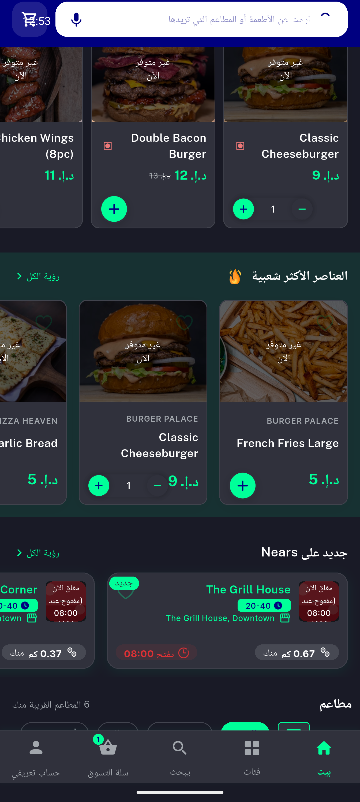</a> qa rail arabic rtl dark</td>
<td align="center" width="33%"><a href="19-qa-guest-food-home-37labels.png">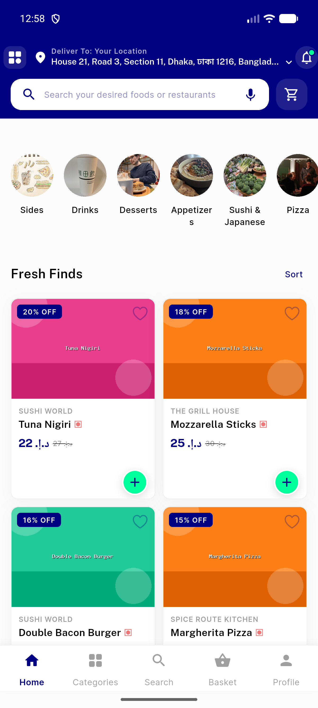</a> qa guest food home 37labels</td>
</tr>
<tr>
<td align="center" width="33%"><a href="20-qa-guest-profile-alive-after-food.png">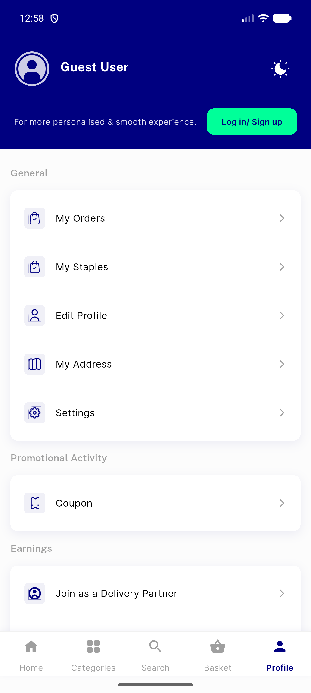</a> qa guest profile alive after food</td>
</tr>
</table>

### Other artifacts
- [`03-before-first-exception-head.txt`](03-before-first-exception-head.txt)
- [`progress.md`](progress.md)

---
*From `nears/docs/qa-evidence/NEARS-339/` · public-repo scrub policy (no live secrets; verified clean).*
