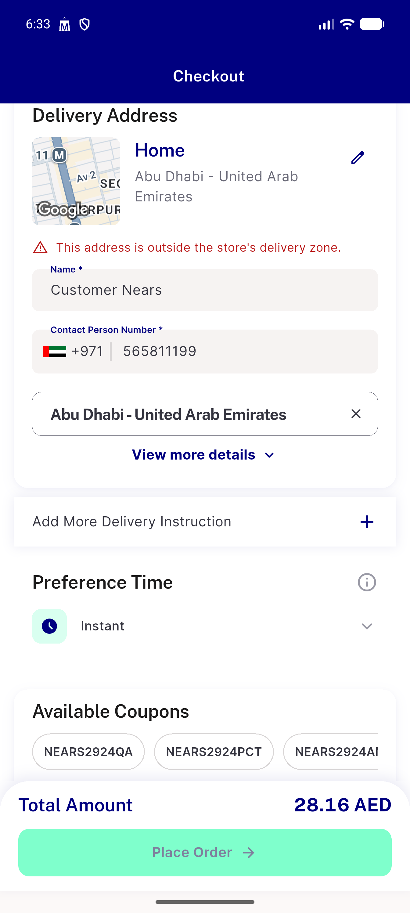
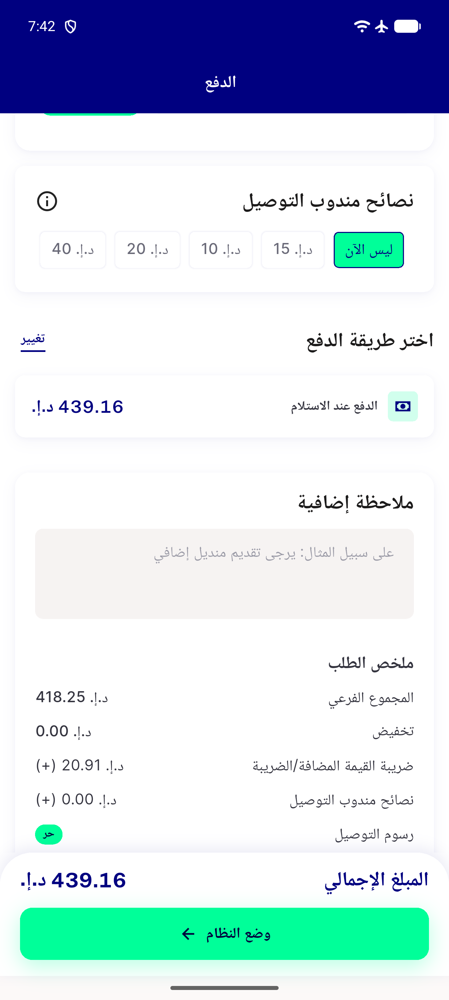
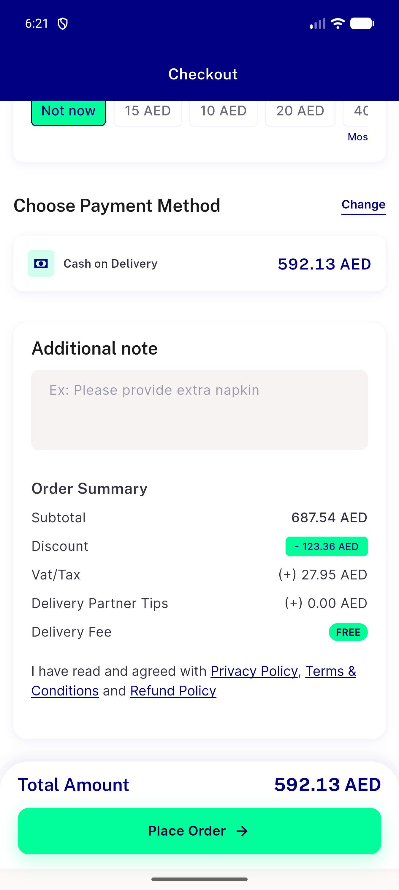
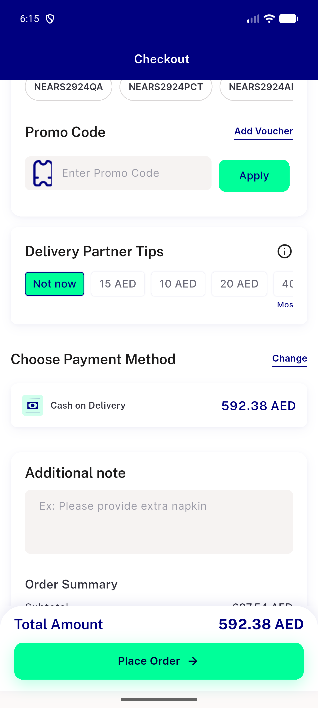
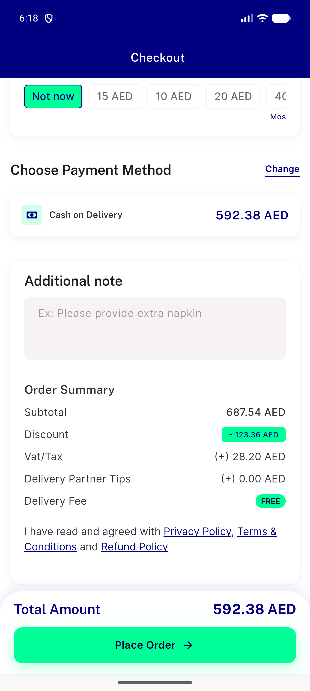
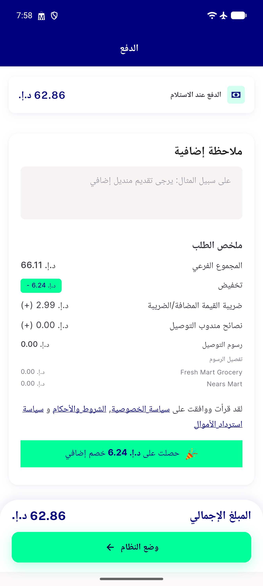

# QA Evidence — NEARS-3392

**Delta QA fix-cycle 2 -- delivery-quote mechanism live-tested for the first time; found a stale-state defect where a failed quote fetch does not surface the retry UI and Place Order is not disabled**

**6 screenshot(s).** Click any thumbnail for full resolution.

<table>
<tr>
<td align="center" width="33%"> address change out of zone</td>
<td align="center" width="33%"> bug delivery quote failed state not shown</td>
<td align="center" width="33%"> bug stale tax after coupon removal</td>
</tr>
<tr>
<td align="center" width="33%"> checkout initial</td>
<td align="center" width="33%"> checkout pricing breakdown</td>
<td align="center" width="33%"> multistore fee breakdown coupon removed</td>
</tr>
</table>

### Other artifacts
- [`bug-ac4-place-order-not-disabled-after-quote-failure.log`](bug-ac4-place-order-not-disabled-after-quote-failure.log)
- [`bug-delivery-quote-failed-state-not-shown.log`](bug-delivery-quote-failed-state-not-shown.log)
- [`bug-delivery-quote-failed-state-not-shown.xml`](bug-delivery-quote-failed-state-not-shown.xml)

---
*From `nears/docs/qa-evidence/NEARS-3392/` · public-repo scrub policy (no live secrets; verified clean).*
