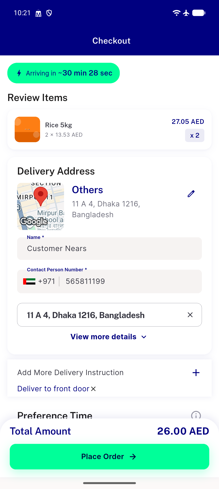
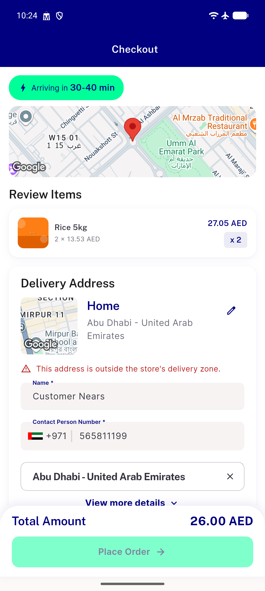
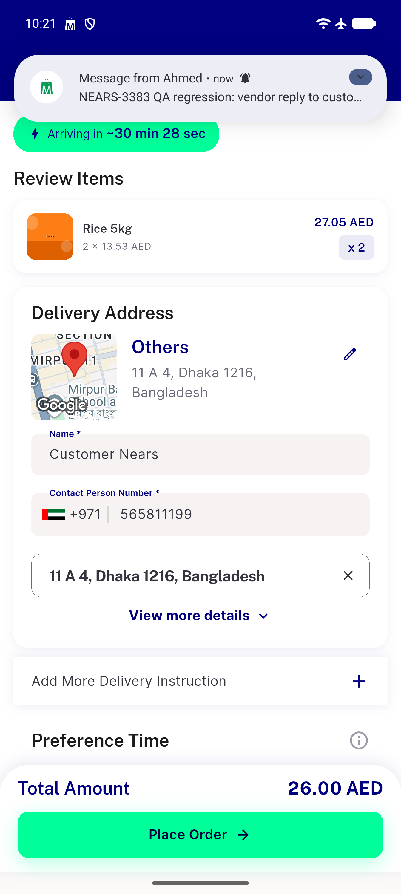
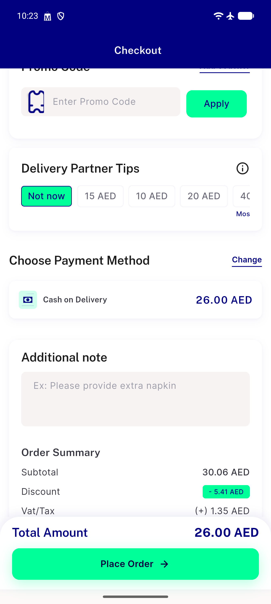
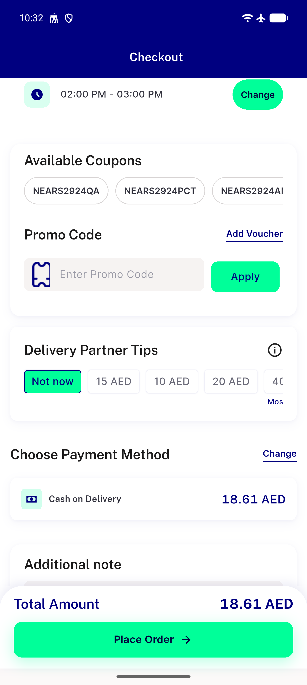
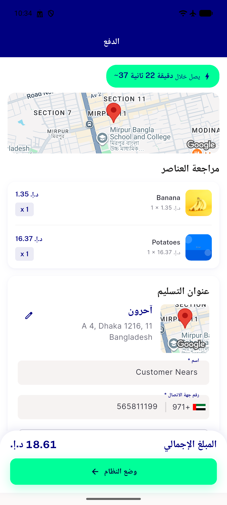

# QA Evidence — NEARS-3393

**PASS -- AddressDeliveryOptionController extraction verified live, checkout money-path clean, RTL/out-of-zone/time-slot/delivery-instruction regressions clean; 2 unrelated pre-existing regression-candidates logged**

**6 screenshot(s).** Click any thumbnail for full resolution.

<table>
<tr>
<td align="center" width="33%"> ac2 delivery instruction selected</td>
<td align="center" width="33%"> ac3 ac4 outofzone panel</td>
<td align="center" width="33%"> ac5 checkout baseline</td>
</tr>
<tr>
<td align="center" width="33%"> ac5 order summary after address2</td>
<td align="center" width="33%"> ac5 timeslot selected</td>
<td align="center" width="33%"> regression rtl checkout address</td>
</tr>
</table>

### Other artifacts
- [`bug-cart-suggested-item-type-error.log`](bug-cart-suggested-item-type-error.log)
- [`bug-location-permission-timeout.log`](bug-location-permission-timeout.log)

---
*From `nears/docs/qa-evidence/NEARS-3393/` · public-repo scrub policy (no live secrets; verified clean).*
