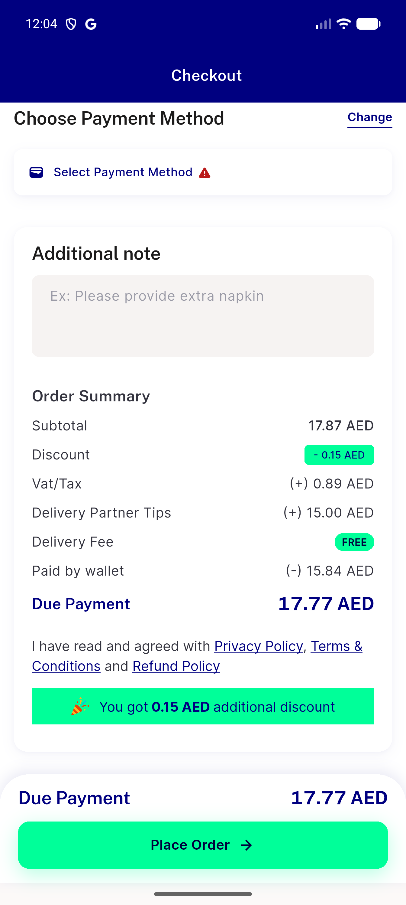
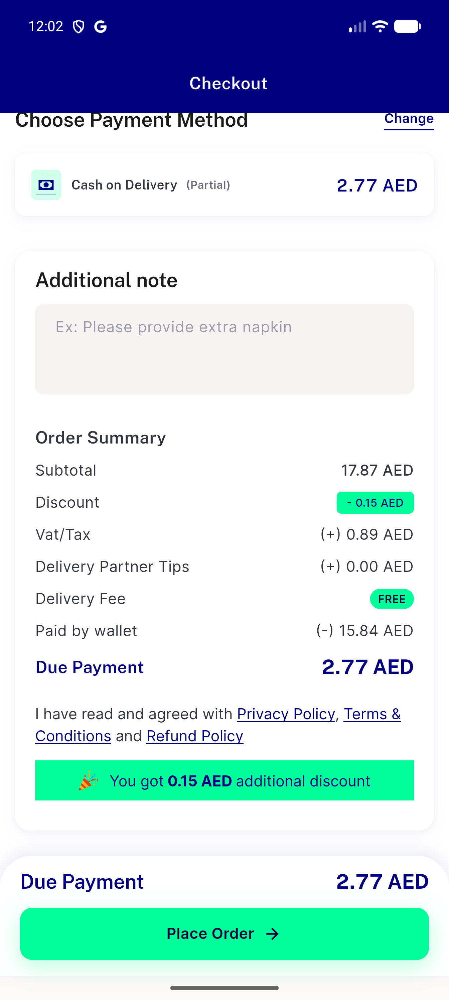
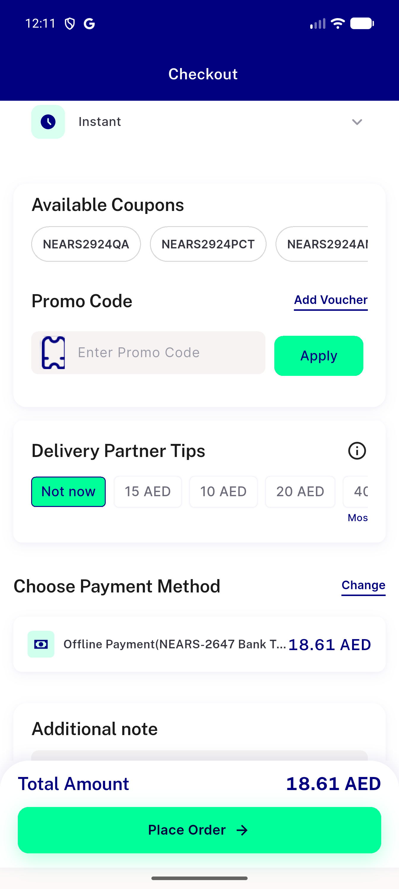

# QA Evidence — NEARS-3394

**PASS — all 5 ACs demonstrated live, AC4 GetBuilder rebuild-scoping fix confirmed working (immediate order-summary update, no extra tap)**

**3 screenshot(s).** Click any thumbnail for full resolution.

<table>
<tr>
<td align="center" width="33%"> ac4 tips and wallet summary immediate update</td>
<td align="center" width="33%"> ac4 wallet partial pay immediate update</td>
<td align="center" width="33%"> ac5 offline bank selected</td>
</tr>
</table>

### Other artifacts
- [`bug-unrelated-cart-suggest-item-typeerror.log`](bug-unrelated-cart-suggest-item-typeerror.log)

---
*From `nears/docs/qa-evidence/NEARS-3394/` · public-repo scrub policy (no live secrets; verified clean).*
