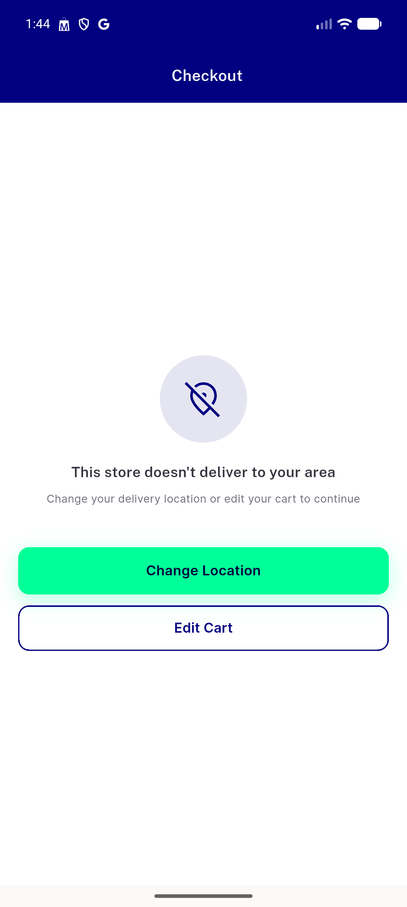
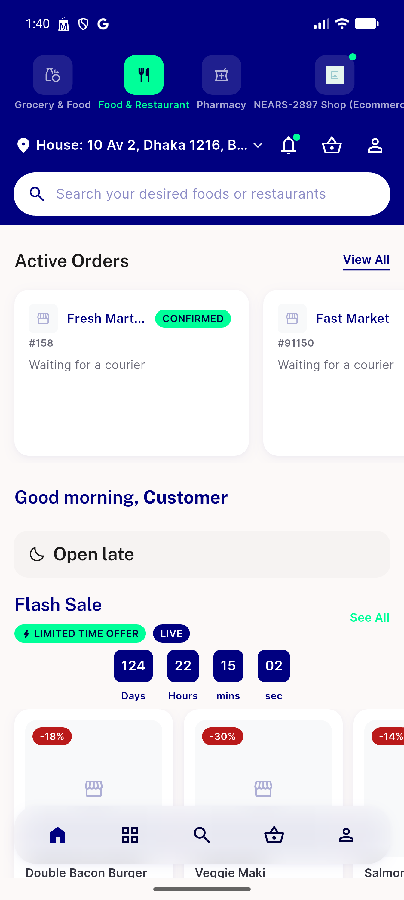
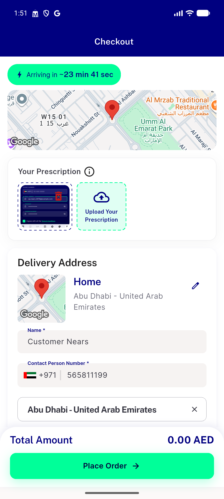
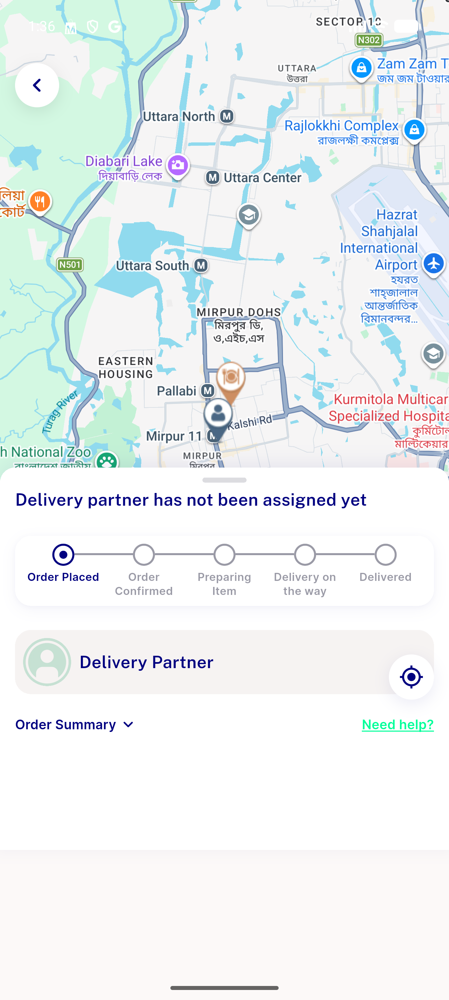
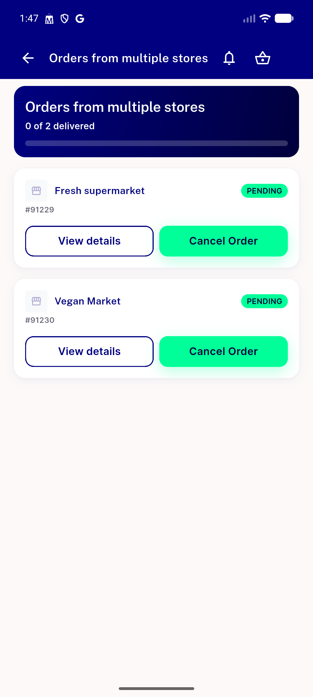
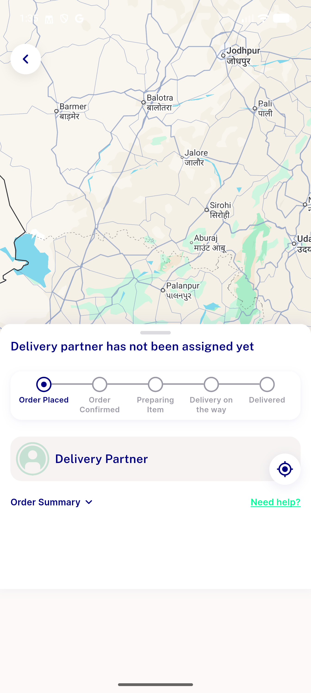
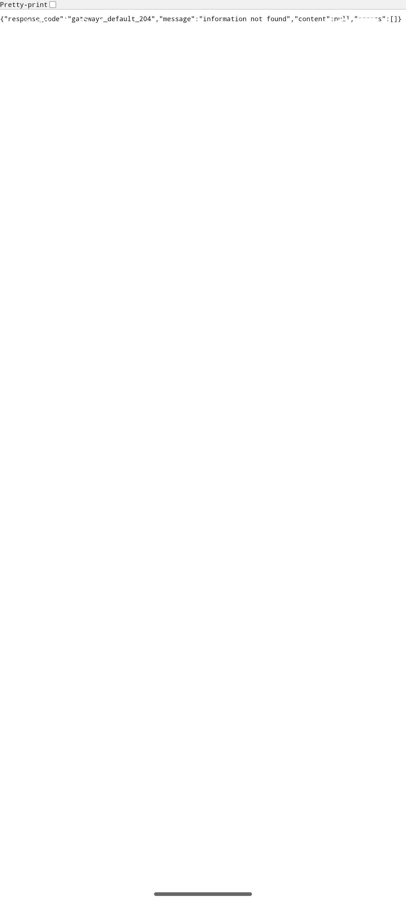
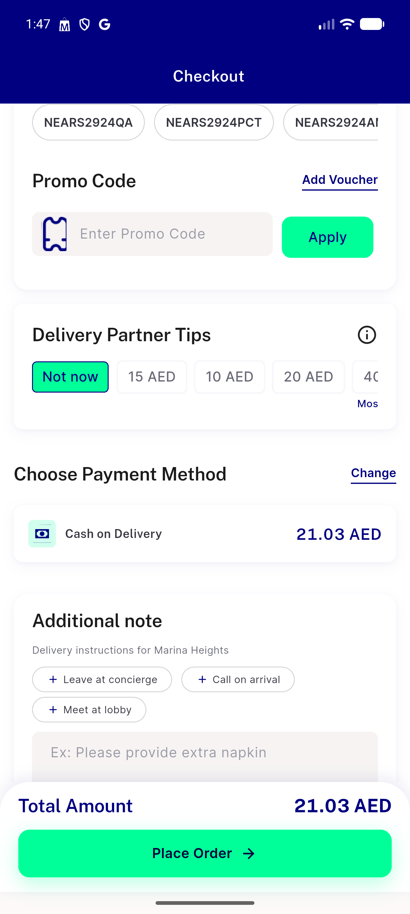

# QA Evidence — NEARS-3395

**PASS — COD/digital-cancel/group-order live checkout regression, AC4 double-tap single-order confirmed**

**9 screenshot(s).** Click any thumbnail for full resolution.

<table>
<tr>
<td align="center" width="33%"> ac regression outofzone multistore</td>
<td align="center" width="33%"> ac3 digital cancel cod fallback</td>
<td align="center" width="33%"> ac3 prescription topsection attached</td>
</tr>
<tr>
<td align="center" width="33%"> ac3 prescription topsection ltr</td>
<td align="center" width="33%"> ac4 doubletap cod single order</td>
<td align="center" width="33%"> ac6 7 group order placed</td>
</tr>
<tr>
<td align="center" width="33%"> ac7 cod order placed</td>
<td align="center" width="33%"> ac7 digital payment webview</td>
<td align="center" width="33%"> ac7 group order checkout</td>
</tr>
</table>

---
*From `nears/docs/qa-evidence/NEARS-3395/` · public-repo scrub policy (no live secrets; verified clean).*
