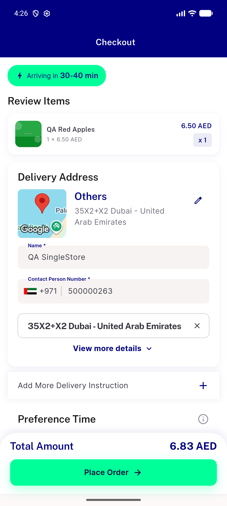
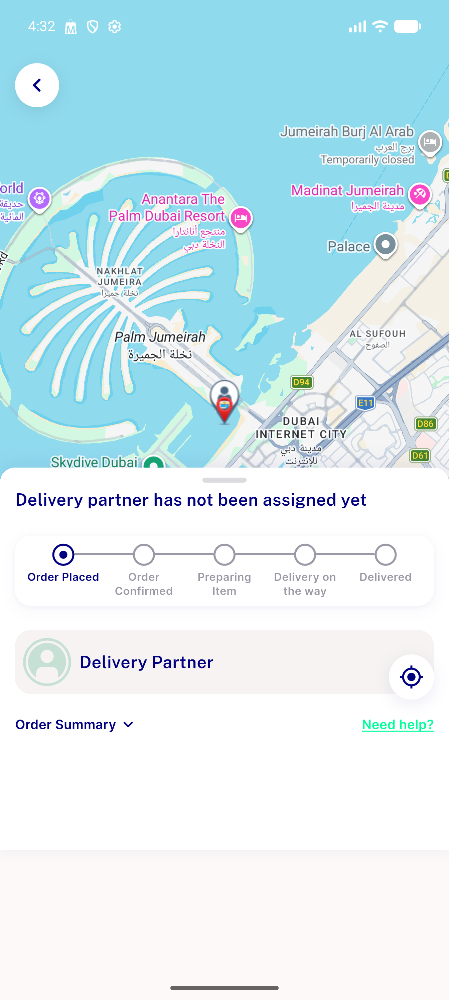

# QA Evidence — NEARS-3398

**PASS — Checkout country-code picker defaults to +971 (AE), COD Place Order works end-to-end, manual re-pick regression clean**

**2 screenshot(s).** Click any thumbnail for full resolution.

<table>
<tr>
<td align="center" width="33%"> ac1 checkout country picker default 971</td>
<td align="center" width="33%"> ac3 manual repick order confirmed</td>
</tr>
</table>

### Other artifacts
- [`ac1-checkout-a11y-dump.xml`](ac1-checkout-a11y-dump.xml)
- [`bug-cartsuggestitemmodel-typeerror.log`](bug-cartsuggestitemmodel-typeerror.log)

---
*From `nears/docs/qa-evidence/NEARS-3398/` · public-repo scrub policy (no live secrets; verified clean).*
