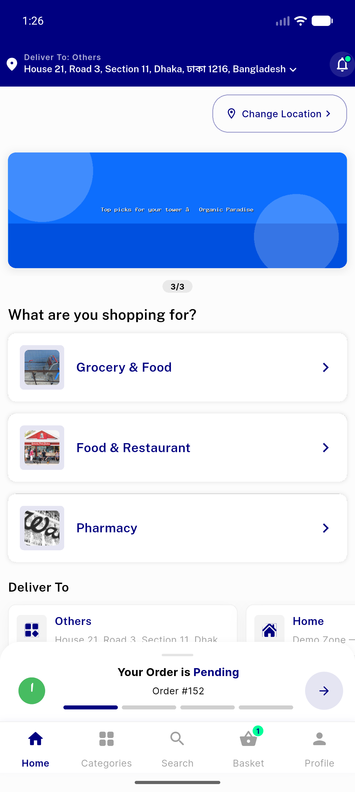
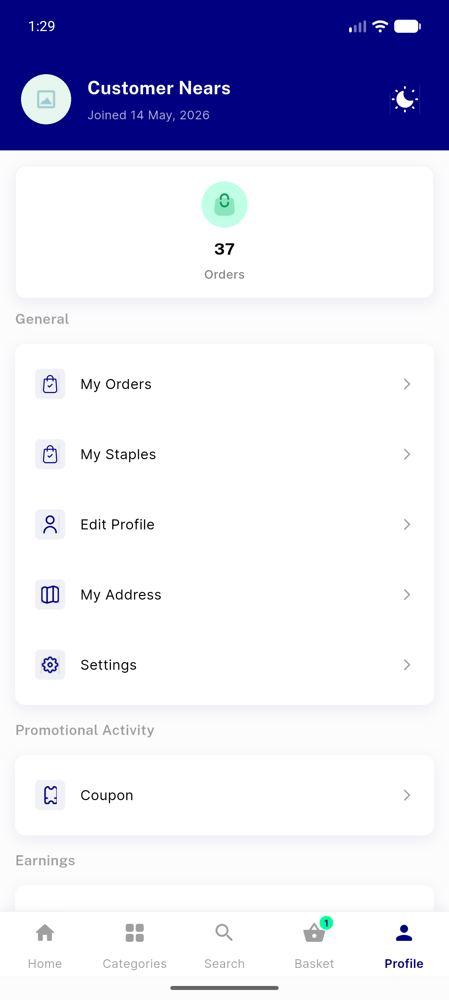
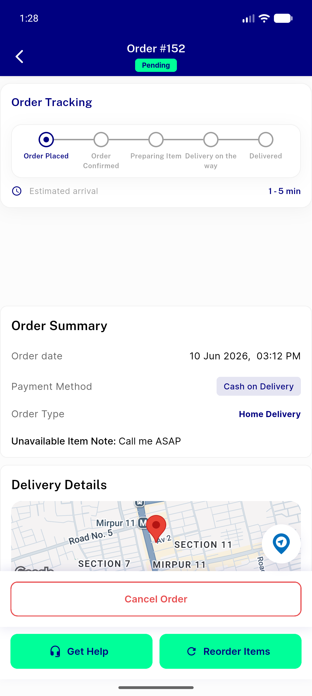
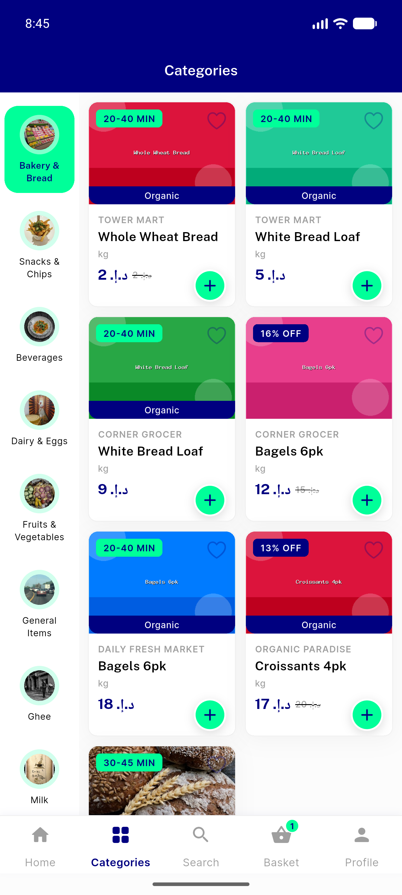
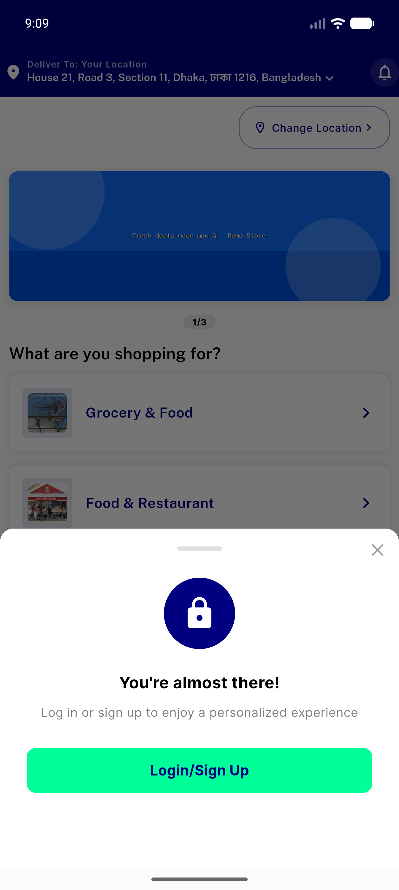
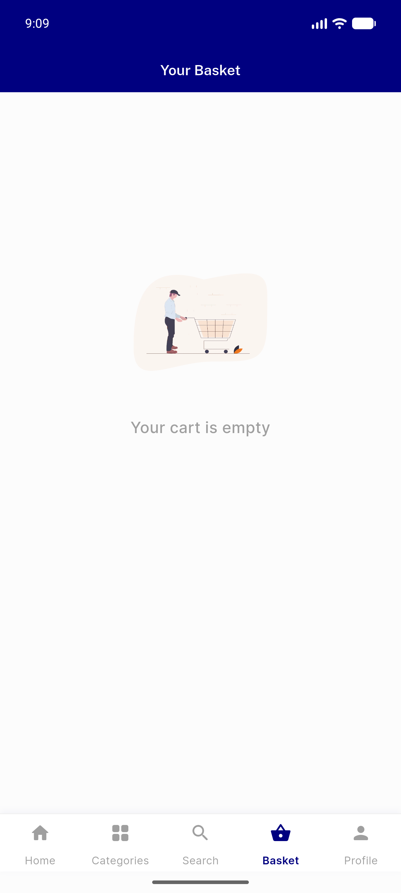
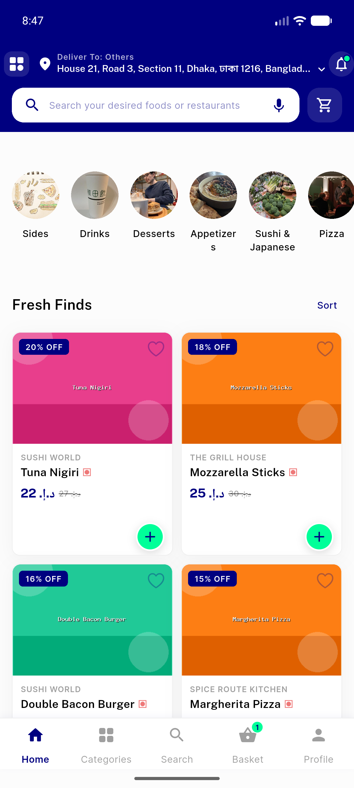
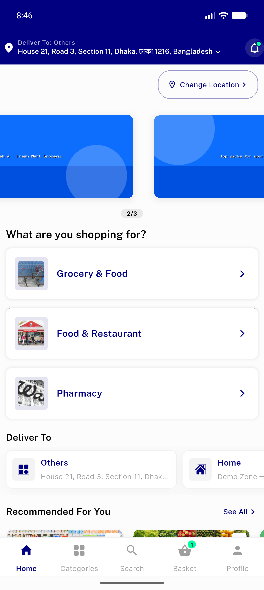
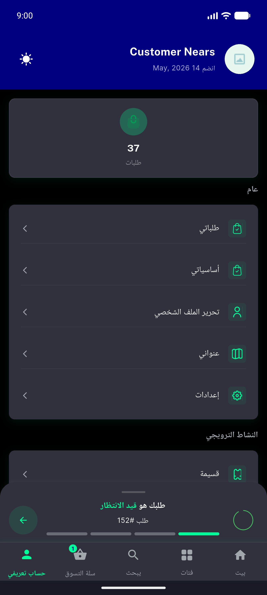
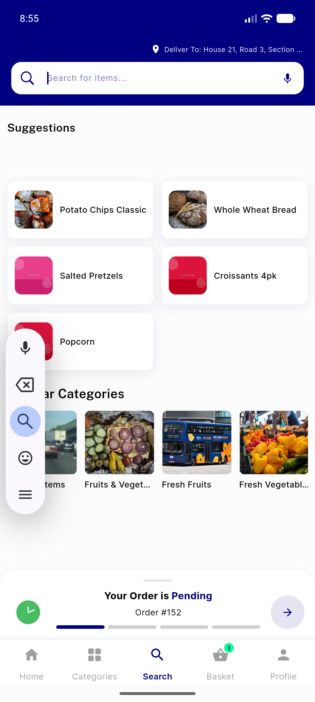

# QA Evidence — NEARS-340

**PASS — bottom-nav a11y: all ACs demonstrated live on emulator-5554 (Android 17), build feat/NEARS-340-navbar-a11y @5387e1be; guest/no-order/running-order + TalkBack semantics + module-switcher + RTL/dark regression sweep clean; flutter test 723/723 green**

**10 screenshot(s).** Click any thumbnail for full resolution.

<table>
<tr>
<td align="center" width="33%"> ac1 banner above nav 5tabs</td>
<td align="center" width="33%"> ac1 banner swiped nav stays</td>
<td align="center" width="33%"> ac1 banner tap order tracking</td>
</tr>
<tr>
<td align="center" width="33%"> ac2 no banner categories selected</td>
<td align="center" width="33%"> ac2guest login sheet tabs hidden expected</td>
<td align="center" width="33%"> ac2guest tabs clickable after dismiss</td>
</tr>
<tr>
<td align="center" width="33%"> ac5 food home renders but a11y dead nears339</td>
<td align="center" width="33%"> ac5 module selection after switch tap</td>
<td align="center" width="33%"> ac6 dark arabic rtl banner stack</td>
</tr>
<tr>
<td align="center" width="33%"> ac6 keyboard state probe</td>
</tr>
</table>

### Other artifacts
- [`progress.md`](progress.md)

---
*From `nears/docs/qa-evidence/NEARS-340/` · public-repo scrub policy (no live secrets; verified clean).*
