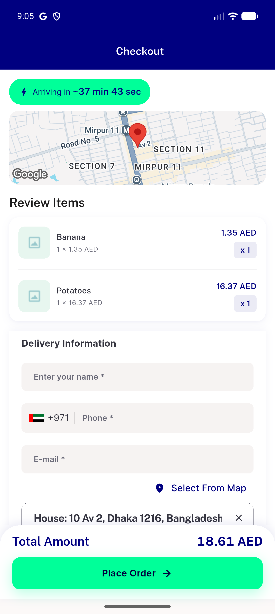
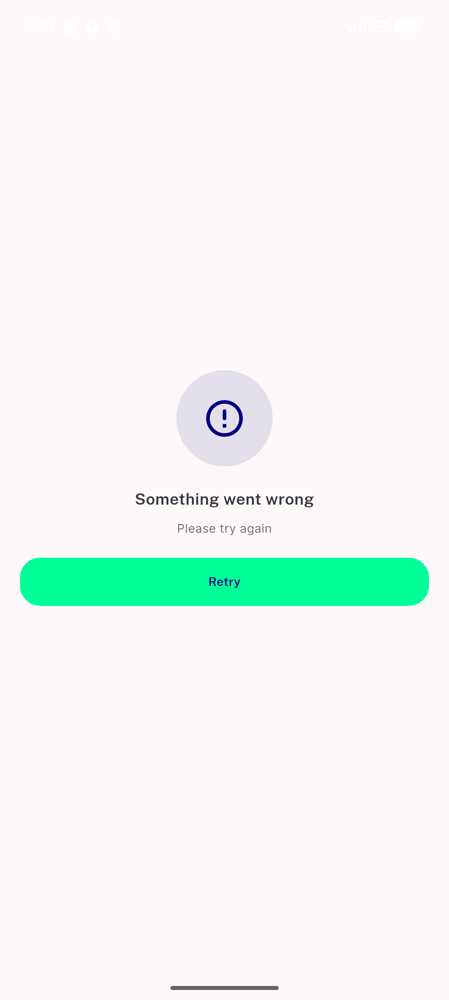
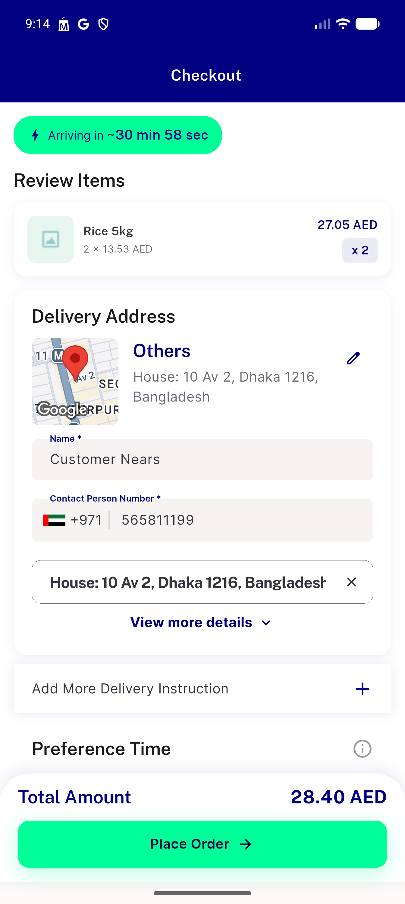

# QA Evidence — NEARS-3411

**PASS — guest checkout country picker defaults to AE/+971 ISO-alpha2, no manual repick required; manual repick + order submission verified**

**3 screenshot(s).** Click any thumbnail for full resolution.

<table>
<tr>
<td align="center" width="33%"> ac1 ac2 guest checkout default 971</td>
<td align="center" width="33%"> regression guest order track 401</td>
<td align="center" width="33%"> regression loggedin checkout default 971</td>
</tr>
</table>

### Other artifacts
- [`ac1-guest-checkout-a11y-dump.xml`](ac1-guest-checkout-a11y-dump.xml)
- [`bug-guest-order-track-401.log`](bug-guest-order-track-401.log)
- [`regression-loggedin-checkout-a11y-dump.xml`](regression-loggedin-checkout-a11y-dump.xml)

---
*From `nears/docs/qa-evidence/NEARS-3411/` · public-repo scrub policy (no live secrets; verified clean).*
