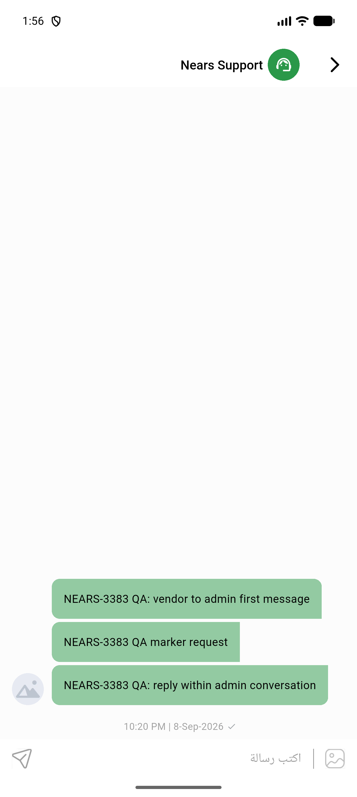
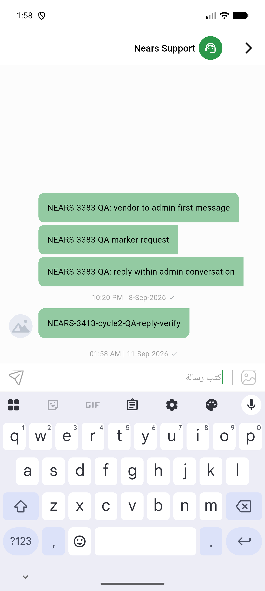
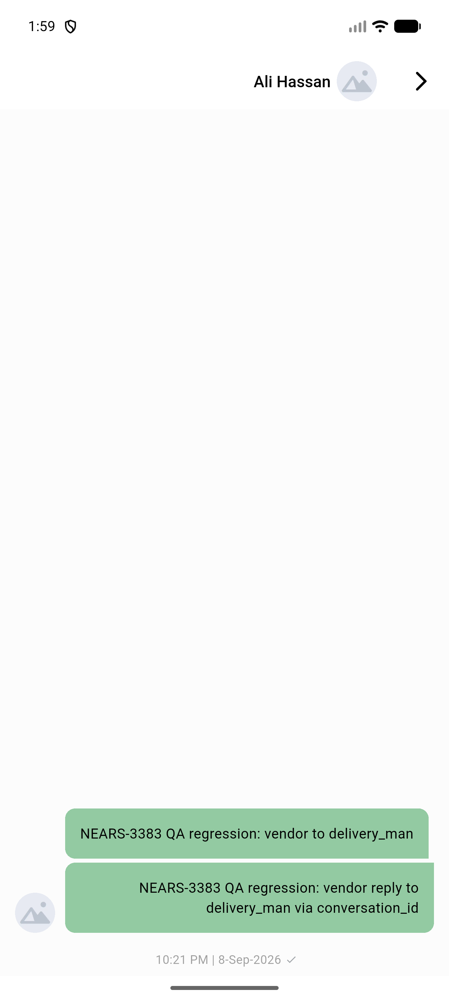

# QA Evidence — NEARS-3413

**Delta re-QA cycle 2 — AC3 confirmed fixed (compose bar renders, reply sends, appears on refresh); targeted regression clean; reachability gap for admin-initiated direction still open, declined raw-DB-insert workaround per read-only-DB hard rule**

**9 screenshot(s).** Click any thumbnail for full resolution.

<table>
<tr>
<td align="center" width="33%"> ac rtl arabic chatscreen</td>
<td align="center" width="33%"> ac rtl arabic conversation list</td>
<td align="center" width="33%"> ac1 conversation list vendor initiated</td>
</tr>
<tr>
<td align="center" width="33%"> ac2 chatscreen vendor initiated</td>
<td align="center" width="33%"> bug admin compose bar hidden</td>
<td align="center" width="33%"> cycle2 ac3 compose bar visible</td>
</tr>
<tr>
<td align="center" width="33%"> cycle2 ac3 reply sent and visible</td>
<td align="center" width="33%"> cycle2 regression deliveryman compose still hidden</td>
<td align="center" width="33%"> regression deliveryman chat</td>
</tr>
</table>

### Other artifacts
- [`bug-admin-compose-bar-hidden.log`](bug-admin-compose-bar-hidden.log)

---
*From `nears/docs/qa-evidence/NEARS-3413/` · public-repo scrub policy (no live secrets; verified clean).*
