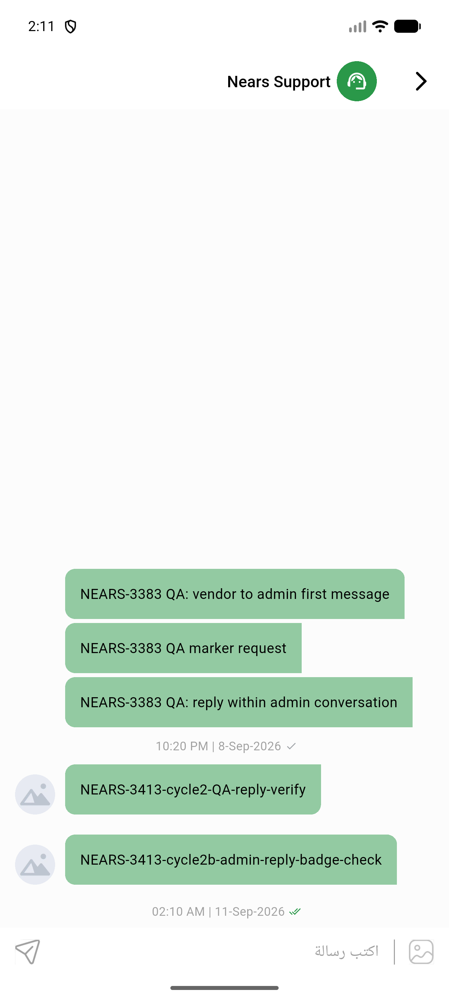
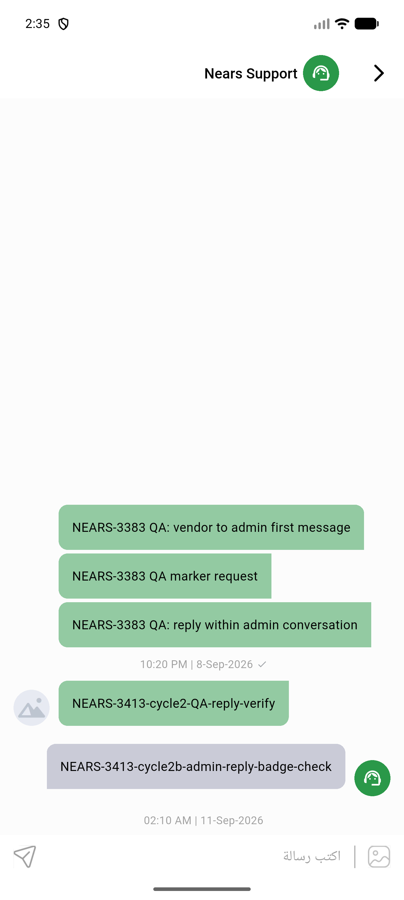

# QA Evidence — NEARS-3413

**Cycle 3 — bubble mis-attribution bug CONFIRMED FIXED: admin reply (sender_id=131) now renders as a received bubble with Nears Support badge; vendor's own sent bubbles unaffected**

**11 screenshot(s).** Click any thumbnail for full resolution.

<table>
<tr>
<td align="center" width="33%"> ac rtl arabic chatscreen</td>
<td align="center" width="33%"> ac rtl arabic conversation list</td>
<td align="center" width="33%"> ac1 conversation list vendor initiated</td>
</tr>
<tr>
<td align="center" width="33%"> ac2 chatscreen vendor initiated</td>
<td align="center" width="33%"> bug admin compose bar hidden</td>
<td align="center" width="33%"> cycle2 ac3 compose bar visible</td>
</tr>
<tr>
<td align="center" width="33%"> cycle2 ac3 reply sent and visible</td>
<td align="center" width="33%"> cycle2 regression deliveryman compose still hidden</td>
<td align="center" width="33%"> cycle2b admin reply bubble side</td>
</tr>
<tr>
<td align="center" width="33%"> cycle3 admin reply bubble fixed</td>
<td align="center" width="33%"> regression deliveryman chat</td>
</tr>
</table>

### Other artifacts
- [`bug-admin-compose-bar-hidden.log`](bug-admin-compose-bar-hidden.log)
- [`bug-admin-reply-mis-sided-bubble.log`](bug-admin-reply-mis-sided-bubble.log)

---
*From `nears/docs/qa-evidence/NEARS-3413/` · public-repo scrub policy (no live secrets; verified clean).*
