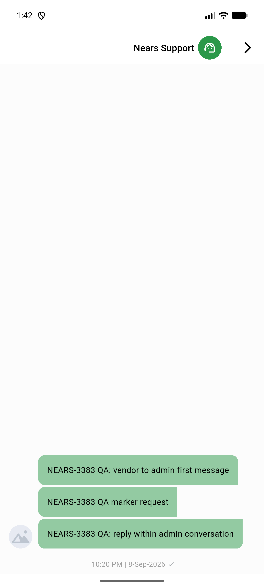
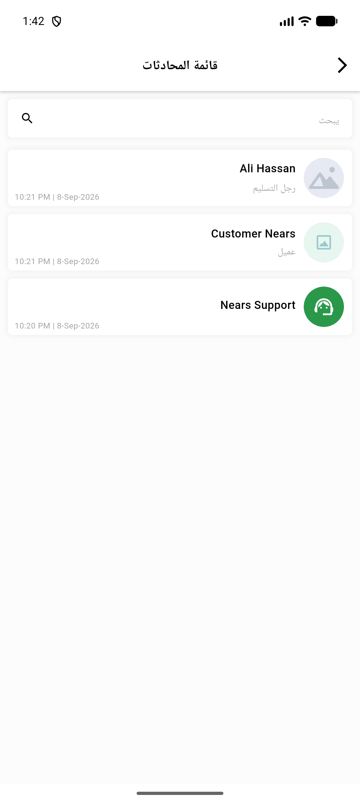
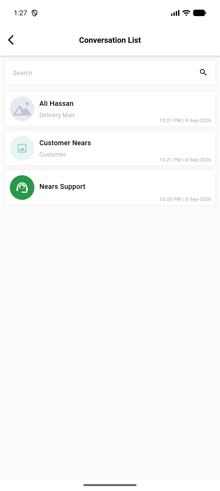
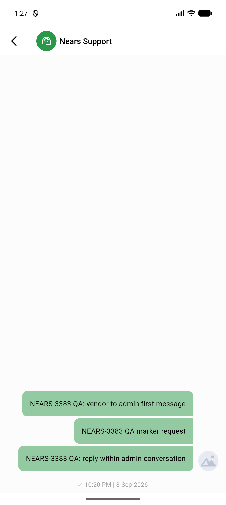
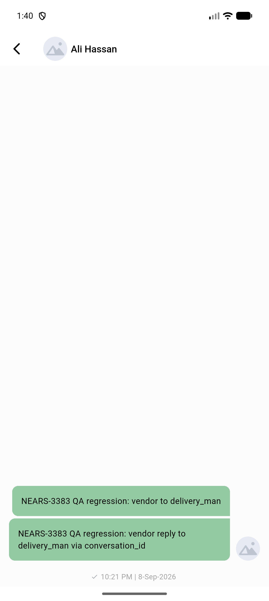

# QA Evidence — NEARS-3413

**FAIL — AC1/AC2 vendor-initiated direction + RTL/regression clean; AC3 blocked (compose bar never renders for admin threads once they have >=1 message); admin-initiated direction unreachable live (no product flow originates it)**

**6 screenshot(s).** Click any thumbnail for full resolution.

<table>
<tr>
<td align="center" width="33%"> ac rtl arabic chatscreen</td>
<td align="center" width="33%"> ac rtl arabic conversation list</td>
<td align="center" width="33%"> ac1 conversation list vendor initiated</td>
</tr>
<tr>
<td align="center" width="33%"> ac2 chatscreen vendor initiated</td>
<td align="center" width="33%"> bug admin compose bar hidden</td>
<td align="center" width="33%"> regression deliveryman chat</td>
</tr>
</table>

### Other artifacts
- [`bug-admin-compose-bar-hidden.log`](bug-admin-compose-bar-hidden.log)

---
*From `nears/docs/qa-evidence/NEARS-3413/` · public-repo scrub policy (no live secrets; verified clean).*
