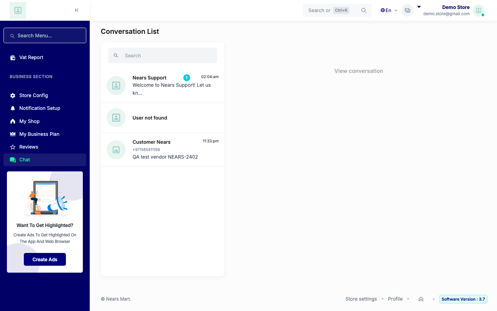
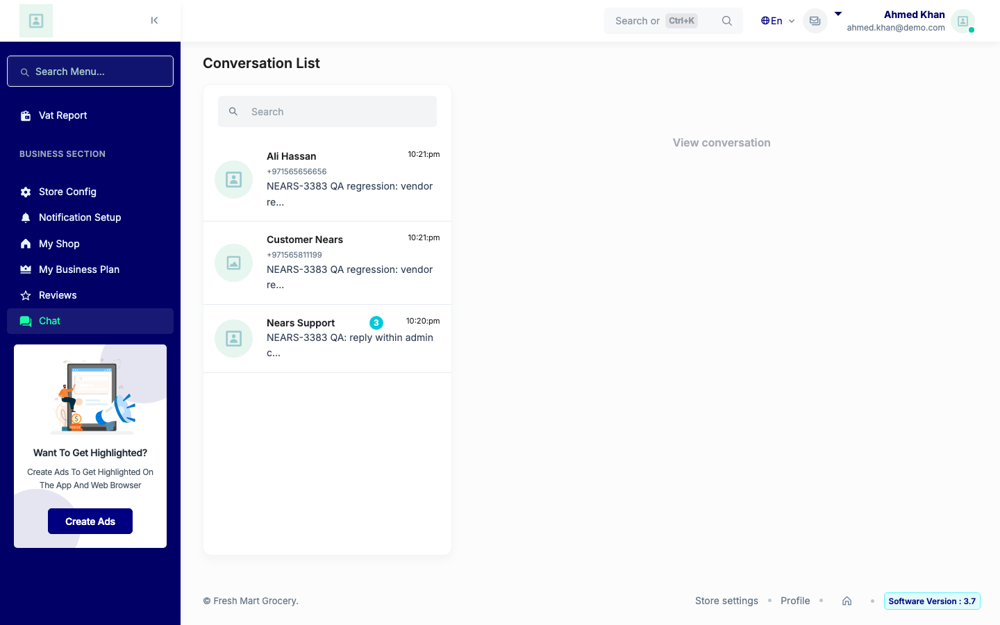
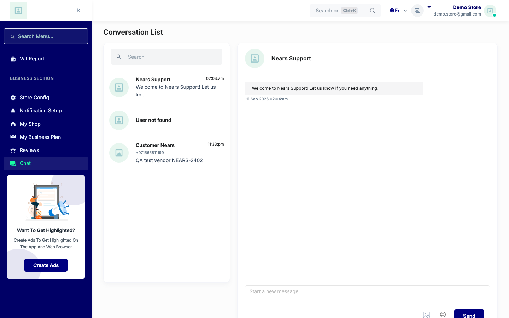
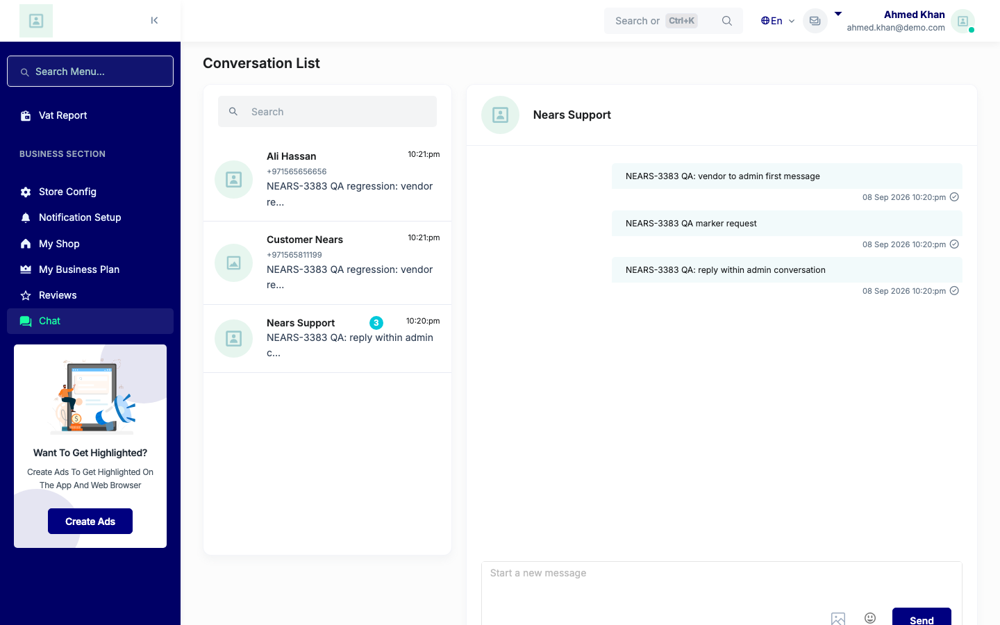
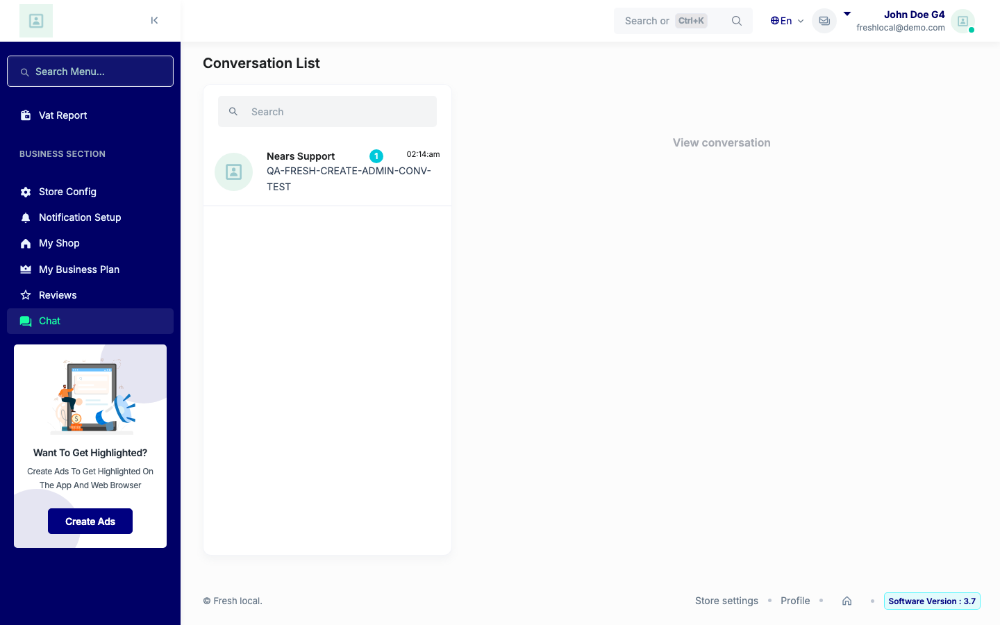
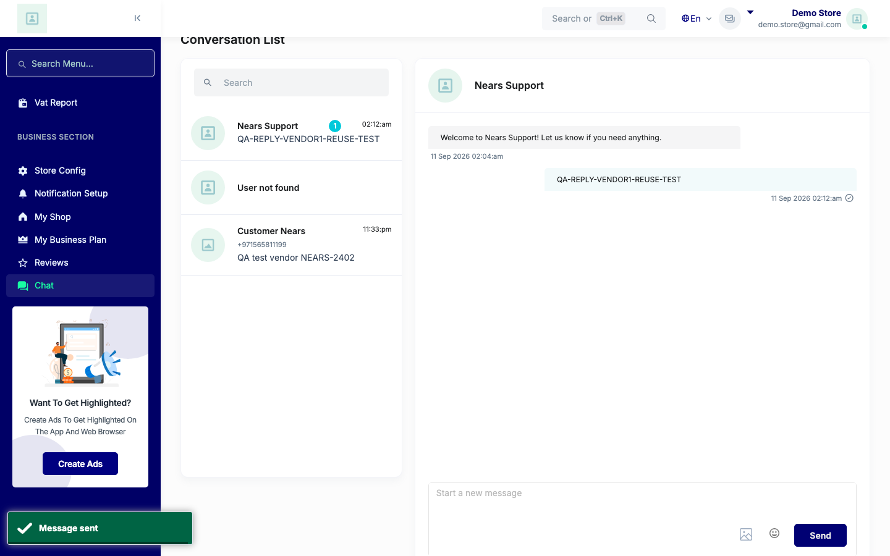
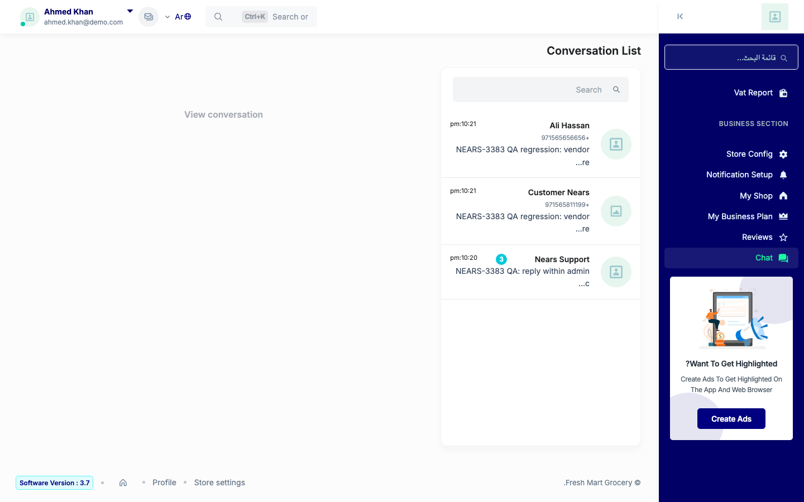

# QA Evidence — NEARS-3414

**PASS - admin/support conversation row clickable both directions, thread opens clean, reply fix-cycle-1 verified live**

**7 screenshot(s).** Click any thumbnail for full resolution.

<table>
<tr>
<td align="center" width="33%"> ac1 admin initiated and broken fallback vendor1</td>
<td align="center" width="33%"> ac1 vendor initiated and regression rows vendor2</td>
<td align="center" width="33%"> ac2 admin initiated thread open vendor1</td>
</tr>
<tr>
<td align="center" width="33%"> ac2 vendor initiated thread open vendor2</td>
<td align="center" width="33%"> fixcycle1 reply creates fresh admin conversation vendor9</td>
<td align="center" width="33%"> fixcycle1 reply reuses admin initiated thread vendor1</td>
</tr>
<tr>
<td align="center" width="33%"> regression arabic rtl message list vendor2</td>
</tr>
</table>

---
*From `nears/docs/qa-evidence/NEARS-3414/` · public-repo scrub policy (no live secrets; verified clean).*
