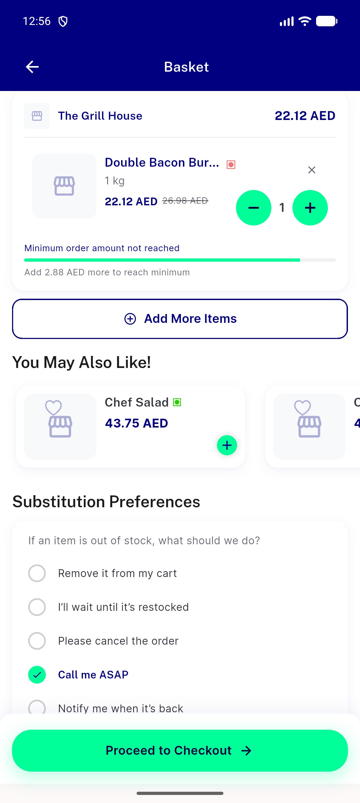
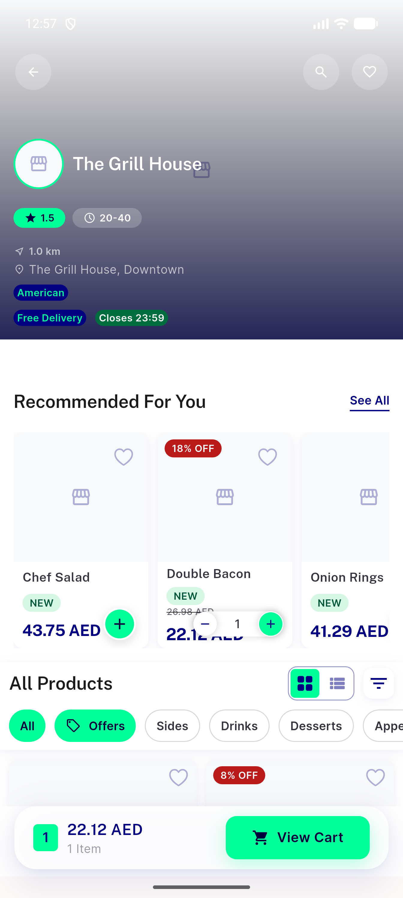

# QA Evidence — NEARS-3417

**PASS - UserApp emulator-5558, AC1+AC2 demonstrated live, no TypeError**

**2 screenshot(s).** Click any thumbnail for full resolution.

<table>
<tr>
<td align="center" width="33%"> ac1 cart suggested items</td>
<td align="center" width="33%"> ac2 recommended items</td>
</tr>
</table>

---
*From `nears/docs/qa-evidence/NEARS-3417/` · public-repo scrub policy (no live secrets; verified clean).*
