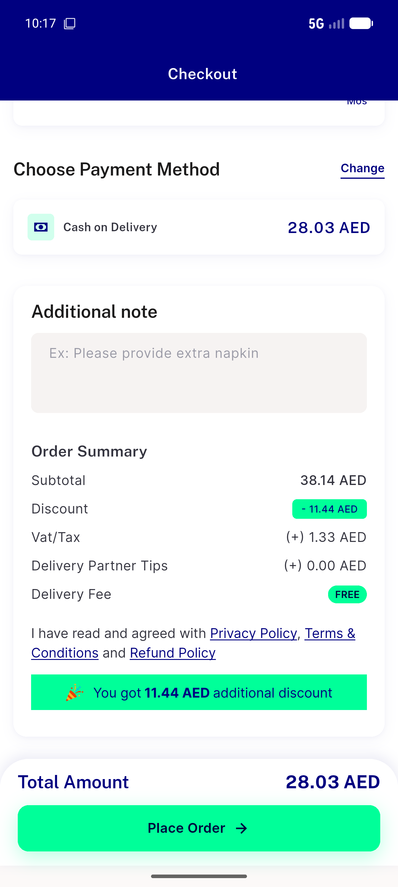

# QA Evidence — NEARS-3418

**PASS - VAT/Tax line re-fires and clears stale coupon-discounted value on coupon removal; swap/rapid-toggle/multi-store/place-order oracle all verified live on emulator-5558**

**1 screenshot(s).** Click any thumbnail for full resolution.

<table>
<tr>
<td align="center" width="33%"> ac2 tax reverts post removal</td>
</tr>
</table>

### Other artifacts
- [`bug-cart-suggest-item-typeerror.log`](bug-cart-suggest-item-typeerror.log)
- [`bug-coldstart-double-getordertax.log`](bug-coldstart-double-getordertax.log)

---
*From `nears/docs/qa-evidence/NEARS-3418/` · public-repo scrub policy (no live secrets; verified clean).*
