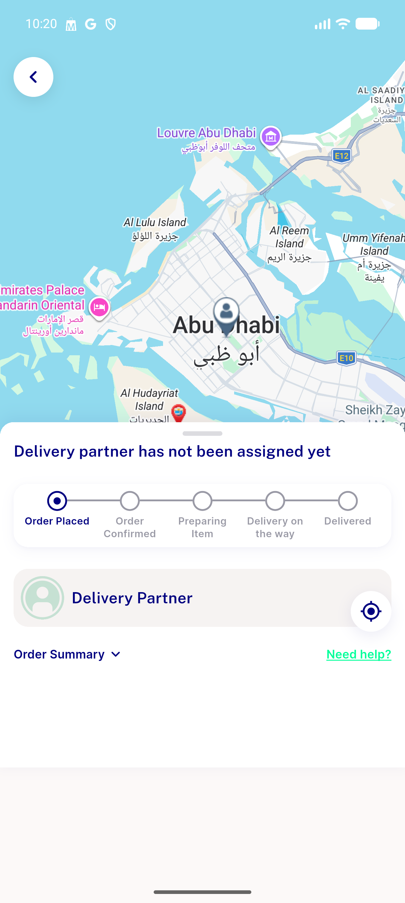
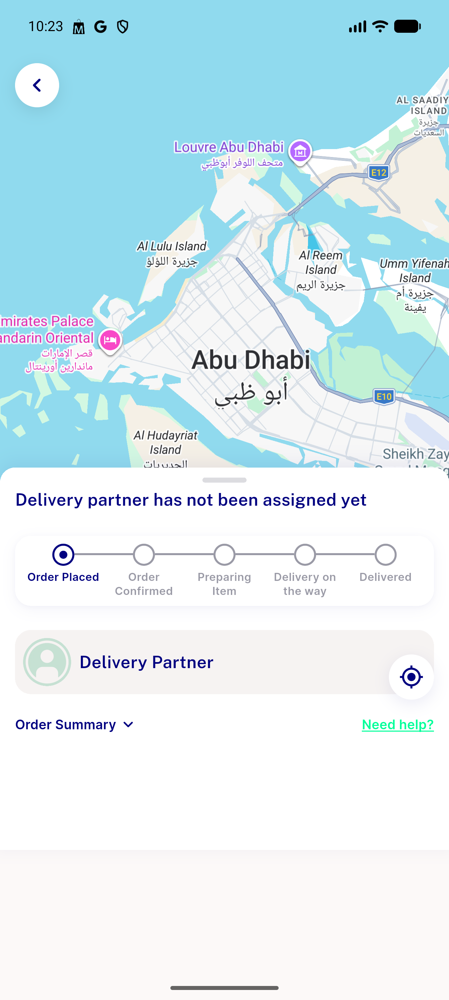

# QA Evidence — NEARS-3419

**PASS — guest order-track 401 fix verified live (guest place-order->track 200, periodic poll holds, authenticated regression clean, IDOR/security regression clean, X-Guest-Token header confirmed)**

**2 screenshot(s).** Click any thumbnail for full resolution.

<table>
<tr>
<td align="center" width="33%"> ac1 guest order tracking success</td>
<td align="center" width="33%"> ac3 authenticated tracking unchanged</td>
</tr>
</table>

### Other artifacts
- [`bug-suggested-items-typeerror.log`](bug-suggested-items-typeerror.log)
- [`security-idor-regression.log`](security-idor-regression.log)

---
*From `nears/docs/qa-evidence/NEARS-3419/` · public-repo scrub policy (no live secrets; verified clean).*
