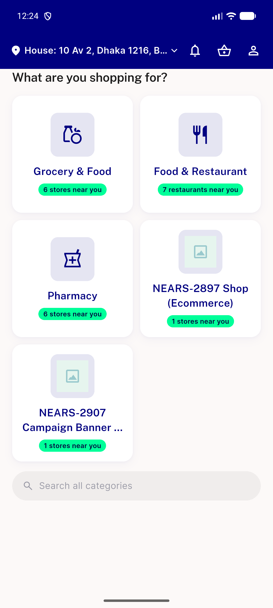
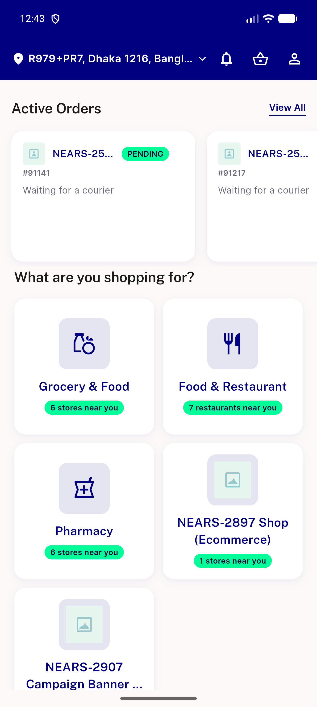
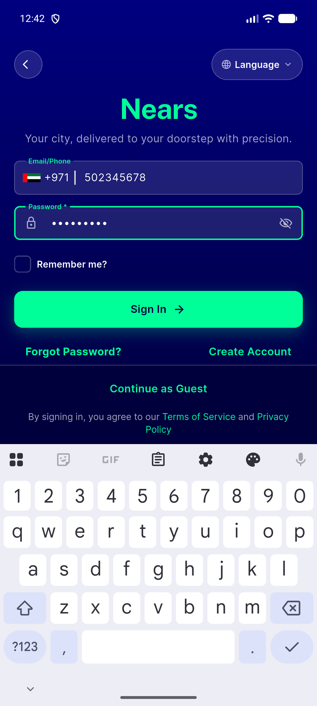
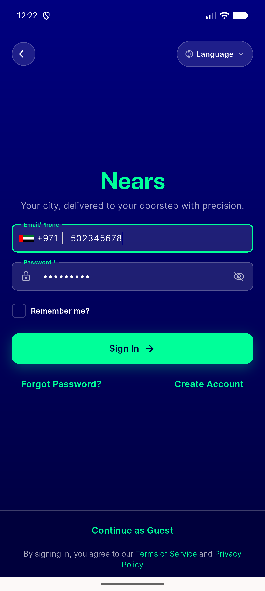

# QA Evidence — NEARS-3430

**Delta re-QA cycle 2: AC1/AC2/AC4 PASS, AC3 phone-format regression FIXED (log-confirmed), AC3 remains UNVERIFIABLE live (Firebase billing gap + no email-unverified DB fixture) — env limitations, not code defects**

**4 screenshot(s).** Click any thumbnail for full resolution.

<table>
<tr>
<td align="center" width="33%"> ac2 verified account proceeds to app</td>
<td align="center" width="33%"> ac2 verified proceeds recheck</td>
<td align="center" width="33%"> ac3 phone fix confirmed billing blocker</td>
</tr>
<tr>
<td align="center" width="33%"> bug firebase phone format crash</td>
</tr>
</table>

### Other artifacts
- [`ac3-phone-fix-confirmed-billing-blocker.log`](ac3-phone-fix-confirmed-billing-blocker.log)
- [`bug-firebase-phone-format-crash.log`](bug-firebase-phone-format-crash.log)

---
*From `nears/docs/qa-evidence/NEARS-3430/` · public-repo scrub policy (no live secrets; verified clean).*
