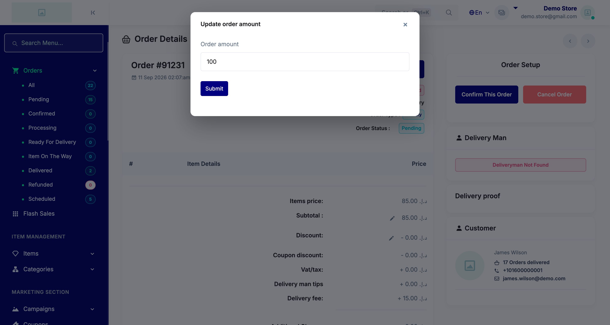
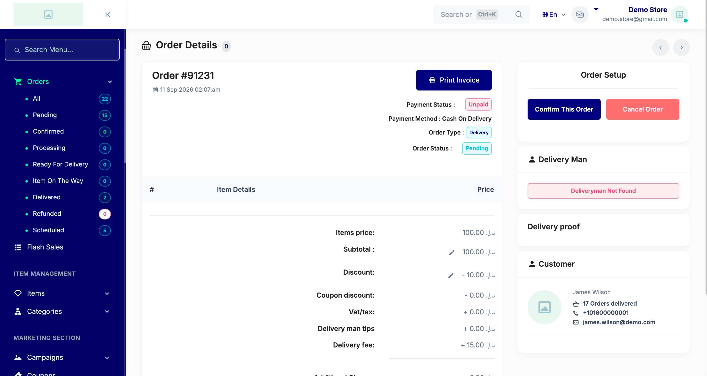
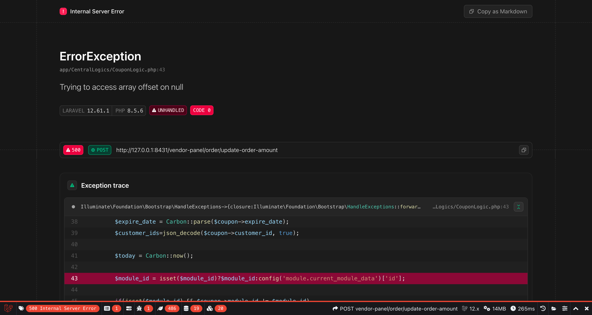

# QA Evidence — NEARS-3431

**BLOCKED — API surface PASS (AC2/AC3-API/AC5), web surface blocked by pre-existing infra gap (AC1/AC4/AC3-web undemonstrated live via browser)**

**4 screenshot(s).** Click any thumbnail for full resolution.

<table>
<tr>
<td align="center" width="33%"> ac1 ac4 web ineligible modal before</td>
<td align="center" width="33%"> ac1 ac4 web ineligible order91231 after</td>
<td align="center" width="33%"> ac3 ac4 web eligible order91232 after</td>
</tr>
<tr>
<td align="center" width="33%"> bug vendor web coupon edit 500 module context</td>
</tr>
</table>

### Other artifacts
- [`bug-vendor-web-coupon-edit-500-module-context.log`](bug-vendor-web-coupon-edit-500-module-context.log)

---
*From `nears/docs/qa-evidence/NEARS-3431/` · public-repo scrub policy (no live secrets; verified clean).*
