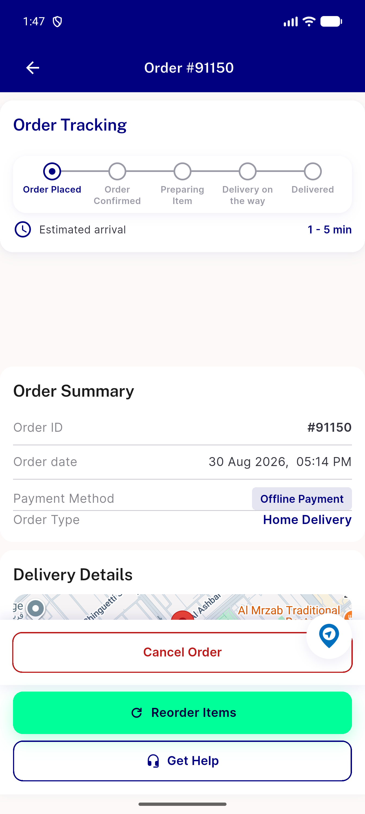
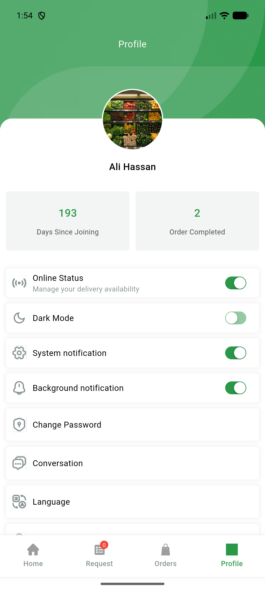

# QA Evidence — NEARS-3434

**PASS — AC1-4 demonstrated live (Admin validator + real reverb driver connect, UserApp+DeliveryApp), automated backstop 5/5+18/18+12/12 green, 1 pre-existing unrelated regression-candidate logged**

**2 screenshot(s).** Click any thumbnail for full resolution.

<table>
<tr>
<td align="center" width="33%"> ac2 userapp order tracking pusher connected</td>
<td align="center" width="33%"> ac3 deliveryapp online legacy websocket connected</td>
</tr>
</table>

### Other artifacts
- [`ac1-validator-live-curl.log`](ac1-validator-live-curl.log)
- [`ac2-userapp-pusher-log-excerpt.log`](ac2-userapp-pusher-log-excerpt.log)
- [`ac3-deliveryapp-legacy-log-excerpt.log`](ac3-deliveryapp-legacy-log-excerpt.log)
- [`ac4-laravel-log-clean.log`](ac4-laravel-log-clean.log)
- [`bug-reverb-host-invalid-server-broadcast.log`](bug-reverb-host-invalid-server-broadcast.log)

---
*From `nears/docs/qa-evidence/NEARS-3434/` · public-repo scrub policy (no live secrets; verified clean).*
